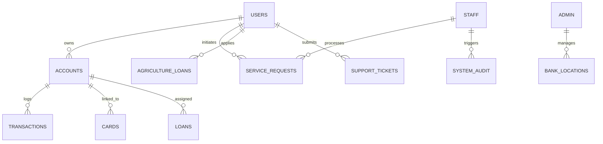

# 4. DATABASE DESIGN
# CHAPTER-4

## 4.1 Introduction
The database for "Smart Bank" acts as the central repository for all critical banking operations, ranging from user accounts to transactions and customer support. It is designed to ensure data integrity, security, and high performance across retail, corporate, and agricultural banking segments. The architecture leverages relational database concepts to efficiently query complex financial records while maintaining strict ACID compliance critical for a financial institution.

## 4.2 Scope
This chapter delineates the structure of the database utilized by the Smart Bank platform. It includes the schemas for all core banking functions such as authentication, account management, financial transactions, agricultural loan tracking, internal staff operations, and 3D map location indexing.

## 4.3 Database Schema Relationship

## 4.4 Table Descriptions

### 4.4.1 Admin Table (`admins`)
**Purpose**: Stores high-level administrative credentials and biometric profile data.

| Field Name | Data Type | Constraints | Description |
|---|---|---|---|
| id | INTEGER | PRIMARY KEY, AUTO | Unique admin identifier |
| username | VARCHAR(50) | UNIQUE, NOT NULL | Login username |
| password | VARCHAR(255) | NOT NULL | Hashed security key |
| level | VARCHAR(50) | DEFAULT 'admin' | Access clearance level |
| face_auth_enabled | INTEGER | DEFAULT 0 | Toggle for biometric |
| face_descriptor | TEXT | — | Encoded face facial landmarks |

### 4.4.2 Staff Table (`staff`)
**Purpose**: Manages bank employee data and shift-based authentication permissions.

| Field Name | Data Type | Constraints | Description |
|---|---|---|---|
| id | INTEGER | PRIMARY KEY | Internal ID |
| staff_id | VARCHAR(50) | UNIQUE, NOT NULL | Public Employee ID |
| department | VARCHAR(50) | — | Employee's division |
| status | VARCHAR(20) | DEFAULT 'active' | Current employment state |
| face_auth_enabled | INTEGER | DEFAULT 0 | Biometric toggle |
| base_salary | DECIMAL(15,2)| DEFAULT 50000 | Monthly payroll base |

### 4.4.3 Customer Table (`users`)
**Purpose**: Central customer profile management.

| Field Name | Data Type | Constraints | Description |
|---|---|---|---|
| id | INTEGER | PRIMARY KEY | Unique identifier |
| username | VARCHAR(50) | UNIQUE | Login handle |
| email | VARCHAR(100) | UNIQUE, NOT NULL | For notifications/OTP |
| status | VARCHAR(20) | — | Active/Blocked/Pending |
| upi_id | VARCHAR(50) | UNIQUE | Unique payment handle |
| mobile_passcode| VARCHAR(255)| — | Secure balance pin |

### 4.4.4 Services Table (`service_applications`)
**Purpose**: Tracks applications for specialized banking products.

| Field Name | Data Type | Constraints | Description |
|---|---|---|---|
| id | INTEGER | PRIMARY KEY | Application ID |
| user_id | INTEGER | FOREIGN KEY | Applicant link |
| service_type | VARCHAR(50) | NOT NULL | Loan/Card/Agri etc |
| product_name | VARCHAR(100)| — | Specific product name |
| amount | DECIMAL(15,2)| — | Requested capital |
| status | VARCHAR(20) | DEFAULT 'pending' | Current queue status |

### 4.4.5 Sub-Services Table (`account_requests`)
**Purpose**: Detailed validation phase for specific service tiers (KYC/Account Setup).

| Field Name | Data Type | Constraints | Description |
|---|---|---|---|
| id | INTEGER | PRIMARY KEY | ID |
| user_id | INTEGER | FOREIGN KEY | Link to user record |
| account_type | VARCHAR(50) | — | Savings/Current/Corp |
| aadhaar_number | VARCHAR(20) | — | Identity validation number |
| status | VARCHAR(20) | — | Verification status |
| tax_id | VARCHAR(50) | — | PAN/TIN details |

### 4.4.6 Packages Table (`accounts`)
**Purpose**: Financial ledger entities representing customer liquid balance pools.

| Field Name | Data Type | Constraints | Description |
|---|---|---|---|
| id | INTEGER | PRIMARY KEY | Account ID |
| account_number | VARCHAR(20) | UNIQUE, NOT NULL | SMTB standardized ID |
| balance | DECIMAL(15,2)| DEFAULT 0.00 | Real-time liquid funds |
| currency | VARCHAR(3) | DEFAULT 'INR' | Local currency code |
| ifsc | VARCHAR(20) | — | Branch routing code |
| updated_at | TIMESTAMP | — | Last ledger movement |

### 4.4.7 Sub-Packages Table (`cards`)
**Purpose**: Manages card tiers (Gold/Platinum) linked to respective account packages.

| Field Name | Data Type | Constraints | Description |
|---|---|---|---|
| id | INTEGER | PRIMARY KEY | Card ID |
| card_number | VARCHAR(20) | UNIQUE | 16-digit card numerical |
| card_type | VARCHAR(20) | — | Debit/Credit/Visa/NPCI |
| cvv | VARCHAR(4) | NOT NULL | Crypted security digit |
| credit_limit | DECIMAL(15,2)| — | Authorized spend limit |
| status | VARCHAR(20) | — | Active/Blocked/Inactive |

### 4.4.8 Interaction/Attendance Table (`attendance`)
**Purpose**: Logging operational shifts and scheduled staff/customer interactions.

| Field Name | Data Type | Constraints | Description |
|---|---|---|---|
| id | INTEGER | PRIMARY KEY | Record ID |
| staff_id | INTEGER | FOREIGN KEY | Employee handle |
| date | DATE | — | Interaction/Shift date |
| clock_in | TIMESTAMP | — | Login timestamp |
| clock_out | TIMESTAMP | — | Logout timestamp |
| total_hours | DECIMAL(5,2) | — | Effective work/session |

### 4.4.9 Payment Table (`transactions`)
**Purpose**: Low-level ledger of all individual liquidity movements.

| Field Name | Data Type | Constraints | Description |
|---|---|---|---|
| id | INTEGER | PRIMARY KEY | Txn ID |
| account_id | INTEGER | FOREIGN KEY | Origin account link |
| type | VARCHAR(20) | — | Credit/Debit |
| amount | DECIMAL(15,2)| NOT NULL | Movement magnitude |
| balance_after | DECIMAL(15,2)| — | Snapshot balance log |
| mode | VARCHAR(20) | DEFAULT 'NEFT' | UPI/NEFT/IMPS/ATM |

### 4.4.10 Feedback Table (`support_tickets`)
**Purpose**: Managing external queries, complaints, and platform feedback.

| Field Name | Data Type | Constraints | Description |
|---|---|---|---|
| id | INTEGER | PRIMARY KEY | Ticket ID |
| user_id | INTEGER | FOREIGN KEY | Link to complainant |
| subject | VARCHAR(200)| — | Query summary |
| message | TEXT | — | Full query description |
| priority | VARCHAR(20) | — | Low/Normal/Urgent |
| status | VARCHAR(20) | DEFAULT 'pending' | Resolution state |
