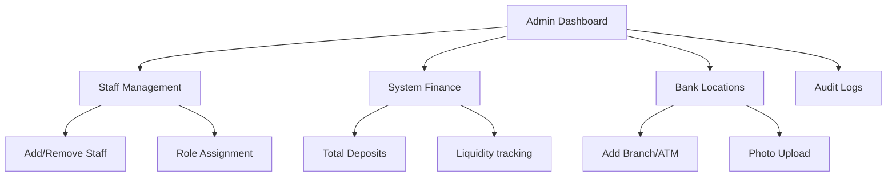
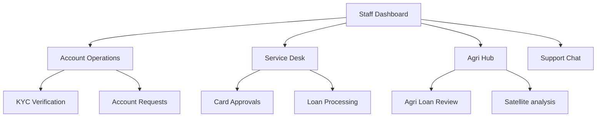
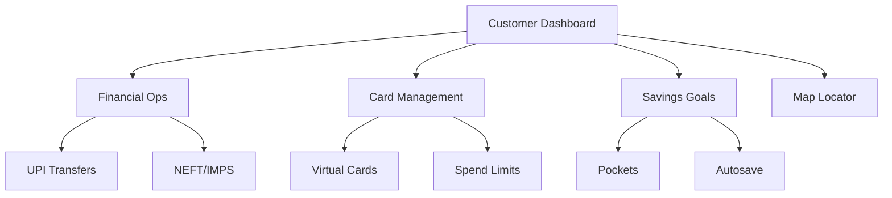
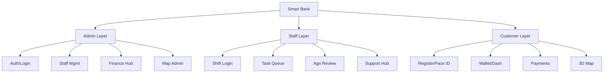
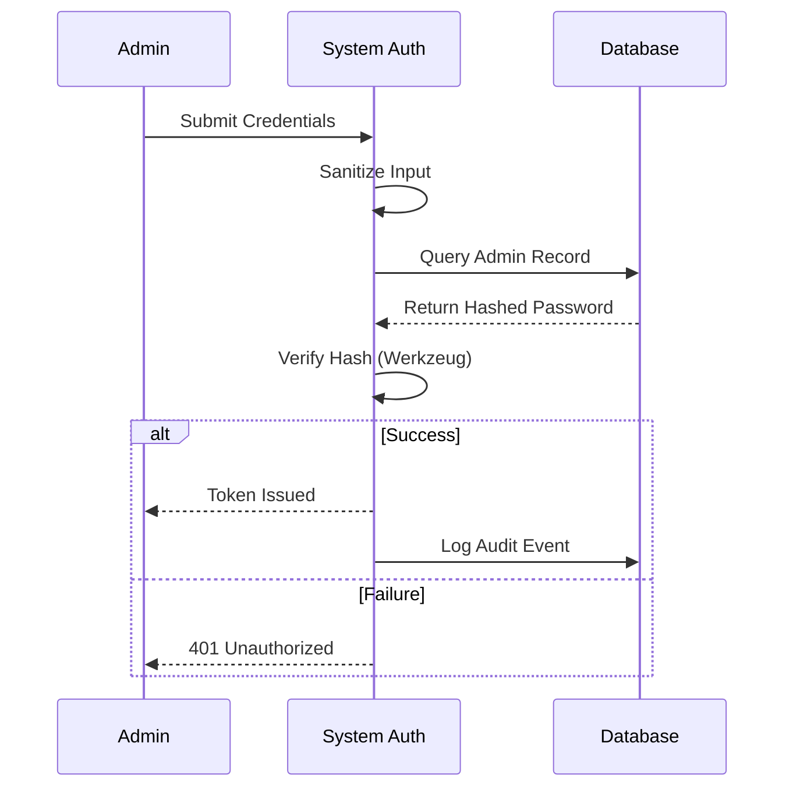
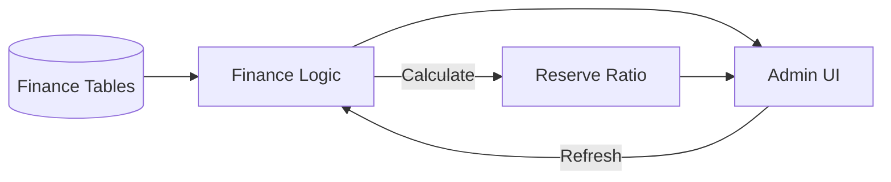
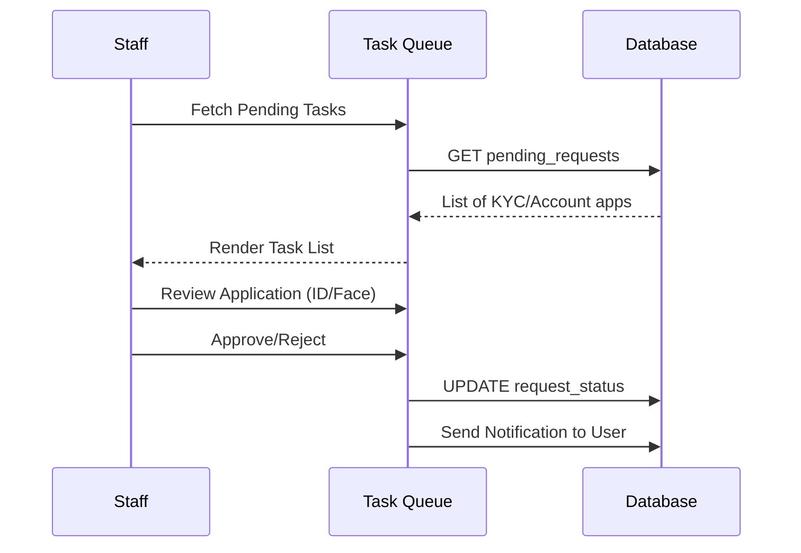
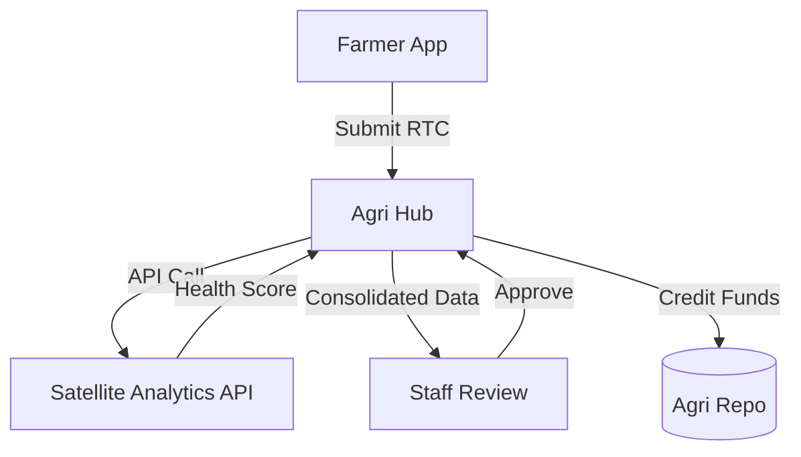
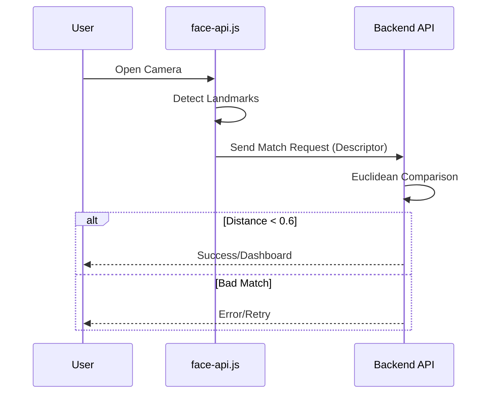
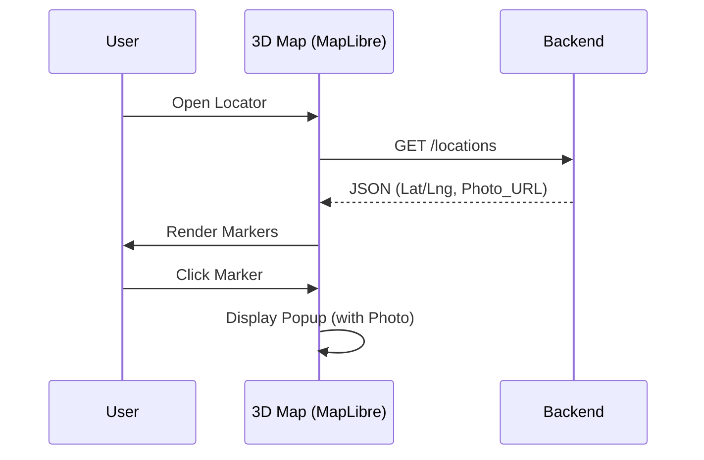

# 5. DETAILED DESIGN
# CHAPTER-5

## 5.1 Introduction
The detailed design phase elaborates on the system architecture by decomposing the application into modular functional segments. For "Smart Bank", this structure partitions routing, processing, and visualization models into respective domains belonging to the Admin, Staff, and Customer user groups. The interface designs, controller logic, and backend processing pipelines are meticulously categorized.

## 5.2 Applicable Documents
- Smart Bank Software Requirement Specification (SRS) - Chapter 2
- System Flow and Context Diagrams - Chapter 3
- Database Schema and Architecture - Chapter 4

## 5.3 Structure of the Software Package
The Smart Bank software operates utilizing a sophisticated web-app architecture (Flask backend with vanilla JS/HTML frontends).

### 5.3.1 Structure Chart for Admin
The Admin layer provides overarching system oversight, managing staff accounts, platform liquidity, and high-level infrastructural settings.

### 5.3.2 Structure Chart for Staff
The Staff layer is focused around task processing, KYC validations, account requests, and direct customer interactions via the support portal.

### 5.3.3 Structure Chart for Customer (User)
The Customer layer enables varied account operations tailored to the user profile (Retail, Corporate, Agriculture).

## 5.4 Modular Decomposition of Components

### 5.4.1 Admin Layer
#### 5.4.1.1 Login & Central Auth
Secured biometric and password/PIN-based administrative access protocol granting elevated operational rights.

#### 5.4.1.2 Manage Staff & Workforce
Creation, deletion, and role assignment for bank staffing.
#### 5.4.1.3 Manage Customers
Overrides and direct suspension controls on customer profiles during fraudulent activity incidents.
#### 5.4.1.4 Manage General Ledger (System Finance)
Real-time tracking of total platform deposits, active loan liabilities, and liquid reserves.

#### 5.4.1.5 Manage Branch & ATM Locations (Map)
Administrative interface mapping utilizing MapLibre 3D, allowing admins to add or deactivate physical bank branch/ATM locations and attach geospatial images.
#### 5.4.1.6 Audit Logs
Viewable systemic trails logging transaction overrides, login attempts, and policy modifications.

### 5.4.2 Staff Layer
#### 5.4.2.1 Secure Login
Enforced login tracking shift times and operational access.
#### 5.4.2.2 My Task Desk (Queue Processing)
Approval workflow pipelines for new account creation requests, managing pending KYC (Know Your Customer) verifications, and validating document uploads.

#### 5.4.2.3 Manage Card Approvals
Issuance workflows for new virtual debit/credit cards linked to customer accounts.
#### 5.4.2.4 Manage Agriculture Loans
A dedicated processing system for assessing farmer profiles, evaluating land yield metrics, and approving agriculture credit subsidies.

#### 5.4.2.5 Manage Customer Support
Handling live chat tickets, email escalations, and issuing localized user notifications for critical alerts.

### 5.4.3 Customer (User) Layer
#### 5.4.3.1 User Registration & Login
Fast, highly compliant onboarding systems utilizing biometric Face ID and document verification pathways.

#### 5.4.3.2 Financial Dashboard
The core interface reflecting dynamic balances (with privacy eye toggles), recent transactions, and segmented transaction history analytics.
#### 5.4.3.3 Funds Transfer (NEFT/UPI)
Enabling secure peer-to-peer or peer-to-business liquidity transfers including beneficiary lifecycle management.
#### 5.4.3.4 Physical/Virtual Cards
Interface to review connected cards, request new tier upgrades, and perform emergency block/unblock actions.
#### 5.4.3.5 Savings Goals (Pockets)
Tool allowing users to lock designated funds into target-oriented savings vaults, with progress visualizers.
#### 5.4.3.6 Location Finder Map
A fully interactive, MapLibre-powered 3D spatial map enabling customers to navigate to the nearest Branches and ATMs uploaded by the bank staff.

