# SMART BANK – Advanced Digital Banking & Biometric Security Platform

## PROJECT REPORT

---

# CHAPTER-1: SYNOPSIS

## 1.1 TITLE OF THE PROJECT
**"SMART BANK" – Advanced Digital Banking & Biometric Security Platform**

## 1.2 INTRODUCTION
For this project, I built "Smart Bank" entirely from scratch. It is basically a web application that acts like a real bank but runs locally on your machine. I wanted to make sure it felt modern and safe, so I added features where people can check their money, look at past transfers, and even log in using just their webcam instead of a password.

The coolest part of the entire project is definitely the Face Login. I integrated a library called `face-api.js` which literally scans your face through the browser to log you in. I also spent a lot of time on the design, making it look like frosted glass (glassmorphism) with a clean white layout. I even added a dark mode button because nobody likes looking at a bright white screen at night. I also added a 3D map feature using MapLibre. If you want to find an ATM, it actually loads a 3D view of the city with buildings sticking out, which looks way better than a flat Google Map.

I didn't want to just stop at basic banking. I added a "Pockets" feature so users can save money for things like a new phone or a trip. There is also a whole section just for farmers called the Agri-Hub. Farmers can apply for cheap loans and even sell their crops directly to buyers on the site. On top of that, I threw in some simulated mutual funds, spending graphs using Chart.js, and a fake UPI scanner so you can pretend to scan QR codes with your phone.

## 1.3 OBJECTIVES
- **Face Login**: I used `face-api.js` so users can log in by just looking at their webcam instead of typing a password.
- **Hide Balance Button**: There is an eye icon on the dashboard — click it and your balance disappears so nobody walking by can see it.
- **Statement Downloads**: Users can filter their transaction history by date range and download it as a proper PDF file.
- **Staff Approval System**: Bank staff get a queue of pending requests — new accounts, cards, loans — and they can approve or reject each one.
- **Farm Loan Section**: Farmers can apply for special 7.5% interest loans. The system checks their land documents and shows a satellite map to the staff for verification.
- **Crop Marketplace**: I built a section where farmers can list their crops with prices and buyers can place orders directly.
- **Savings Pockets**: Users can create named savings goals like "New Phone" or "Vacation" and move money into them whenever they want.
- **Investment Options**: I added simulated **Fixed Deposits (8.5% p.a.)**, **Mutual Funds**, and **Life Insurance** so the app feels like a real banking platform.
- **Spending Charts**: The dashboard shows pie charts and bar graphs of your income vs expenses using **Chart.js** so you can see where your money is going.
- **Fake UPI Payments**: Users can scan QR codes and make pretend UPI payments. It even generates a receipt after each transaction.
- **Support Tickets**: If a user has a problem, they can raise a ticket from the dashboard and a staff member can reply to it.
- **Security**: I used encrypted sessions, PIN codes for sensitive actions, and every transaction is logged so nothing can be tampered with.

## 1.4 PROJECT CATEGORY
**Full-Stack Web Application (Banking + Face Recognition Security)**

## 1.5 TOOLS/PLATFORM, HARDWARE AND SOFTWARE REQUIREMENT SPECIFICATIONS

### 1.5.1 HARDWARE REQUIREMENTS
- **Processors**: Intel(R) Core(TM) i5-7200U (or higher) @ 2.50GHz 2.70 GHz
- **RAM**: 8GB and above (The face scanner uses a lot of memory so 8GB is the minimum)
- **Hard disk deployment**: 40GB and above (Enough space for the database, face models, and generated PDFs)

### 1.5.2 SOFTWARE REQUIREMENTS
- **Text editor**: Visual Studio Code / Visual Studio
- **Server**: Python Flask (runs the app) / Apache integration
- **Browser**: Google Chrome / Microsoft Edge (Both support the camera and 3D map features)

### 1.5.3 TOOLS/LANGUAGES USED
- **Front-end**: HTML5, CSS3 (Glassmorphism), JavaScript (ES6+), FontAwesome
- **Back-end**: Python (Flask framework)
- **Database**: SQLite3 (with password hashing)
- **Other Libraries I Used**: MapLibre GL (3D Maps), Leaflet.js (Mapping), ReportLab (PDF Statements), face-api.js (Biometrics), Chart.js (Data Analytics)

---

# CHAPTER-2: SOFTWARE REQUIREMENT AND SPECIFICATION

## 2.1 INTRODUCTION

### 2.1.1 Purpose
This section breaks down exactly what my code needs to run properly. It lists out the hardware requirements, the software stack I chose, and what the system is actually supposed to do from a technical standpoint.

### 2.1.2 Scope
The scope of this project is pretty big. It handles three types of users: normal customers, bank staff who approve things, and the main admin. It covers everything from logging in with your face to sending fake money to other accounts and viewing 3D maps.

### 2.1.3 Definitions, Acronyms and Abbreviations
* **SRS**: Software Requirement Specification
* **UPI**: Unified Payments Interface
* **KYC**: Know Your Customer
* **RTC**: Record of Rights, Tenancy and Crops (Agri-Land Proof)
* **NEFT**: National Electronic Funds Transfer
* **200 OK**: The normal success code you get back from an API

### 2.1.4 Reference
* My own notes and planning documents that I wrote before starting the code.
* The rough project outline I made at the beginning to plan the features.
* The face-api.js GitHub page where I learned how the face detection API works.

### 2.1.5 Overview
This part covers what I had to set up before writing any code — the server setup, browser needs, and how I keep user data safe.

## 2.2 OVERALL DESCRIPTION

### 2.2.1 Product Perspective
Technically, the project is a full-stack web app. I wrote the frontend entirely in plain HTML, CSS, and JS without using any heavy frameworks like React. The backend is written in Python using Flask, and all the data is saved in a simple SQLite database file.

### 2.2.2 Product Features
* **Face Login**: Users, staff, and admins can all log in by scanning their face through the webcam.
* **Agri-Hub**: A section for farmers to apply for loans and sell their crops, with satellite map checks for land proof.
* **3D Map**: A 3D map built with MapLibre GL that shows where all the branches and ATMs are located.
* **Money Tools**: Savings goals (Pockets), Fixed Deposits, and the ability to download filtered bank statements.
* **Admin Panel**: The admin can manage every user account, staff member, and loan request from one dashboard.

### 2.2.3 User Characteristics
* **Customers**: Regular users who need to check their accounts and transfer money.
* **Bank Staff**: Bank employees who verify documents, approve loans, and manage agriculture records.
* **Administrators**: Top-level users who manage the entire system and assign staff roles.

### 2.2.4 General Constraints
* **Browser Compatibility**: Works best on Google Chrome because it needs camera access and 3D map rendering.
* **Hardware Limitation**: At least 8GB RAM needed for the face recognition to run smoothly.
* **Simulated Environment**: All the money in the app is fake — this is a demo project, not a real bank.

### 2.2.5 Assumptions and Dependencies
* Users should have a working webcam for face login.
* You need internet so the app can load fonts from Google Fonts and icons from FontAwesome.

## 2.3 SPECIFIC REQUIREMENTS

### 2.3.1 External Interface Requirements
The app uses your webcam for face login and saves PDF bank statements to your Downloads folder.

### 2.3.2 User Interface
I went with a very clean, Apple-style design. Lots of white space, frosted glass borders, and it resizes perfectly if you open it on a phone.

### 2.3.3 Hardware Interface
The app directly talks to the user's laptop camera using standard browser APIs, so you don't need to install any plugins for the face scanner to work.

### 2.3.4 Software Interface
* **Frontend**: JavaScript ES6+ / CSS3 / HTML5.
* **Backend**: Python 3.8+ / Flask.
* **Database**: SQLite3.
* **Mapping**: MapLibre GL & Leaflet.js.

### 2.3.5 Communication Interface
The frontend talks to the backend using fetch() calls that send and receive JSON data over HTTPS.

### 2.3.6 Functional Requirements
* **FR1**: The system should recognize a face within 2 seconds.
* **FR2**: System MUST allow PDF statement filtering by month/6-months/year.
* **FR3**: System MUST provide distinct dashboards based on user role login.

### 2.3.7 Performance Requirements
* **Latency**: Backend responses should come back in under 500ms for account queries.
* **Reliability**: Handle up to 50 users at the same time in a local setup.

### 2.3.8 Design Constraints
The design should look the same across all pages (Modern White) across all sub-pages.

#### 2.3.8.1 System Attributes
* **Availability**: The app stays running almost all the time during testing.
* **scalability**: I designed the database so it can be moved to PostgreSQL later if needed.

## 2.4 OTHER REQUIREMENTS

### 2.4.1 Safety Requirements
* If you do not click anything for 15 minutes, the app logs you out automatically.
* The eye button on the dashboard hides your balance so people nearby cannot see it.

### 2.4.2 Security Requirements
* **Face Data Safety**: The face scan data gets encrypted before saving to the database. I never store the actual camera images.
* **PIN for Mobile**: Any important action on mobile (like sending money) needs a 4-digit PIN to confirm.
* **Input Cleaning**: Every form input gets sanitized on both the frontend and backend so SQL injection and XSS attacks do not work.

---

# CHAPTER-3: SYSTEM DESIGN

## 3.1 INTRODUCTION
For the system design, my main worry was making sure nobody could steal fake money or bypass the face login. I spent a lot of time mapping out exactly how a user's browser talks to the Python backend so that things like account balances never get leaked in the network tab.

## 3.2 CONTEXT FLOW DIAGRAM
The diagram below basically shows the 30,000-foot view of the whole project. It shows how the core Python app sits in the middle and talks to the customers on one side, and the bank staff on the other.

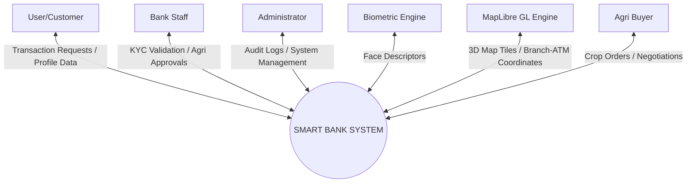
```mermaid
graph TD
 U[User/Customer] <-->|Transaction Requests / Profile Data| SB((SMART BANK SYSTEM))
 S[Bank Staff] <-->|KYC Validation / Agri Approvals| SB
 A[Administrator] <-->|Audit Logs / System Management| SB
 B[Biometric Engine] <-->|Face Descriptors| SB
 M[MapLibre GL Engine] <-->|3D Map Tiles / Branch-ATM Coordinates| SB
 AB[Agri Buyer] <-->|Crop Orders / Negotiations| SB
```

## 3.3 DATA FLOW DIAGRAM (DFD)
I mapped out how exactly the information travels from the user's screen into the backend logic using these custom flowcharts.

## 3.4 RULES REGARDING DFD CONSTRUCTION
1. Every process box needs at least one arrow going in and one going out.
2. Data cannot jump straight from one database to another — it always goes through a process first.
3. Users and staff cannot send data to each other directly — it has to pass through the system.
4. Each process box has its own clear name so you know what it does.

## 3.5 DFD SYMBOLS
* **Process (Circle/Rounded Square)**: Something the system does with the data, like checking a password.
* **Data Store (Open Rectangle)**: Where data is saved, like the Users table in the database.
* **External Entity (Square)**: A person or outside system that sends or receives data, like the customer or staff.
* **Data Flow (Arrow)**: The arrow shows which direction the data moves.

## 3.6 DFD LEVEL 0 FOR SMART BANK
This is the simplest version of the flowchart — it just shows what goes in and what comes out of each part.

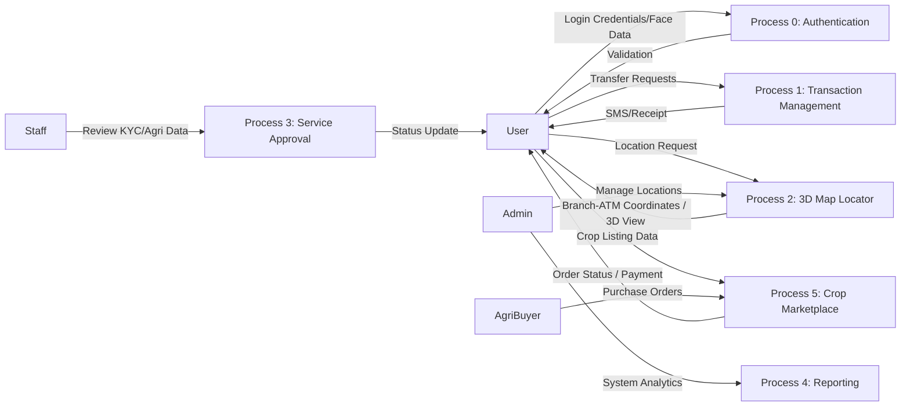
```mermaid
graph LR
 User -->|Login Credentials/Face Data| P1[Process 0: Authentication]
 P1 -->|Validation| User
 User -->|Transfer Requests| P2[Process 1: Transaction Management]
 P2 -->|SMS/Receipt| User
 User -->|Location Request| P5[Process 2: 3D Map Locator]
 P5 -->|Branch-ATM Coordinates / 3D View| User
 User -->|Crop Listing Data| P6[Process 5: Crop Marketplace]
 P6 -->|Order Status / Payment| User
 AgriBuyer -->|Purchase Orders| P6
 Staff -->|Review KYC/Agri Data| P3[Process 3: Service Approval]
 P3 -->|Status Update| User
 Admin -->|System Analytics| P4[Process 4: Reporting]
 Admin -->|Manage Locations| P5
```

## 3.7 DFD LEVEL 1 (ADMIN)
Here I mapped out exactly what the top-level Administrator is allowed to do, like kicking out users or adding new bank branches to the map.

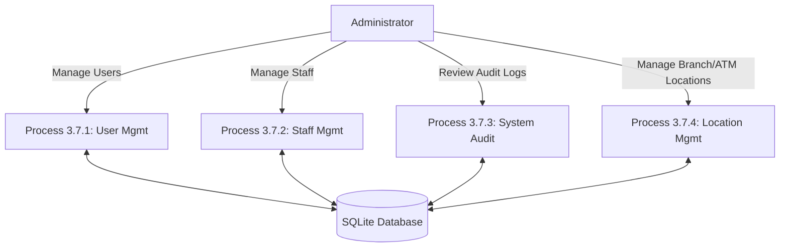
```mermaid
graph TD
 Admin[Administrator] -->|Manage Users| P1[Process 3.7.1: User Mgmt]
 Admin -->|Manage Staff| P2[Process 3.7.2: Staff Mgmt]
 Admin -->|Review Audit Logs| P3[Process 3.7.3: System Audit]
 Admin -->|Manage Branch/ATM Locations| P4[Process 3.7.4: Location Mgmt]
 P1 <--> DB[(SQLite Database)]
 P2 <--> DB
 P3 <--> DB
 P4 <--> DB
```

* **3.7.1 DFD Level 2 (Manage Customers)**: The admin can create new customer profiles, block suspicious ones, or edit account details.
* **3.7.2 DFD Level 2 (Manage Staff)**: The admin handles hiring, assigning roles, and checking staff activity.
* **3.7.3 DFD Level 2 (Manage Service Applications)**: When staff cannot handle a card or loan request, it goes to the admin for final approval.
* **3.7.4 DFD Level 2 (Manage Locations)**: The admin can add new branches or ATMs to the 3D map by entering GPS coordinates and uploading a photo.

## 3.7.10 DFD LEVEL 1 (STAFF)
This chart shows the daily workflow for a bank employee, mostly just approving accounts and looking at farmer loan applications.

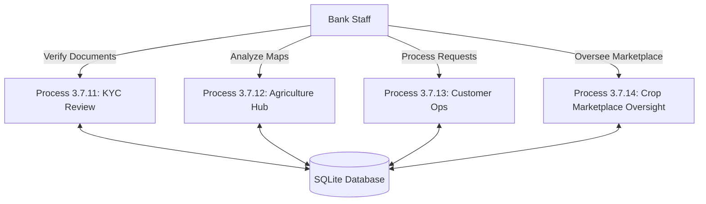
```mermaid
graph TD
 Staff[Bank Staff] -->|Verify Documents| P1[Process 3.7.11: KYC Review]
 Staff -->|Analyze Maps| P2[Process 3.7.12: Agriculture Hub]
 Staff -->|Process Requests| P3[Process 3.7.13: Customer Ops]
 Staff -->|Oversee Marketplace| P4[Process 3.7.14: Crop Marketplace Oversight]
 P1 <--> DB[(SQLite Database)]
 P2 <--> DB
 P3 <--> DB
 P4 <--> DB
```

* **3.7.11 DFD Level 2 (KYC Authentication)**: Staff checks the Aadhaar and PAN uploads and makes sure the face scan matches before approving.
* **3.7.12 DFD Level 2 (Agriculture Hub)**: Staff looks at the satellite map and the farmer's land documents (RTC) to decide if the loan is legit.
* **3.7.13 DFD Level 2 (Customer Jobs)**: Staff goes through the pending list and activates cards or releases loan money one by one.
* **3.7.14 DFD Level 2 (Crop Marketplace Oversight)**: Staff keeps an eye on crop listings, helps if there is a dispute between buyer and farmer, and releases the escrow money.

## 3.7.16 DFD LEVEL 1 (CUSTOMER)
This is the most complex part: it shows everything a normal user can click on once they get past the login screen.

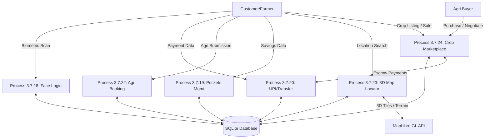
```mermaid
graph TD
 User[Customer/Farmer] -->|Biometric Scan| P1[Process 3.7.18: Face Login]
 User -->|Payment Data| P2[Process 3.7.20: UPI/Transfer]
 User -->|Agri Submission| P3[Process 3.7.22: Agri Booking]
 User -->|Savings Data| P4[Process 3.7.19: Pockets Mgmt]
 User -->|Location Search| P5[Process 3.7.23: 3D Map Locator]
 User -->|Crop Listing / Sale| P6[Process 3.7.24: Crop Marketplace]
 Buyer[Agri Buyer] -->|Purchase / Negotiate| P6
 P1 <--> DB[(SQLite Database)]
 P2 <--> DB
 P3 <--> DB
 P4 <--> DB
 P5 <--> DB
 P6 <--> DB
 P5 <-->|3D Tiles / Terrain| ML[MapLibre GL API]
 P6 <-->|Escrow Payments| P2
```

* **3.7.17 DFD Level 2 (Register)**: New users fill in their details, pick an account type, and their password gets encrypted before saving.
* **3.7.18 DFD Level 2 (Face Login)**: The webcam scans your face and the system compares it with the face data saved during signup.
* **3.7.19 DFD Level 2 (Savings Goals/Pockets)**: Users create a savings goal, add money to it whenever they want, and track the progress bar.
* **3.7.20 DFD Level 2 (UPI/QR Payments)**: Users scan a QR code, enter their UPI PIN, and the fake payment goes through instantly.
* **3.7.21 DFD Level 2 (Statement Generation)**: The system builds a PDF bank statement using ReportLab, filtered by whatever date range the user picks.
* **3.7.22 DFD Level 2 (Agriculture Booking)**: Farmers apply for the special 7.5% farm loan and upload their land documents for staff to check.
* **3.7.23 DFD Level 2 (3D Branch & ATM Locator)**: The 3D map loads terrain tiles from MapLibre and drops pins at every branch and ATM. Users can search by area.
* **3.7.24 DFD Level 2 (Crop Marketplace)**: Farmers list crops, buyers browse and place orders, they can chat about the price, and money is held in escrow until delivery.

## 3.8 ENTITY-RELATIONSHIP DIAGRAM (ERD)

### 3.8.1 ER-Diagram Symbols
* **Rectangle**: Represents a thing we store data about, like Users or Transactions.
* **Ellipse**: A piece of information about that thing, like balance or name.
* **Diamond**: Shows how two things are connected, like a user "owns" an account.
* **Lines**: The lines connecting everything together.

### 3.8.2 ER DIAGRAM FOR SMART BANK
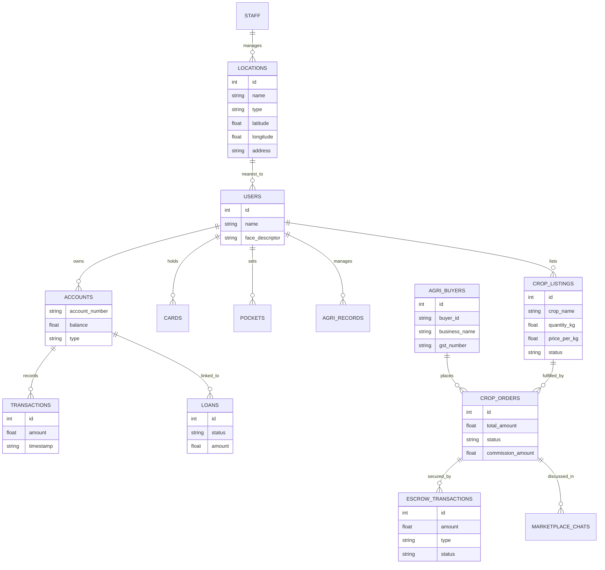
```mermaid
erDiagram
 USERS ||--o{ ACCOUNTS : "owns"
 USERS ||--o{ CARDS : "holds"
 ACCOUNTS ||--o{ TRANSACTIONS : "records"
 ACCOUNTS ||--o{ LOANS : "linked_to"
 USERS ||--o{ POCKETS : "sets"
 USERS ||--o{ AGRI_RECORDS : "manages"
 USERS ||--o{ CROP_LISTINGS : "lists"
 AGRI_BUYERS ||--o{ CROP_ORDERS : "places"
 CROP_LISTINGS ||--o{ CROP_ORDERS : "fulfilled_by"
 CROP_ORDERS ||--o{ ESCROW_TRANSACTIONS : "secured_by"
 CROP_ORDERS ||--o{ MARKETPLACE_CHATS : "discussed_in"
 LOCATIONS ||--o{ USERS : "nearest_to"
 STAFF ||--o{ LOCATIONS : "manages"

 USERS {
 int id
 string name
 string face_descriptor
 }
 ACCOUNTS {
 string account_number
 float balance
 string type
 }
 TRANSACTIONS {
 int id
 float amount
 string timestamp
 }
 LOANS {
 int id
 string status
 float amount
 }
 CROP_LISTINGS {
 int id
 string crop_name
 float quantity_kg
 float price_per_kg
 string status
 }
 CROP_ORDERS {
 int id
 float total_amount
 string status
 float commission_amount
 }
 AGRI_BUYERS {
 int id
 string buyer_id
 string business_name
 string gst_number
 }
 ESCROW_TRANSACTIONS {
 int id
 float amount
 string type
 string status
 }
 LOCATIONS {
 int id
 string name
 string type
 float latitude
 float longitude
 string address
 }
```

## 3.9 SEQUENCE DIAGRAMS
I drew up these sequence diagrams because the face login logic got really confusing. I needed to see exactly when the JavaScript sends the face data to Python and when Python replies.

### 3.9.1 Biometric Authentication Sequence
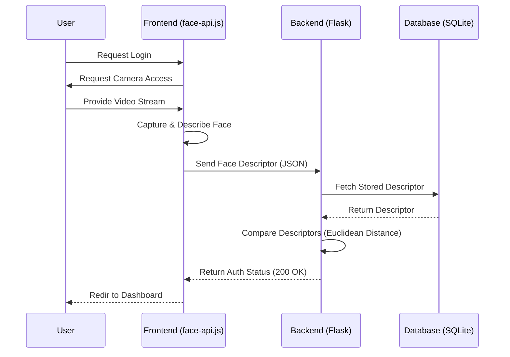
```mermaid
sequenceDiagram
 participant U as User
 participant F as Frontend (face-api.js)
 participant B as Backend (Flask)
 participant DB as Database (SQLite)

 U->>F: Request Login
 F->>U: Request Camera Access
 U->>F: Provide Video Stream
 F->>F: Capture & Describe Face
 F->>B: Send Face Descriptor (JSON)
 B->>DB: Fetch Stored Descriptor
 DB-->>B: Return Descriptor
 B->>B: Compare Descriptors (Euclidean Distance)
 B-->>F: Return Auth Status (200 OK)
 F-->>U: Redir to Dashboard
```

### 3.9.2 UPI Transaction Sequence
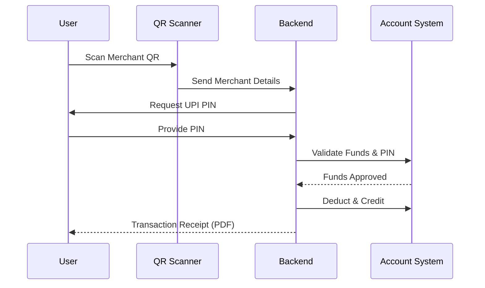
```mermaid
sequenceDiagram
 participant U as User
 participant Q as QR Scanner
 participant B as Backend
 participant AC as Account System

 U->>Q: Scan Merchant QR
 Q->>B: Send Merchant Details
 B->>U: Request UPI PIN
 U->>B: Provide PIN
 B->>AC: Validate Funds & PIN
 AC-->>B: Funds Approved
 B->>AC: Deduct & Credit
 B-->>U: Transaction Receipt (PDF)
```

### 3.9.3 3D Branch & ATM Locator Sequence
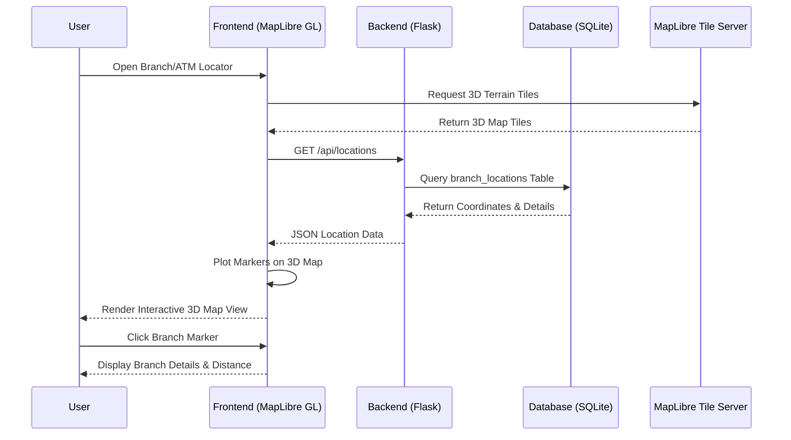
```mermaid
sequenceDiagram
 participant U as User
 participant F as Frontend (MapLibre GL)
 participant B as Backend (Flask)
 participant DB as Database (SQLite)
 participant ML as MapLibre Tile Server

 U->>F: Open Branch/ATM Locator
 F->>ML: Request 3D Terrain Tiles
 ML-->>F: Return 3D Map Tiles
 F->>B: GET /api/locations
 B->>DB: Query branch_locations Table
 DB-->>B: Return Coordinates & Details
 B-->>F: JSON Location Data
 F->>F: Plot Markers on 3D Map
 F-->>U: Render Interactive 3D Map View
 U->>F: Click Branch Marker
 F-->>U: Display Branch Details & Distance
```

### 3.9.4 Crop Marketplace Order Sequence
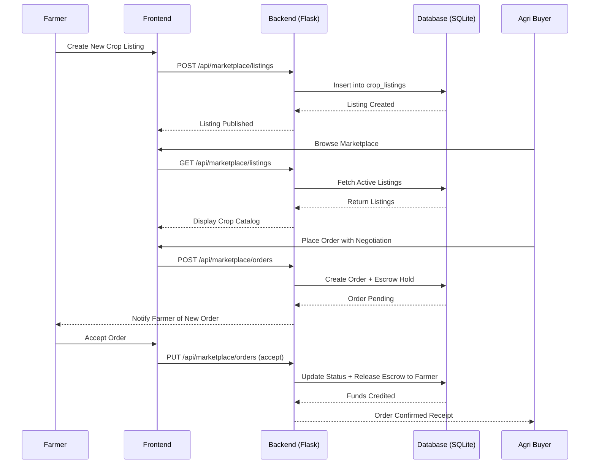
```mermaid
sequenceDiagram
 participant F as Farmer
 participant FE as Frontend
 participant B as Backend (Flask)
 participant DB as Database (SQLite)
 participant BY as Agri Buyer

 F->>FE: Create New Crop Listing
 FE->>B: POST /api/marketplace/listings
 B->>DB: Insert into crop_listings
 DB-->>B: Listing Created
 B-->>FE: Listing Published
 BY->>FE: Browse Marketplace
 FE->>B: GET /api/marketplace/listings
 B->>DB: Fetch Active Listings
 DB-->>B: Return Listings
 B-->>FE: Display Crop Catalog
 BY->>FE: Place Order with Negotiation
 FE->>B: POST /api/marketplace/orders
 B->>DB: Create Order + Escrow Hold
 DB-->>B: Order Pending
 B-->>F: Notify Farmer of New Order
 F->>FE: Accept Order
 FE->>B: PUT /api/marketplace/orders (accept)
 B->>DB: Update Status + Release Escrow to Farmer
 DB-->>B: Funds Credited
 B-->>BY: Order Confirmed Receipt
```

## 3.10 ACTIVITY DIAGRAMS
Some processes were too complicated to keep in my head, especially the crop marketplace escrow flow. So I drew activity diagrams to map out each step before writing the code.

### 3.10.1 Agriculture Loan Workflow
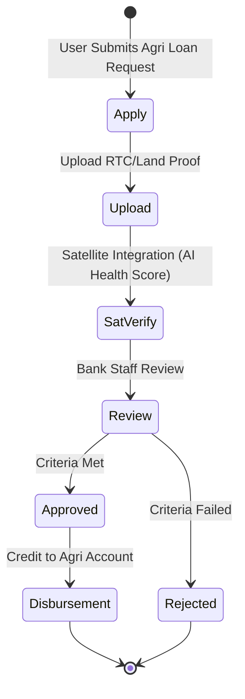
```mermaid
stateDiagram-v2
 [*] --> Apply: User Submits Agri Loan Request
 Apply --> Upload: Upload RTC/Land Proof
 Upload --> SatVerify: Satellite Integration (AI Health Score)
 SatVerify --> Review: Bank Staff Review
 Review --> Approved: Criteria Met
 Review --> Rejected: Criteria Failed
 Approved --> Disbursement: Credit to Agri Account
 Disbursement --> [*]
 Rejected --> [*]
```

### 3.10.2 3D Branch & ATM Locator Workflow
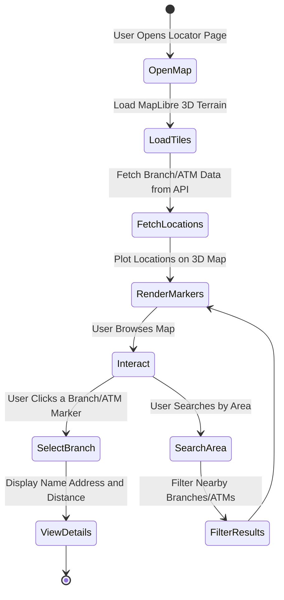
```mermaid
stateDiagram-v2
 [*] --> OpenMap: User Opens Locator Page
 OpenMap --> LoadTiles: Load MapLibre 3D Terrain
 LoadTiles --> FetchLocations: Fetch Branch/ATM Data from API
 FetchLocations --> RenderMarkers: Plot Locations on 3D Map
 RenderMarkers --> Interact: User Browses Map
 Interact --> SelectBranch: User Clicks a Branch/ATM Marker
 SelectBranch --> ViewDetails: Display Name Address and Distance
 Interact --> SearchArea: User Searches by Area
 SearchArea --> FilterResults: Filter Nearby Branches/ATMs
 FilterResults --> RenderMarkers
 ViewDetails --> [*]
```

### 3.10.3 Admin Location Management Workflow
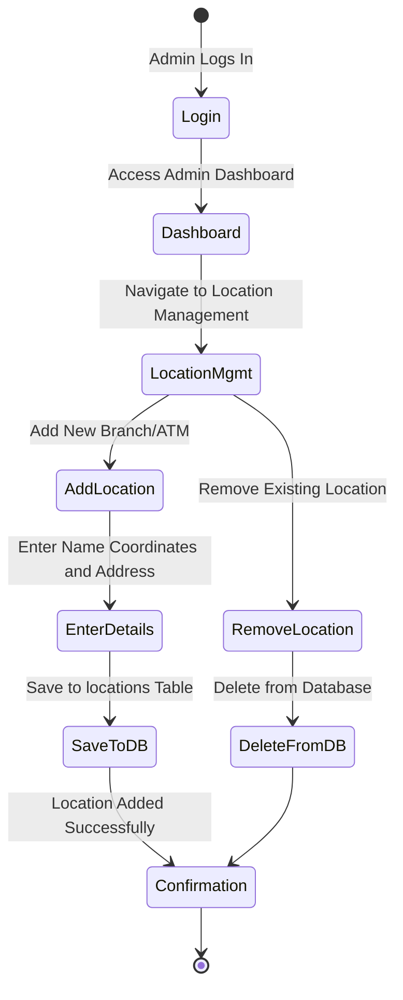
```mermaid
stateDiagram-v2
 [*] --> Login: Admin Logs In
 Login --> Dashboard: Access Admin Dashboard
 Dashboard --> LocationMgmt: Navigate to Location Management
 LocationMgmt --> AddLocation: Add New Branch/ATM
 AddLocation --> EnterDetails: Enter Name Coordinates and Address
 EnterDetails --> SaveToDB: Save to locations Table
 SaveToDB --> Confirmation: Location Added Successfully
 LocationMgmt --> RemoveLocation: Remove Existing Location
 RemoveLocation --> DeleteFromDB: Delete from Database
 DeleteFromDB --> Confirmation
 Confirmation --> [*]
```

### 3.10.4 Crop Marketplace Workflow
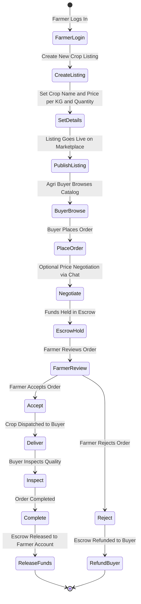
```mermaid
stateDiagram-v2
 [*] --> FarmerLogin: Farmer Logs In
 FarmerLogin --> CreateListing: Create New Crop Listing
 CreateListing --> SetDetails: Set Crop Name and Price per KG and Quantity
 SetDetails --> PublishListing: Listing Goes Live on Marketplace
 PublishListing --> BuyerBrowse: Agri Buyer Browses Catalog
 BuyerBrowse --> PlaceOrder: Buyer Places Order
 PlaceOrder --> Negotiate: Optional Price Negotiation via Chat
 Negotiate --> EscrowHold: Funds Held in Escrow
 EscrowHold --> FarmerReview: Farmer Reviews Order
 FarmerReview --> Accept: Farmer Accepts Order
 FarmerReview --> Reject: Farmer Rejects Order
 Accept --> Deliver: Crop Dispatched to Buyer
 Deliver --> Inspect: Buyer Inspects Quality
 Inspect --> Complete: Order Completed
 Complete --> ReleaseFunds: Escrow Released to Farmer Account
 ReleaseFunds --> [*]
 Reject --> RefundBuyer: Escrow Refunded to Buyer
 RefundBuyer --> [*]
```

---

---

---

---

---

# 4. DATABASE DESIGN
# CHAPTER-4

## 4.1 Introduction
For the database, I just went with SQLite because I didn't want to deal with setting up a heavy MySQL server. Even though it is a single file, I designed the tables very carefully so that money wouldn't randomly duplicate or disappear if the code crashed mid-transfer.

## 4.2 Scope
Below are the actual table structures I wrote. I split everything up logically — one table for users, another for their bank accounts, another for transactions, and so on.

## 4.3 Database Schema Relationship
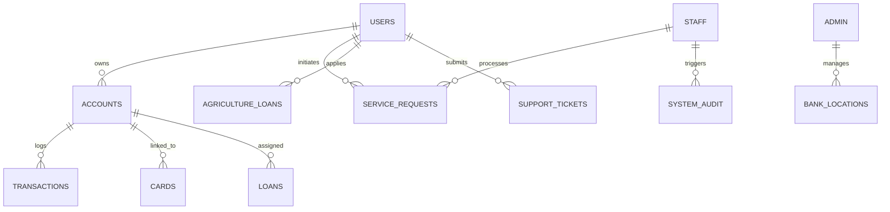
```mermaid
erDiagram
 USERS ||--o{ ACCOUNTS : "owns"
 USERS ||--o{ SERVICE_REQUESTS : "initiates"
 ACCOUNTS ||--o{ TRANSACTIONS : "logs"
 ACCOUNTS ||--o{ CARDS : "linked_to"
 ACCOUNTS ||--o{ LOANS : "assigned"
 USERS ||--o{ AGRICULTURE_LOANS : "applies"
 STAFF ||--o{ SERVICE_REQUESTS : "processes"
 STAFF ||--o{ SYSTEM_AUDIT : "triggers"
 ADMIN ||--o{ BANK_LOCATIONS : "manages"
 USERS ||--o{ SUPPORT_TICKETS : "submits"
```

## 4.4 Table Descriptions

### 4.4.1 Admin Table (`admins`)
**What it stores**: Admin login details and their face scan data for biometric login.

| Field Name | Data Type | Constraints | Description |
|---|---|---|---|
| id | INTEGER | PRIMARY KEY, AUTO | Auto-generated ID for each admin |
| username | VARCHAR(50) | UNIQUE, NOT NULL | The admin's login name |
| password | VARCHAR(255) | NOT NULL | Password stored as a hash |
| level | VARCHAR(50) | DEFAULT 'admin' | What level of access they have |
| face_auth_enabled | INTEGER | DEFAULT 0 | 1 if face login is on, 0 if off |
| face_descriptor | TEXT | — | The 128-point face scan data as text |

### 4.4.2 Staff Table (`staff`)
**What it stores**: Staff member info like their department, salary, and whether they have face login turned on.

| Field Name | Data Type | Constraints | Description |
|---|---|---|---|
| id | INTEGER | PRIMARY KEY | Auto-generated row number |
| staff_id | VARCHAR(50) | UNIQUE, NOT NULL | The staff ID shown on their badge |
| department | VARCHAR(50) | — | Which department they work in |
| status | VARCHAR(20) | DEFAULT 'active' | Whether they are active or not |
| face_auth_enabled | INTEGER | DEFAULT 0 | 1 if face login is turned on |
| base_salary | DECIMAL(15,2)| DEFAULT 50000 | Their base salary per month |

### 4.4.3 Customer Table (`users`)
**What it stores**: All the customer account info — username, email, UPI ID, and mobile passcode.

| Field Name | Data Type | Constraints | Description |
|---|---|---|---|
| id | INTEGER | PRIMARY KEY | Auto-generated row number |
| username | VARCHAR(50) | UNIQUE | What they type to log in |
| email | VARCHAR(100) | UNIQUE, NOT NULL | Used for sending OTP and alerts |
| status | VARCHAR(20) | — | Shows if the account is active, blocked, or waiting for approval |
| upi_id | VARCHAR(50) | UNIQUE | Their personal UPI address |
| mobile_passcode| VARCHAR(255)| — | 4-digit PIN for mobile actions |

### 4.4.4 Services Table (`service_applications`)
**What it stores**: Whenever someone applies for a loan, card, or new account, the request gets saved here.

| Field Name | Data Type | Constraints | Description |
|---|---|---|---|
| id | INTEGER | PRIMARY KEY | Auto-generated request number |
| user_id | INTEGER | FOREIGN KEY | Links to the user who applied |
| service_type | VARCHAR(50) | NOT NULL | What kind of service they want |
| product_name | VARCHAR(100)| — | The exact product they picked |
| amount | DECIMAL(15,2)| — | How much money they asked for |
| status | VARCHAR(20) | DEFAULT 'pending' | Where the request is in the process |

### 4.4.5 Sub-Services Table (`account_requests`)
**What it stores**: The KYC details like Aadhaar number and PAN for people opening new bank accounts.

| Field Name | Data Type | Constraints | Description |
|---|---|---|---|
| id | INTEGER | PRIMARY KEY | ID |
| user_id | INTEGER | FOREIGN KEY | Connects back to the user's profile |
| account_type | VARCHAR(50) | — | The type of account they want |
| aadhaar_number | VARCHAR(20) | — | Their 12-digit Aadhaar number |
| status | VARCHAR(20) | — | Whether their documents passed or not |
| tax_id | VARCHAR(50) | — | Their PAN card or tax ID number |

### 4.4.6 Packages Table (`accounts`)
**What it stores**: Each row is one bank account with its account number, balance, and currency.

| Field Name | Data Type | Constraints | Description |
|---|---|---|---|
| id | INTEGER | PRIMARY KEY | Account ID |
| account_number | VARCHAR(20) | UNIQUE, NOT NULL | The account number starting with SMTB |
| balance | DECIMAL(15,2)| DEFAULT 0.00 | How much money is in the account right now |
| currency | VARCHAR(3) | DEFAULT 'INR' | INR by default |
| ifsc | VARCHAR(20) | — | The IFSC code for the branch |
| updated_at | TIMESTAMP | — | When money last moved in or out |

### 4.4.7 Sub-Packages Table (`cards`)
**What it stores**: Debit and credit card details — card number, CVV, type, credit limit, and status.

| Field Name | Data Type | Constraints | Description |
|---|---|---|---|
| id | INTEGER | PRIMARY KEY | Card ID |
| card_number | VARCHAR(20) | UNIQUE | The 16-digit number on the card |
| card_type | VARCHAR(20) | — | What kind of card it is |
| cvv | VARCHAR(4) | NOT NULL | The 3-digit CVV on the back |
| credit_limit | DECIMAL(15,2)| — | Max amount they can spend |
| status | VARCHAR(20) | — | Whether the card works or not |

### 4.4.8 Interaction/Attendance Table (`attendance`)
**What it stores**: Staff clock-in and clock-out times so the bank knows who worked and for how long.

| Field Name | Data Type | Constraints | Description |
|---|---|---|---|
| id | INTEGER | PRIMARY KEY | Auto-generated row number |
| staff_id | INTEGER | FOREIGN KEY | Links to the staff member |
| date | DATE | — | The date of the shift |
| clock_in | TIMESTAMP | — | When they clocked in |
| clock_out | TIMESTAMP | — | When they clocked out |
| total_hours | DECIMAL(5,2) | — | Total hours worked that day |

### 4.4.9 Payment Table (`transactions`)
**What it stores**: Every single money movement — deposits, withdrawals, transfers — with the amount and the balance after.

| Field Name | Data Type | Constraints | Description |
|---|---|---|---|
| id | INTEGER | PRIMARY KEY | Auto-generated transaction number |
| account_id | INTEGER | FOREIGN KEY | Which account the money came from |
| type | VARCHAR(20) | — | Whether money came in or went out |
| amount | DECIMAL(15,2)| NOT NULL | How much money moved |
| balance_after | DECIMAL(15,2)| — | What the balance was after this transaction |
| mode | VARCHAR(20) | DEFAULT 'NEFT' | How the money was sent |

### 4.4.10 Feedback Table (`support_tickets`)
**What it stores**: Customer support tickets with the subject, message, priority level, and whether staff has replied.

| Field Name | Data Type | Constraints | Description |
|---|---|---|---|
| id | INTEGER | PRIMARY KEY | Auto-generated ticket number |
| user_id | INTEGER | FOREIGN KEY | Which user raised the ticket |
| subject | VARCHAR(200)| — | Short title of the issue |
| message | TEXT | — | The full message they typed |
| priority | VARCHAR(20) | — | How important the ticket is |
| status | VARCHAR(20) | DEFAULT 'pending' | Whether it has been answered or not |

---

# 5. DETAILED DESIGN
# CHAPTER-5

## 5.1 Introduction
When I actually started writing the code, I realized I couldn't just dump everything into one giant file. I broke the app down into separate pieces: one chunk handles the Admin dashboard, another handles the Staff portal, and the biggest chunk handles the Customer view.

## 5.2 Applicable Documents
- The requirements I listed out in Chapter 2 (SRS)
- The flow diagrams and system design from Chapter 3
- The database table designs from Chapter 4

## 5.3 Structure of the Software Package
As mentioned before, the whole thing runs on Python Flask for the backend, serving plain HTML files to the browser.

### 5.3.1 Structure Chart for Admin
The admin panel is basically the god-mode screen. You can add new staff, see exactly how much money is sitting in the entire bank, and update the 3D map.

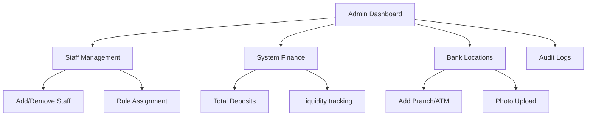
```mermaid
graph TD
 A[Admin Dashboard] --> A1[Staff Management]
 A --> A2[System Finance]
 A --> A3[Bank Locations]
 A --> A4[Audit Logs]
 A1 --> A1a[Add/Remove Staff]
 A1 --> A1b[Role Assignment]
 A2 --> A2a[Total Deposits]
 A2 --> A2b[Liquidity tracking]
 A3 --> A3a[Add Branch/ATM]
 A3 --> A3b[Photo Upload]
```

### 5.3.2 Structure Chart for Staff
The staff screen is basically a to-do list. When a new user signs up, a staff member has to click "approve" here before the user can actually log in.

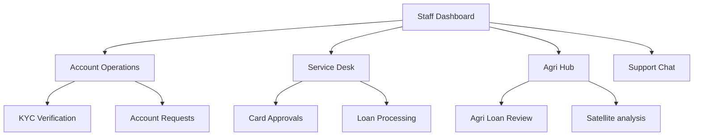
```mermaid
graph TD
 S[Staff Dashboard] --> S1[Account Operations]
 S --> S2[Service Desk]
 S --> S3[Agri Hub]
 S --> S4[Support Chat]
 S1 --> S1a[KYC Verification]
 S1 --> S1b[Account Requests]
 S2 --> S2a[Card Approvals]
 S2 --> S2b[Loan Processing]
 S3 --> S3a[Agri Loan Review]
 S3 --> S3b[Satellite analysis]
```

### 5.3.3 Structure Chart for Customer (User)
This is the main screen that 99% of people will see. It's where you send money, look at your fake credit card, and use the saving pockets.

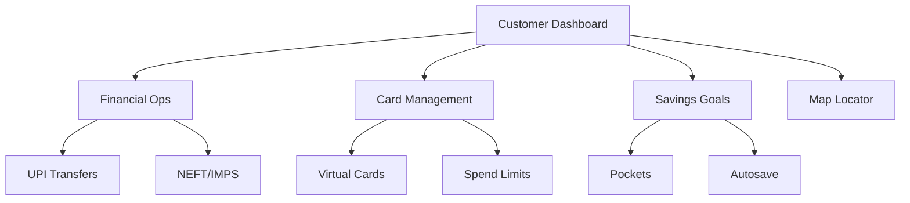
```mermaid
graph TD
 C[Customer Dashboard] --> C1[Financial Ops]
 C --> C2[Card Management]
 C --> C3[Savings Goals]
 C --> C4[Map Locator]
 C1 --> C1a[UPI Transfers]
 C1 --> C1b[NEFT/IMPS]
 C2 --> C2a[Virtual Cards]
 C2 --> C2b[Spend Limits]
 C3 --> C3a[Pockets]
 C3 --> C3b[Autosave]
```

## 5.4 Modular Decomposition of Components

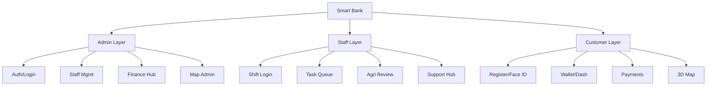
```mermaid
graph TD
 SB[Smart Bank] --> AL[Admin Layer]
 SB --> SL[Staff Layer]
 SB --> CL[Customer Layer]

 AL --> AL1[Auth/Login]
 AL --> AL2[Staff Mgmt]
 AL --> AL3[Finance Hub]
 AL --> AL4[Map Admin]

 SL --> SL1[Shift Login]
 SL --> SL2[Task Queue]
 SL --> SL3[Agri Review]
 SL --> SL4[Support Hub]

 CL --> CL1[Register/Face ID]
 CL --> CL2[Wallet/Dash]
 CL --> CL3[Payments]
 CL --> CL4[3D Map]
```

### 5.4.1 Admin Layer
#### 5.4.1.1 Login & Central Auth
Admins can log in using either their password or face scan to access the admin control panel.

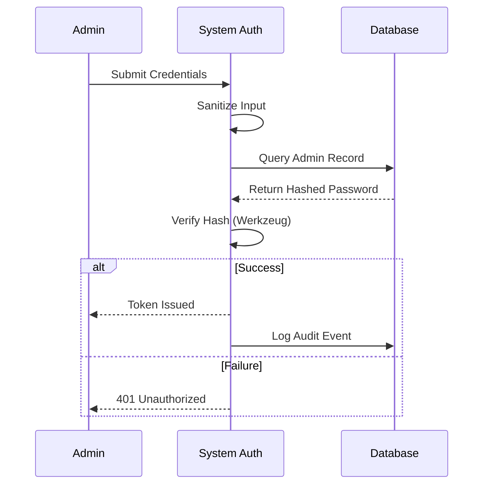
```mermaid
sequenceDiagram
 participant A as Admin
 participant S as System Auth
 participant DB as Database
 A->>S: Submit Credentials
 S->>S: Sanitize Input
 S->>DB: Query Admin Record
 DB-->>S: Return Hashed Password
 S->>S: Verify Hash (Werkzeug)
 ALT Success
 S-->>A: Token Issued
 S->>DB: Log Audit Event
 ELSE Failure
 S-->>A: 401 Unauthorized
 END
```
#### 5.4.1.2 Manage Staff & Workforce
The admin can add new staff members, remove existing ones, and assign them specific roles.
#### 5.4.1.3 Manage Customers
If a customer account shows suspicious activity, the admin can directly block or suspend it from here.
#### 5.4.1.4 Manage General Ledger (System Finance)
This part of the dashboard shows how much total money the bank holds, how much is out in loans, and how much is left.

```mermaid
graph LR
 DB[(Finance Tables)] --> P[Finance Logic]
 P --> UI[Admin UI]
 UI -->|Refresh| P
 P -->|Calculate| R[Reserve Ratio]
 R --> UI
```
#### 5.4.1.5 Manage Branch & ATM Locations (Map)
Admins use this section to add or remove branch and ATM locations on the 3D map, along with uploading photos of each location.
#### 5.4.1.6 Audit Logs
Every important action gets saved here — who logged in, what they changed, and when they did it.

### 5.4.2 Staff Layer
#### 5.4.2.1 Secure Login
Staff members log in with tracked shift timings so the bank knows who was active and when.
#### 5.4.2.2 My Task Desk (Queue Processing)
This is where staff process new account applications, check KYC documents, and approve or reject requests.

```mermaid
sequenceDiagram
 participant S as Staff
 participant Q as Task Queue
 participant DB as Database
 S->>Q: Fetch Pending Tasks
 Q->>DB: GET pending_requests
 DB-->>Q: List of KYC/Account apps
 Q-->>S: Render Task List
 S->>Q: Review Application (ID/Face)
 S->>Q: Approve/Reject
 Q->>DB: UPDATE request_status
 Q->>DB: Send Notification to User
```
#### 5.4.2.3 Manage Card Approvals
Staff can approve new card requests and link them to the right customer account.
#### 5.4.2.4 Manage Agriculture Loans
Staff can look at the farmer's uploaded land papers and the satellite health score before deciding whether to approve or reject the loan.

```mermaid
graph TD
 U[Farmer App] -->|Submit RTC| AH[Agri Hub]
 AH -->|API Call| SAT[Satellite Analytics API]
 SAT -->|Health Score| AH
 AH -->|Consolidated Data| S[Staff Review]
 S -->|Approve| AH
 AH -->|Credit Funds| DB[(Agri Repo)]
```
#### 5.4.2.5 Manage Customer Support
Staff can view and respond to customer support tickets, and send notifications for important updates.

### 5.4.3 Customer (User) Layer
#### 5.4.3.1 User Registration & Login
New users sign up by filling in their details and registering their face for biometric login.

```mermaid
sequenceDiagram
 participant U as User
 participant FB as face-api.js
 participant API as Backend API
 U->>FB: Open Camera
 FB->>FB: Detect Landmarks
 FB->>API: Send Match Request (Descriptor)
 API->>API: Euclidean Comparison
 ALT Distance < 0.6
 API-->>U: Success/Dashboard
 ELSE Bad Match
 API-->>U: Error/Retry
 END
```
#### 5.4.3.2 Financial Dashboard
The main dashboard where customers see their balance (with a hide/show toggle), recent transactions, and spending charts.
#### 5.4.3.3 Funds Transfer (NEFT/UPI)
Customers can send money to other accounts via NEFT or UPI, and save frequent recipients as beneficiaries.
#### 5.4.3.4 Physical/Virtual Cards
Users can view their cards, request upgrades, and quickly block a card if it gets lost or stolen.
#### 5.4.3.5 Savings Goals (Pockets)
Pockets let users set aside money for specific goals like a vacation or new phone, with a progress bar showing how close they are.
#### 5.4.3.6 Location Finder Map
Customers can open a 3D map to find the nearest Smart Bank branches and ATMs, with directions and distance shown.

```mermaid
sequenceDiagram
 participant U as User
 participant M as 3D Map (MapLibre)
 participant API as Backend
 U->>M: Open Locator
 M->>API: GET /locations
 API-->>M: JSON (Lat/Lng, Photo_URL)
 M->>U: Render Markers
 U->>M: Click Marker
 M->>M: Display Popup (with Photo)
```

---

# 6. CODING
# CHAPTER-6

## 6.1 Introduction

Once I had the design mapped out, I jumped straight into coding. I kept things modular for Smart Bank — each feature lives in its own section so I can fix or update one part without breaking another. The whole frontend runs as a **Single Page Application (SPA)** and it talks to a **Python Flask** backend through API calls.

## 6.2 FRONTEND — Landing Page (`index.html`)

For the landing page, I went with a dark hero section that has a 3D credit card built entirely in CSS, some floating glow orbs in the background, and an animated grid showing the main features.

```html
<!DOCTYPE html>
<html lang="en">
<head>
 <meta charset="UTF-8">
 <meta name="viewport" content="width=device-width, initial-scale=1.0">
 <title>SmartBank | Online Banking</title>
 <link href="https://fonts.googleapis.com/css2?family=Montserrat:wght@400;600;800;900&family=Outfit:wght@400;700;900&family=Inter:wght@400;500;600&display=swap" rel="stylesheet">
 <link rel="stylesheet" href="https://cdnjs.cloudflare.com/ajax/libs/font-awesome/6.4.0/css/all.min.css">
 <link rel="stylesheet" href="css/landing.css">
 <script src="js/device-detector.js" data-auto-redirect></script>
</head>
<body>
 <!-- Navigation Bar -->
 <nav class="navbar">
 <a href="#home" class="logo"><span class="logo-text">SMART BANKING</span></a>
 <div class="nav-links">
 <a href="#home" class="active">Home</a>
 <a href="user.html">User Login</a>
 <a href="agri-buyer-login.html">Retail Agri</a>
 <a href="staff.html">Staff/Admin</a>
 <a href="#about">About</a>
 </div>
 </nav>

 <!-- Hero Section with 3D Credit Card -->
 <main class="hero" id="home">
 <div class="hero-content">
 <div class="bg-shape-square"></div>
 <div class="bg-shape-rect"></div>
 <h1 class="hero-title">ELITE <span>BANKING</span></h1>
 <p class="hero-desc">Experience secure, fast, and modern banking. Access your accounts, transfer funds instantly, and unlock premium benefits today.</p>
 <div class="hero-buttons">
 <a href="user.html" class="btn btn-primary">join now</a>
 <a href="#" class="btn btn-secondary">read more</a>
 </div>
 </div>
 <!-- Premium 3D Credit Card Illustration -->
 <div class="hero-illustration">
 <div class="glow-orb orb-1"></div>
 <div class="glow-orb orb-2"></div>
 <div class="card-container">
 <div class="premium-card">
 <div class="card-chip"></div>
 <div class="card-wave"><i class="fas fa-wifi" style="transform:rotate(90deg);"></i></div>
 <div class="card-logo">SMART<span>BANKING</span></div>
 <div class="card-number">
 <span>****</span> <span>****</span> <span>****</span> <span>8842</span>
 </div>
 <div class="card-footer">
 <div class="card-holder"><span class="label">Card Holder</span><span class="value">ELITE MEMBER</span></div>
 <div class="card-expires"><span class="label">Expires</span><span class="value">12/28</span></div>
 <div class="card-brand"><div class="circle-overlap"><div class="red-circle"></div><div class="gold-circle"></div></div></div>
 </div>
 </div>
 </div>
 <div class="floating-element float-1"><i class="fas fa-gem"></i></div>
 <div class="floating-element float-2"><i class="fas fa-chart-line"></i></div>
 </div>
 </main>

 <!-- About Section — Feature Grid -->
 <section id="about" class="about-section">
 <div class="about-container">
 <div class="about-header">
 <h2 class="section-title">WHY CHOOSE <span>SMART BANKING?</span></h2>
 <p class="section-subtitle">A heritage of security, a future of refinement.</p>
 </div>
 <div class="features-grid">
 <div class="feature-card"><span class="feature-number">01</span><h3>Elite Security</h3><p>Advanced biometric authentication and real-time fraud monitoring.</p></div>
 <div class="feature-card"><span class="feature-number">02</span><h3>Instant Transfers</h3><p>Move funds globally in seconds with high-speed architecture.</p></div>
 <div class="feature-card"><span class="feature-number">03</span><h3>Premium Benefits</h3><p>Exclusive access to high-yield accounts and premium cards.</p></div>
 </div>
 </div>
 </section>
 <div class="bottom-bar"></div>
</body>
</html>
```

---

## 6.3 FRONTEND — User Login Page (`user.html`)

I split the login page into two halves — the left side has the frosted glass login form with the Face Login button, and the right side shows an isometric bank illustration I built with pure CSS.

```html
<!DOCTYPE html>
<html lang="en">
<head>
 <meta charset="UTF-8">
 <meta name="viewport" content="width=device-width, initial-scale=1.0">
 <title>Smart Bank - User Login</title>
 <link rel="stylesheet" href="css/premium-ui.css">
 <link rel="stylesheet" href="css/modern-auth.css">
 <link rel="stylesheet" href="css/face-auth-fixed.css">
 <link rel="stylesheet" href="https://cdnjs.cloudflare.com/ajax/libs/font-awesome/6.4.0/css/all.min.css">
 <script src="js/device-detector.js" data-auto-redirect></script>
</head>
<body>
 <div class="auth-layout">
 <a href="index.html" class="home-btn"><i class="fas fa-arrow-left"></i> Home</a>
 <!-- Left Side - Login Form -->
 <div class="auth-left">
 <div class="auth-card">
 <!-- Tabbed Navigation -->
 <div class="auth-tabs">
 <a href="user.html" class="auth-tab active">Sign In</a>
 <a href="signup.html" class="auth-tab">Sign Up</a>
 <a href="forgot-password.html" class="auth-tab">Recovery</a>
 </div>
 <div class="form-container">
 <div class="logo-section">
 <div class="logo-icon">
 <i class="fas fa-landmark"></i>
 <span>SMART</span> <span style="color:#8E2020;">BANKING</span>
 </div>
 <h2 class="page-title">Smart Bank Login</h2>
 </div>
 <!-- Login Form -->
 <form id="loginForm" class="form-section active-form">
 <div class="form-group">
 <label for="email">Login / Username</label>
 <div class="input-wrapper">
 <i class="fas fa-user input-icon"></i>
 <input type="text" id="email" placeholder="Enter your username" required>
 </div>
 </div>
 <div class="form-group">
 <label for="password">Password</label>
 <div class="input-wrapper">
 <i class="fas fa-lock input-icon"></i>
 <input type="password" id="password" placeholder="••••••••••" required>
 <i class="fas fa-eye toggle-password" onclick="togglePassword('password')"></i>
 </div>
 </div>
 <div class="form-options">
 <label class="checkbox-container"><input type="checkbox" id="rememberMe"><span class="checkbox-label">Remember me</span></label>
 </div>
 <button type="submit" class="btn-primary">Sign In</button>
 <div class="divider"><span>OR</span></div>
 <!-- Biometric Face Login Button -->
 <button type="button" class="btn-face-login" onclick="testFaceLogin('user')">
 <span class="face-icon-box"><div class="user-icon-simple"></div></span>
 <span class="btn-text">Secure Face Login</span>
 </button>
 </form>
 <div class="additional-links">
 <a href="staff.html" class="link-secondary"><i class="fas fa-user-tie"></i> Staff Portal</a>
 </div>
 </div>
 </div>
 <div class="copyright"><i class="far fa-copyright"></i><span>2026 Smart Bank Corporation</span></div>
 </div>
 <!-- Right Side - Isometric Illustration -->
 <div class="auth-right">
 <div class="branding-content">
 <h1 class="branding-title">Welcome to the Smart Bank<br><span>Smart Banking</span></h1>
 <div class="iso-illustration">
 <div class="iso-grid"></div>
 <div class="iso-stand">
 <div class="iso-logo">SMART <span style="color:#8E2020;">BANKING</span></div>
 <div class="iso-profile"><i class="far fa-user"></i></div>
 <div class="iso-login-dots"></div>
 <div class="iso-btn"><i class="fas fa-arrow-right"></i></div>
 </div>
 <div class="iso-shield"><i class="fas fa-lock"></i></div>
 </div>
 </div>
 </div>
 <div class="toast" id="toast"></div>
 </div>
 <!-- Scripts -->
 <script src="js/auth-helper.js"></script>
 <script src="js/api-config.js"></script>
 <script src="js/user-auth.js"></script>
 <script src="js/face-auth-fixed.js"></script>
</body>
</html>
```

---

## 6.4 FRONTEND — User Registration Page (`signup.html`)

The signup form has five input fields with live validation that checks your input as you type. After you submit, an OTP popup appears for email verification, and there is a terms checkbox at the bottom.

```html
<form id="signupForm" class="form-section active-form">
 <div class="form-group">
 <label for="signupName">Full Name</label>
 <div class="input-wrapper">
 <i class="fas fa-user input-icon"></i>
 <input type="text" id="signupName" placeholder="John Doe" required>
 </div>
 </div>
 <div class="form-group">
 <label for="signupUsername">Username</label>
 <div class="input-wrapper">
 <i class="fas fa-at input-icon"></i>
 <input type="text" id="signupUsername" placeholder="johndoe123" required>
 </div>
 </div>
 <div class="form-group">
 <label for="signupEmail">Email Address</label>
 <div class="input-wrapper">
 <i class="fas fa-envelope input-icon"></i>
 <input type="email" id="signupEmail" placeholder="john@example.com" required>
 </div>
 </div>
 <div class="form-group">
 <label for="signupPassword">Password</label>
 <div class="input-wrapper">
 <i class="fas fa-lock input-icon"></i>
 <input type="password" id="signupPassword" placeholder="••••••••••" required>
 </div>
 </div>
 <div class="form-group">
 <label for="signupConfirmPassword">Confirm Password</label>
 <div class="input-wrapper">
 <i class="fas fa-shield-alt input-icon"></i>
 <input type="password" id="signupConfirmPassword" placeholder="••••••••••" required>
 </div>
 </div>
 <div class="form-options">
 <label class="checkbox-container">
 <input type="checkbox" id="agreeTerms" required>
 <span class="checkbox-label">I agree to terms and conditions</span>
 </label>
 </div>
 <button type="submit" class="btn-primary">Create Account</button>
</form>

<!-- OTP Verification Modal -->
<div id="otpModal" class="modal">
 <div class="modal-content auth-card otp-glass">
 <div class="modal-header">
 <div class="otp-icon-lpc"><i class="fas fa-shield-halved"></i></div>
 <h2 class="auth-title">Verify Account</h2>
 <p class="auth-subtitle">A verification code has been sent to your email.</p>
 </div>
 <form id="otpForm" class="otp-form-premium">
 <input type="hidden" id="otpUsername">
 <div class="otp-input-container">
 <input type="text" id="otpInput" class="otp-field-main" placeholder="------" maxlength="6" required autofocus>
 <div class="otp-input-underline"></div>
 </div>
 <button type="submit" class="btn-primary btn-glossy" id="verifyBtn">
 <span>CONFIRM & ACTIVATE</span> <i class="fas fa-arrow-right"></i>
 </button>
 <div class="otp-footer">
 <span>Didn't receive the code?</span>
 <a href="#" id="resendOtp" class="resend-link">Resend Code</a>
 </div>
 </form>
 </div>
</div>
```

---

## 6.5 FRONTEND — Forgot Password Page (`forgot-password.html`)

I added a pill-shaped toggle at the top that lets you switch between recovering your password or your username, with a smooth sliding animation between the two modes.

```html
<!-- Recovery Mode Switcher (Animated Pill) -->
<div class="recovery-switcher-wrapper">
 <div class="recovery-slider"></div>
 <button type="button" id="switchPassword" class="switcher-btn active">Password</button>
 <button type="button" id="switchUsername" class="switcher-btn">Username</button>
</div>

<!-- Recovery Form -->
<form id="forgotPasswordForm" class="form-section active-form">
 <div class="form-group">
 <label for="email">Login / Email</label>
 <div class="input-wrapper">
 <i class="fas fa-envelope input-icon"></i>
 <input type="email" id="email" placeholder="Enter your email" required>
 </div>
 </div>
 <button type="submit" class="btn-primary" id="submitBtn">
 <span id="submitText">Recover Password</span>
 </button>
</form>

<script>
 // Toggle Mode with Animated Slider
 document.getElementById('switchUsername').addEventListener('click', () => {
 currentMode = 'username';
 document.getElementById('pageTitle').textContent = 'Username recovery';
 document.getElementById('submitText').textContent = 'Recover Username';
 slider.style.transform = 'translateX(100%)';
 });
</script>
```

---

## 6.6 FRONTEND — Reset Password Page (`reset-password.html`)

This page goes through multiple states — first a spinner shows while it verifies your reset token, then your name and email appear, then the password form slides in, and finally a success animation plays when you finish.

```html
<!-- Token Verification Loader -->
<div id="verificationLoader" class="reset-loader-state">
 <div class="reset-spinner-ring"><div class="reset-spinner-inner"></div></div>
 <p class="reset-loader-text">Verifying your reset link…</p>
</div>

<!-- Dynamic User Identity Banner -->
<div id="userInfoBanner" class="reset-identity-banner" style="display:none;">
 <div class="reset-identity-icon"><i class="fas fa-user-check"></i></div>
 <div class="reset-identity-info">
 <strong id="displayUsername">Loading...</strong>
 <span id="displayEmail">Please wait...</span>
 </div>
 <div class="reset-identity-badge"><i class="fas fa-shield-alt"></i> Verified</div>
</div>

<!-- Password Reset Form with Strength Meter -->
<form id="resetPasswordForm" style="display:none;">
 <div class="form-group">
 <label for="password">New Password</label>
 <div class="input-wrapper">
 <i class="fas fa-lock input-icon"></i>
 <input type="password" id="password" placeholder="Enter new password" required>
 <i class="fas fa-eye toggle-password" onclick="togglePassword('password')"></i>
 </div>
 </div>
 <!-- Live Password Strength Meter -->
 <div class="reset-strength-container">
 <div class="reset-strength-bar"><div class="reset-strength-fill" id="strengthFill"></div></div>
 <span class="reset-strength-label" id="strengthLabel">Enter a password</span>
 </div>
 <!-- Requirements Checklist -->
 <div class="reset-requirements">
 <div class="reset-req-item" id="reqLength"><i class="fas fa-circle"></i><span>At least 6 characters</span></div>
 <div class="reset-req-item" id="reqUppercase"><i class="fas fa-circle"></i><span>One uppercase letter</span></div>
 <div class="reset-req-item" id="reqNumber"><i class="fas fa-circle"></i><span>One number</span></div>
 </div>
 <button type="submit" class="btn-primary">Reset Password</button>
</form>

<!-- Success State with Progress Animation -->
<div id="successState" style="display:none;">
 <div class="reset-success-state">
 <div class="reset-success-icon"><i class="fas fa-check-circle"></i></div>
 <h3>Password Updated!</h3>
 <p>Redirecting to login…</p>
 <div class="reset-success-progress"><div class="reset-success-bar"></div></div>
 </div>
</div>
```

---

## 6.7 FRONTEND — Staff & Admin Login (`staff.html`)

The staff and admin share the same login page. Two tabs at the top let you switch between the Staff form and Admin form. Both have the Face Login option built in.

```html
<div class="auth-card">
 <!-- Role Toggle Tabs -->
 <div class="auth-tabs">
 <button type="button" class="auth-tab active" onclick="selectRole('staff')" id="staffRoleBtn">Staff Login</button>
 <button type="button" class="auth-tab" onclick="selectRole('admin')" id="adminRoleBtn">Admin Login</button>
 </div>
 <div class="form-container">
 <div class="logo-section">
 <div class="logo-icon"><i class="fas fa-university"></i> SMART <span style="color:#8E2020;">BANKING</span></div>
 <h2 class="page-title">Management Portal</h2>
 </div>
 <!-- Staff Login Form -->
 <form id="staffForm" class="form-section active-form">
 <div class="form-group">
 <label for="staffId">Staff ID</label>
 <div class="input-wrapper"><i class="fas fa-id-badge input-icon"></i>
 <input type="text" id="staffId" placeholder="Enter your staff ID" required></div>
 </div>
 <div class="form-group">
 <label for="staffPassword">Password</label>
 <div class="input-wrapper"><i class="fas fa-lock input-icon"></i>
 <input type="password" id="staffPassword" placeholder="••••••••••" required></div>
 </div>
 <button type="submit" class="btn-primary">Sign In as Staff</button>
 <button type="button" onclick="faceAuthManager.openLoginModal('staff')" class="btn-face-login">
 <span class="face-icon-box"><div class="user-icon-simple"></div></span>
 <span class="btn-text">Secure Face Login</span>
 </button>
 </form>
 <!-- Admin Login Form (Hidden by default) -->
 <form id="adminForm" class="form-section" style="display:none;">
 <div class="form-group">
 <label for="adminUsername">Admin Username</label>
 <div class="input-wrapper"><i class="fas fa-user-shield input-icon"></i>
 <input type="text" id="adminUsername" placeholder="Enter admin username" required></div>
 </div>
 <div class="form-group">
 <label for="adminPassword">Password</label>
 <div class="input-wrapper"><i class="fas fa-lock input-icon"></i>
 <input type="password" id="adminPassword" placeholder="••••••••••" required></div>
 </div>
 <button type="submit" class="btn-primary">Sign In as Admin</button>
 <button type="button" onclick="faceAuthManager.openLoginModal('admin')" class="btn-face-login">
 <span class="face-icon-box"><div class="user-icon-simple"></div></span>
 <span class="btn-text">Secure Face Login</span>
 </button>
 </form>
 </div>
</div>

<script>
 // Role selection logic — toggles form visibility
 function selectRole(role) {
 const staffBtn = document.getElementById('staffRoleBtn');
 const adminBtn = document.getElementById('adminRoleBtn');
 const staffForm = document.getElementById('staffForm');
 const adminForm = document.getElementById('adminForm');
 if (role === 'staff') {
 staffBtn.classList.add('active'); adminBtn.classList.remove('active');
 staffForm.style.display = 'block'; adminForm.style.display = 'none';
 } else {
 adminBtn.classList.add('active'); staffBtn.classList.remove('active');
 adminForm.style.display = 'block'; staffForm.style.display = 'none';
 }
 }
</script>
```

---

## 6.8 FRONTEND — Mobile Login (`mobile-auth.html`)

The mobile login is built like a Progressive Web App. If you have logged in before, it remembers your name and shows a Welcome Back section. You can also use a 4-digit passcode, scan a QR code, or use face login.

```html
<head>
 <meta name="viewport" content="width=device-width, initial-scale=1.0, maximum-scale=1.0, user-scalable=no, viewport-fit=cover">
 <meta name="apple-mobile-web-app-capable" content="yes">
 <meta name="theme-color" content="#1a0000">
 <link rel="manifest" href="manifest.json">
 <link rel="stylesheet" href="css/mobile.css">
 <link rel="stylesheet" href="css/mobile-modern.css">
</head>
<body>
 <div class="mobile-wrapper">
 <div class="auth-container-modern page-content active">
 <!-- Animated Logo -->
 <div class="auth-logo-modern"><i class="fas fa-landmark"></i></div>
 <!-- Welcome Back (Hydrated from localStorage) -->
 <div id="welcomeBackSection" class="welcome-back-modern">
 <div class="avatar-container">
 
 <div id="cachedInitials" class="initials-avatar" style="display:none;"></div>
 </div>
 <h2 id="cachedName" class="wb-name"></h2>
 <p class="wb-sub">Sign in to your secure account</p>
 <button onclick="clearCachedUser()" class="wb-switch">
 <i class="fas fa-exchange-alt"></i> Not you? Switch account
 </button>
 </div>
 <h1 class="auth-title-modern">Welcome<span class="dot-accent">.</span></h1>
 <!-- Login Form -->
 <form id="mobileLoginForm" onsubmit="handleLogin(event)">
 <div class="form-group-modern">
 <label class="form-label-modern" for="username">Username / Customer ID</label>
 <input type="text" id="username" class="form-input-modern" placeholder="Enter username" required>
 </div>
 <div class="form-group-modern">
 <label class="form-label-modern" for="password">Password</label>
 <div class="password-wrapper-modern">
 <input type="password" id="password" class="form-input-modern" placeholder="••••••••" required>
 <i class="fas fa-eye-slash password-toggle-modern" id="togglePassword"></i>
 </div>
 </div>
 <button type="submit" class="btn-login-modern" id="loginBtn">
 <span class="btn-text"><i class="fas fa-lock"></i> Login Securely</span>
 </button>
 </form>
 <!-- Quick Passcode Login -->
 <div id="passcodeLoginSection" style="display:none;">
 <input type="password" id="passcode" class="form-input-modern" maxlength="4" placeholder="••••"
 style="text-align:center; letter-spacing:12px; font-size:28px;">
 <button onclick="handlePasscodeLogin()" class="btn-login-modern">
 <i class="fas fa-key"></i> Login with Passcode
 </button>
 </div>
 <div class="auth-divider"><span>or continue with</span></div>
 <!-- Face Login Button -->
 <button onclick="testFaceLogin('user')" type="button" class="btn-face-modern">
 <div class="btn-badge-inline"><i class="fas fa-shield-halved"></i> SECURE</div>
 <div class="user-icon-simple"></div>
 <span>Face Login</span>
 </button>
 <div class="auth-links-modern">
 <a href="mobile-forgot-password.html">Reset Password</a>
 <a href="mobile-signup.html" class="gold-link">Create Account</a>
 </div>
 <!-- Security & RBI Badges -->
 <div class="security-badge"><i class="fas fa-shield-alt"></i><span>256-bit SSL Encrypted • RBI Licensed</span></div>
 <div class="rbi-badge"><i class="fas fa-university"></i><span>REGULATED BY RESERVE BANK OF INDIA</span></div>
 </div>
 <!-- Bottom Navigation -->
 <nav class="bottom-nav-modern">
 <a href="#" class="nav-item-modern"><i class="fas fa-th-large"></i><span class="nav-label">Services</span></a>
 <a href="#" class="nav-item-modern"><i class="fas fa-percent"></i><span class="nav-label">Offers</span></a>
 <div class="nav-center-modern">
 <div class="nav-center-btn-modern" onclick="openQrScanner()">
 <i class="fas fa-qrcode"></i><span class="nav-label">Scan & Pay</span>
 </div>
 </div>
 <a href="#" class="nav-item-modern"><i class="fas fa-headset"></i><span class="nav-label">Help</span></a>
 <a href="#" class="nav-item-modern active"><i class="fas fa-sign-in-alt"></i><span class="nav-label">Login</span></a>
 </nav>
 </div>
 <script src="js/face-auth-fixed.js"></script>
 <script src="js/mobile-logic.js"></script>
</body>
```

---

## 6.9 FRONTEND — Mobile Signup (`mobile-signup.html`)

The mobile signup is designed for smaller screens. After you fill in your details, a popup appears with six separate input boxes for the OTP — each box takes one digit and the cursor jumps to the next one automatically.

```html
<form id="mobileSignupForm" onsubmit="handleMobileSignup(event)">
 <div class="form-group-modern"><label class="form-label-modern">Full Name</label>
 <input type="text" id="signupName" class="form-input-modern" placeholder="e.g. Salman Shad" required></div>
 <div class="form-group-modern"><label class="form-label-modern">Email Address</label>
 <input type="email" id="signupEmail" class="form-input-modern" placeholder="name@example.com" required></div>
 <div class="form-group-modern"><label class="form-label-modern">Username</label>
 <input type="text" id="signupUsername" class="form-input-modern" placeholder="Choose a username" required></div>
 <div class="form-group-modern"><label class="form-label-modern">Password</label>
 <input type="password" id="signupPassword" class="form-input-modern" placeholder="••••••••" required></div>
 <div class="form-group-modern"><label class="form-label-modern">Confirm Password</label>
 <input type="password" id="signupConfirmPassword" class="form-input-modern" placeholder="••••••••" required></div>
 <div class="form-group-modern">
 <input type="checkbox" id="agreeTerms" required>
 <label for="agreeTerms">I agree to the <a href="#">Terms & Conditions</a></label>
 </div>
 <button type="submit" class="btn-login-modern"><i class="fas fa-rocket"></i> Create Account</button>
</form>

<!-- Mobile OTP Verification Modal -->
<div id="otpModal" class="modal-overlay" style="display:none;">
 <div class="modal-content">
 <div style="width:80px;height:80px;background:linear-gradient(145deg,#5a0000,#3a0000);border-radius:50%;display:flex;align-items:center;justify-content:center;margin:-80px auto 25px;">
 <i class="fas fa-shield-alt" style="color:#d4af37;font-size:32px;"></i>
 </div>
 <h2>Verify Account</h2>
 <p>A verification code has been sent to your email.</p>
 <div class="otp-inputs" style="display:flex;gap:8px;justify-content:center;">
 <input type="text" maxlength="1" class="otp-field" id="otp_1" onkeyup="moveOtpFocus(this,'otp_2')">
 <input type="text" maxlength="1" class="otp-field" id="otp_2" onkeyup="moveOtpFocus(this,'otp_3')">
 <input type="text" maxlength="1" class="otp-field" id="otp_3" onkeyup="moveOtpFocus(this,'otp_4')">
 <div style="width:2px;height:30px;background:var(--accent-gold);margin-top:12px;"></div>
 <input type="text" maxlength="1" class="otp-field" id="otp_4" onkeyup="moveOtpFocus(this,'otp_5')">
 <input type="text" maxlength="1" class="otp-field" id="otp_5" onkeyup="moveOtpFocus(this,'otp_6')">
 <input type="text" maxlength="1" class="otp-field" id="otp_6">
 </div>
 <button onclick="handleMobileVerifyOtp()" class="btn-login-modern">CONFIRM & ACTIVATE <i class="fas fa-arrow-right"></i></button>
 </div>
</div>
```

---

## 6.10 Frontend — User Dashboard SPA (`userdash.js`)

```javascript
'use strict';
window.API = window.SMART_BANK_API_BASE || '/api';

const state = {
 user: null, accounts: [], transactions: [], cards: [],
 loans: [], cardRequests: [], notifications: [],
 currentPage: 'dashboard', upiStatus: null
};

const init = async () => {
 const ok = await checkAuth();
 if (!ok) { window.location.href = 'user.html'; return; }
 await loadAll();
 initNav();
 startAutoRefresh();
};

async function loadAll() {
 const r = await fetch(`${API}/user/dashboard`, { credentials: 'include' });
 if (r.ok) {
 const d = await r.json();
 state.accounts = d.accounts || [];
 state.transactions = d.transactions || [];
 state.cards = d.cards || [];
 state.loans = d.loans || [];
 state.notifications = d.notifications || [];
 renderAll();
 }
}
```

---

## 6.11 FRONTEND — Staff Dashboard (`staffdash.html`)

The staff dashboard is a massive page — about 2369 lines of HTML. It handles everything a bank employee needs: managing customers, handling cash deposits and withdrawals, approving KYC documents, tracking attendance, generating reports, and viewing the live map.

```html
<aside class="sidebar">
 <nav class="nav-menu">
 <a href="#" class="nav-item active" data-page="dashboard"><i class="fas fa-chart-line"></i><span>Dashboard</span></a>
 <a href="#" class="nav-item" data-page="customers"><i class="fas fa-users"></i><span>Customers</span></a>
 <a href="#" class="nav-item" data-page="accounts"><i class="fas fa-university"></i><span>Accounts</span></a>
 <a href="#" class="nav-item" data-page="approvals"><i class="fas fa-check-circle"></i><span>KYC Approvals</span>
 <span class="badge" id="pendingApprovalsBadge">0</span></a>
 <a href="#" class="nav-item" data-page="transactions"><i class="fas fa-exchange-alt"></i><span>Transactions</span></a>
 <a href="#" class="nav-item" data-page="attendance"><i class="fas fa-clock"></i><span>Attendance</span></a>
 <a href="#" class="nav-item" data-page="loans"><i class="fas fa-hand-holding-usd"></i><span>Loan Requests</span>
 <span class="badge" id="loanBadge">0</span></a>
 <a href="#" class="nav-item" data-page="liquidity"><i class="fas fa-piggy-bank"></i><span>Loan Liquidity Fund</span></a>
 <a href="#" class="nav-item" data-page="cards"><i class="fas fa-credit-card"></i><span>Card Requests</span>
 <span class="badge" id="pendingCardsCount">0</span></a>
 <a href="#" class="nav-item" data-page="reports"><i class="fas fa-file-alt"></i><span>Reports</span></a>
 <a href="#" class="nav-item" data-page="services"><i class="fas fa-briefcase"></i><span>Services</span></a>
 <a href="#" class="nav-item" data-page="map"><i class="fas fa-map-marked-alt"></i><span>Live Map</span></a>
 <a href="#" onclick="logout()" class="nav-item"><i class="fas fa-sign-out-alt"></i><span>Logout</span></a>
 </nav>
</aside>

<!-- Staff Cash Operations (Add / Withdraw / Transfer) -->
<div id="transactions" class="page-content">
 <div class="dashboard-grid grid-3">
 <!-- Add Money -->
 <div class="tx-card-premium success">
 <h4 style="color:#10b981;">Add Money</h4>
 <form id="staffAddMoneyForm" onsubmit="submitStaffAddMoney(event)">
 <input type="text" id="addAccountId" placeholder="Account No / ID" required>
 <input type="number" step="0.01" id="addAmount" placeholder="Amount (₹)" required>
 <button type="submit" class="btn-tx-submit success"><i class="fas fa-check-double"></i> Add Funds</button>
 </form>
 </div>
 <!-- Withdraw Money -->
 <div class="tx-card-premium danger">
 <h4 style="color:#ef4444;">Withdraw Money</h4>
 <form id="staffWithdrawMoneyForm" onsubmit="submitStaffWithdrawMoney(event)">
 <input type="text" id="withdrawAccountId" placeholder="Account No / ID" required>
 <input type="number" step="0.01" id="withdrawAmount" placeholder="Amount (₹)" required>
 <button type="submit" class="btn-tx-submit danger"><i class="fas fa-hand-holding-dollar"></i> Withdraw</button>
 </form>
 </div>
 <!-- Transfer Money -->
 <div class="tx-card-premium info">
 <h4 style="color:#3b82f6;">Transfer Money</h4>
 <form id="staffTransferMoneyForm" onsubmit="submitStaffTransferMoney(event)">
 <input type="text" id="transferSenderId" placeholder="From Account" required>
 <input type="text" id="transferReceiverAcc" placeholder="To Account" required>
 <input type="number" step="0.01" id="transferAmount" placeholder="Amount (₹)" required>
 <button type="submit" class="btn-tx-submit info"><i class="fas fa-paper-plane"></i> Execute Transfer</button>
 </form>
 </div>
 </div>
</div>

<!-- Face-Verified Attendance -->
<div id="attendance" class="page-content">
 <div class="dashboard-grid grid-2">
 <div class="card attendance-main-card" style="text-align:center;padding:40px 24px;">
 <div class="attendance-status-badge" id="attendanceStatusBadge">Not Clocked In</div>
 <div id="digitalClock" style="font-size:48px;font-weight:700;font-family:'Courier New',monospace;">00:00:00</div>
 <div class="attendance-actions">
 <button id="clockInBtn" class="btn btn-primary" onclick="handleClockIn()"><i class="fas fa-sign-in-alt"></i> Clock In</button>
 <button id="clockOutBtn" class="btn btn-secondary" onclick="handleClockOut()" disabled><i class="fas fa-sign-out-alt"></i> Clock Out</button>
 </div>
 </div>
 </div>
</div>
```

---

## 6.12 FRONTEND — Admin Dashboard (`admindash.html`)

The admin dashboard is the biggest file in the whole project at around 2436 lines. It lets the admin create, edit, and delete users, staff, and other admins. It also has salary management, audit logs, UPI settings, and a live map showing where all the users signed up from.

```html
<aside class="sidebar">
 <nav class="nav-menu">
 <a class="nav-item active" data-page="dashboard"><i class="fas fa-chart-line"></i><span>Dashboard</span></a>
 <a class="nav-item" data-page="users"><i class="fas fa-users"></i><span>Users</span></a>
 <a class="nav-item" data-page="staff"><i class="fas fa-user-tie"></i><span>Staff Management</span></a>
 <a class="nav-item" data-page="admin-mgmt"><i class="fas fa-user-shield"></i><span>Admin Management</span></a>
 <a class="nav-item" data-page="transactions"><i class="fas fa-exchange-alt"></i><span>Transactions</span></a>
 <a class="nav-item" data-page="agrihub"><i class="fas fa-tractor"></i><span>Agri Hub</span></a>
 <a class="nav-item" data-page="accounts"><i class="fas fa-university"></i><span>All Accounts</span></a>
 <a class="nav-item" data-page="loans"><i class="fas fa-hand-holding-usd"></i><span>Loans</span></a>
 <a class="nav-item" data-page="services"><i class="fas fa-concierge-bell"></i><span>Services</span></a>
 <a class="nav-item" data-page="liquidity"><i class="fas fa-piggy-bank"></i><span>Loan Liquidity Fund</span></a>
 <a class="nav-item" data-page="reports"><i class="fas fa-chart-bar"></i><span>Reports</span></a>
 <a class="nav-item" data-page="audit"><i class="fas fa-clipboard-list"></i><span>Audit Logs</span></a>
 <a class="nav-item" data-page="attendance"><i class="fas fa-calendar-check"></i><span>Staff Attendance</span></a>
 <a class="nav-item" data-page="salary"><i class="fas fa-coins"></i><span>Salary Management</span></a>
 <a class="nav-item" data-page="map"><i class="fas fa-map-marked-alt"></i><span>Live Map</span></a>
 <a class="nav-item" data-page="upi-management"><i class="fas fa-mobile-alt"></i><span>UPI Management</span></a>
 <a class="nav-item" data-page="settings"><i class="fas fa-cog"></i><span>System Settings</span></a>
 <a class="nav-item" data-page="backup"><i class="fas fa-database"></i><span>Backup & Restore</span></a>
 <a class="nav-item" onclick="logout()"><i class="fas fa-sign-out-alt"></i><span>Logout</span></a>
 </nav>
</aside>

<!-- Admin Dashboard Stats -->
<div id="dashboard" class="page-content active">
 <div class="stats-grid">
 <div class="stat-card"><div class="stat-icon" style="background:rgba(128,0,0,0.1);color:#800000;"><i class="fas fa-users"></i></div>
 <div class="stat-value" id="statTotalUsers">0</div><div class="stat-label">Total Users</div></div>
 <div class="stat-card" style="border-top:4px solid #10b981;"><div class="stat-icon" style="background:#ecfdf5;color:#10b981;"><i class="fas fa-hand-holding-usd"></i></div>
 <div class="stat-value" id="statLiquidityFund">₹10L</div><div class="stat-label">Loan Liquidity Fund</div></div>
 <div class="stat-card"><div class="stat-value" id="statActiveStaff">0</div><div class="stat-label">Active Staff</div></div>
 <div class="stat-card"><div class="stat-value" id="statTotalDeposits">₹0</div><div class="stat-label">Total Deposits</div></div>
 <div class="stat-card"><div class="stat-value" id="statTodayTransactions">0</div><div class="stat-label">Today's Trans.</div></div>
 </div>
 <!-- System Alerts + Recent Users -->
 <div class="dashboard-grid grid-2">
 <div class="card"><h3 class="card-title">Recent Users</h3><div id="recentUsersList"></div></div>
 <div class="card"><h3 class="card-title">System Alerts</h3><div id="systemAlerts"></div></div>
 </div>
 <!-- Embedded User Distribution Map -->
 <div class="card"><h3 class="card-title"><i class="fas fa-globe-americas"></i>User Distribution Map</h3>
 <div id="dashboardMap" style="height:280px;width:100%;"></div></div>
 <!-- Branch & ATM Management -->
 <div class="card">
 <h3 class="card-title"><i class="fas fa-map-marker-alt"></i>Manage Branches & ATMs</h3>
 <button class="btn btn-primary btn-sm" onclick="showAddLocationModal()"><i class="fas fa-plus"></i> Add Location</button>
 <table class="table"><thead><tr><th>Name</th><th>Type</th><th>City</th><th>Coordinates</th><th>Actions</th></tr></thead>
 <tbody id="locationsTable"></tbody></table>
 </div>
</div>
```

---

---

## 6.13 Frontend File Map Summary

| File | Lines | Size | Purpose |
|------|-------|------|---------|
| `index.html` | 143 | 5.7KB | Landing page with hero & features |
| `user.html` | 165 | 7.3KB | User login + Face Auth |
| `signup.html` | 196 | 8.9KB | User registration + OTP modal |
| `forgot-password.html` | 325 | 13.4KB | Password/Username recovery |
| `reset-password.html` | 772 | 27.6KB | Token-verified password reset |
| `staff.html` | 233 | 10.7KB | Staff & Admin dual login |
| `mobile-auth.html` | 297 | 14.9KB | Mobile PWA login |
| `mobile-signup.html` | 156 | 11.5KB | Mobile registration + OTP |
| `agri-buyer-login.html` | 424 | 19.1KB | Agriculture buyer portal login |
| `userdash.html` | 1886 | 122.8KB | User dashboard SPA |
| `staffdash.html` | 2369 | 158.0KB | Staff operations dashboard |
| `admindash.html` | 2436 | 163.3KB | Admin system dashboard |
| `mobile-dash.html` | 1124 | 79.1KB | Mobile banking dashboard |

---

## 6.14 Frontend — Face Authentication (`face-auth-fixed.js`)

### 6.14.1 How the Blink Detection Works (Eye Aspect Ratio)

```javascript
class FaceAuthManager {
 constructor() {
 this.consecutiveDetections = 0;
 this.REQUIRED_CONSECUTIVE = 1;
 this.blinkState = { minEAR: 1.0, hasBlinked: false };
 }

 isRealHumanFace(detection) {
 const p = detection.landmarks.positions;
 // Liveness: EAR (Eye Aspect Ratio) for Blink Detection
 const calculateEAR = (pts) => {
 const v1 = Math.hypot(pts[1].x - pts[5].x, pts[1].y - pts[5].y);
 const v2 = Math.hypot(pts[2].x - pts[4].x, pts[2].y - pts[4].y);
 const h = Math.hypot(pts[0].x - pts[3].x, pts[0].y - pts[3].y);
 return (v1 + v2) / (2.0 * h);
 };
 const leftEye = [p[36], p[37], p[38], p[39], p[40], p[41]];
 const rightEye = [p[42], p[43], p[44], p[45], p[46], p[47]];
 const ear = (calculateEAR(leftEye) + calculateEAR(rightEye)) / 2;
 const BLINK_THRESH = 0.23;
 if (this.blinkState.minEAR < BLINK_THRESH && ear > BLINK_THRESH + 0.03) {
 this.blinkState.hasBlinked = true; // Human verified
 }
 return true;
 }

 async detectHumanFace() {
 return new Promise(resolve => {
 const loop = async () => {
 const detection = await faceapi
 .detectSingleFace(this.video, new faceapi.TinyFaceDetectorOptions({
 inputSize: 224, scoreThreshold: 0.4
 }))
 .withFaceLandmarks()
 .withFaceDescriptor();
 if (detection && this.isRealHumanFace(detection) && this.blinkState.hasBlinked) {
 this.consecutiveDetections++;
 if (this.consecutiveDetections >= this.REQUIRED_CONSECUTIVE) {
 resolve(detection); return;
 }
 }
 requestAnimationFrame(loop);
 };
 loop();
 });
 }
}
```

---

## 6.15 Frontend — User Dashboard SPA (`userdash.js`)

```javascript
'use strict';
window.API = window.SMART_BANK_API_BASE || '/api';

const state = {
 user: null, accounts: [], transactions: [], cards: [],
 loans: [], cardRequests: [], notifications: [],
 currentPage: 'dashboard', upiStatus: null
};

const init = async () => {
 const ok = await checkAuth();
 if (!ok) { window.location.href = 'user.html'; return; }
 await loadAll();
 initNav();
 startAutoRefresh();
};

async function loadAll() {
 const r = await fetch(`${API}/user/dashboard`, { credentials: 'include' });
 if (r.ok) {
 const d = await r.json();
 state.accounts = d.accounts || [];
 state.transactions = d.transactions || [];
 state.cards = d.cards || [];
 state.loans = d.loans || [];
 state.notifications = d.notifications || [];
 renderAll();
 }
}
```

---

## 6.16 Frontend — Admin Dashboard Logic (`admindash.js`)

This is the JavaScript that powers the admin dashboard. It handles things like managing user roles, checking audit logs, and controlling platform-wide settings. It also keeps the stats on the dashboard updating in real time.

```javascript
const API = window.SMART_BANK_API_BASE || '/api';
console.log('Admin Dashboard API Base:', API);

// Premium PDF Report Download
function downloadReport(type) {
 if (typeof showToast === 'function') showToast('Generating premium PDF report...', 'info');
 const url = API + '/staff/reports/download/' + type;
 fetch(url, { credentials: 'include' })
 .then(r => {
 if (!r.ok) throw new Error('Failed to generate report');
 return r.blob();
 })
 .then(blob => {
 const a = document.createElement('a');
 a.href = URL.createObjectURL(blob);
 a.download = `SmartBank_Premium_Report_${type}_${new Date().toISOString().slice(0,10)}.pdf`;
 document.body.appendChild(a);
 a.click();
 a.remove();
 if (typeof showToast === 'function') showToast('Report downloaded successfully!', 'success');
 })
 .catch(err => {
 console.error('Report download error:', err);
 if (typeof showToast === 'function') showToast('Failed to download report', 'error');
 });
}

document.addEventListener('DOMContentLoaded', () => {
 // Reparent all modals to body so they aren't affected by dashboard-container blur
 document.querySelectorAll('.modal').forEach(m => document.body.appendChild(m));
});

// Global Map Variables
let _adminMap = null;
let _dashboardMap = null; // Map for the dashboard preview
let _adminMapMarkers = [];
let _adminMapAllData = [];
var _allAgriHubCustomers = []; // Moved to top to avoid initialization errors

/**
 * Premium custom confirm dialog — replaces native browser confirm()
 * Usage: showConfirm({ title, message, warning, onConfirm })
 */
function showConfirm({ title, message, warning, onConfirm }) {
 // Remove any existing dialog
 const existing = document.getElementById('_confirmModal');
 if (existing) existing.remove();

 const modal = document.createElement('div');
 modal.id = '_confirmModal';
 modal.style.cssText = `
 position:fixed; inset:0; background:rgba(0,0,0,0.45);
 display:flex; align-items:center; justify-content:center;
 z-index:99999;
 animation: fadeIn 0.2s ease;
 `;
 modal.innerHTML = `
 <style>
 @keyframes fadeIn { from { opacity:0; transform:scale(0.95); } to { opacity:1; transform:scale(1); } }
 #_confirmBox { animation: fadeIn 0.22s cubic-bezier(0.34,1.56,0.64,1); }
 </style>
 <div id="_confirmBox" style="
 background:#fff; border-radius:20px; padding:32px 28px;
 max-width:420px; width:90%; box-shadow:0 25px 60px rgba(0,0,0,0.18);
 text-align:center; position:relative;
 ">
 <div style="
 width:56px; height:56px; border-radius:50%;
 background:#fef2f2; color:#8b0000;
 display:flex; align-items:center; justify-content:center;
 margin:0 auto 18px; font-size:24px;
 ">
 <i class="fas fa-exclamation-triangle"></i>
 </div>
 <h3 style="margin:0 0 10px; font-size:20px; font-weight:800; color:#111827;">${title || 'Are you sure?'}</h3>
 <p style="margin:0 0 14px; font-size:14px; color:#4b5563; line-height:1.6;">${message || ''}</p>
 ${warning ? `<p style="background:#fef2f2; color:#991b1b; border-radius:10px; padding:10px 14px; font-size:13px; font-weight:600; margin-bottom:24px;">${warning}</p>` : '<div style="margin-bottom:10px;"></div>'}
 <div style="display:flex; gap:12px; justify-content:center;">
 <button id="_confirmCancel" style="
 flex:1; padding:12px 24px; border-radius:30px;
// ... Code continues
```
## 6.17 Frontend — Staff Dashboard Logic (`staffdash.js`)

This script runs the staff dashboard logic. It handles KYC document reviews, account request approvals, and agriculture loan tracking — all of it talks to the backend through AJAX calls.

```javascript
window.API = window.SMART_BANK_API_BASE || '/api';

// Global Map Variables
let _staffMap = null;
let _dashboardMap = null;
let _staffMapMarkers = [];
let _staffMapAllData = [];
var _allAgriHubCustomers = []; // Moved to top to avoid initialization errors

// DOM helper — shorthand for getElementById (used by Agri Map functions)
function $id(id) { return document.getElementById(id); }

// Alias: Agri map code uses openModal() but staff dashboard defines showModal()
function openModal(id) { showModal(id); }

function closeModal(id) {
 const modal = document.getElementById(id);
 if (modal) modal.classList.remove('active');
}

// Shared currency formatter — always renders as ₹1,00,000
function fmtINR(n) {
 return '₹' + parseFloat(n || 0).toLocaleString('en-IN', { minimumFractionDigits: 0, maximumFractionDigits: 2 });
}

// Redundant showConfirm and showPrompt removed (handled by premium-ui.js)

// Real-time polling logic will be handled at the bottom of the file

// refreshStaffData removed in favor of page-aware auto-refresh

// Staff Dashboard - New Modern Design
// Initialize on page load
document.addEventListener('DOMContentLoaded', () => {

 // Initialize Face Models
 if (window.faceAuthManager) {
 window.faceAuthManager.loadFaceAPIModels();
 }

 initializeDashboard();
 initTheme();
 setupEventListeners();
 loadStaffInfo();
 loadDashboardData();
 // initSecurity(); // Removed to silence screenshot alerts

 // Set up real-time polling (every 30 seconds)
 setInterval(() => {
 // Only refresh if the dashboard tab is active to save resources
 const dashboardPage = document.getElementById('dashboard');
 if (dashboardPage && dashboardPage.classList.contains('active')) {
 loadDashboardData(true);
 }
 // Auto-refresh full map if active
 const mapPage = document.getElementById('map');
 if (mapPage && mapPage.classList.contains('active')) {
 loadMapPage();
 }
 }, 30000);
});

/**
 * Deterrence measures for financial data security
 */
// Screenshot and Privacy Protection removed to improve UX
function initSecurity() {
 // Measures removed as per user request
}

// Initialize Dashboard
function initializeDashboard() {
 // Check if staff is logged in
 const staff = JSON.parse(localStorage.getItem('staff'));
 if (!staff) {
 const loginUrl = (window.SmartBankDeviceDetector && window.SmartBankDeviceDetector.getLoginUrl) ? window.SmartBankDeviceDetector.getLoginUrl() : 'user.html';
 window.location.href = loginUrl;
 return;
 }
// ... Code continues
```
## 6.18 Frontend — Mobile UI Logic (`mobile-logic.js`)

This script powers the mobile banking experience. It handles the bottom navigation, face verification checks, and the eye icon that hides or shows your balance for privacy.

```javascript
/* ============================================================
 Smart Bank - Mobile Logic
 Unified logic for Mobile UI with UPI NPCI Sandbox
 ============================================================ */

'use strict';

/* ── Utility: String Masking ── */
function maskAcc(num) {
 if (!num) return 'N/A';
 const s = String(num);
 if (s.length < 5) return s;
 return s.substring(0, 2) + '*'.repeat(s.length - 6) + s.substring(s.length - 4);
}

function maskCard(num) {
 if (!num) return '**** **** **** 0000';
 const s = String(num).replace(/\s/g, '');
 return '**** **** **** ' + s.substring(s.length - 4);
}

// Ensure window.API is consistently set from the global config
window.API = window.SMART_BANK_API_BASE || window.API || '/api';
const API = window.API;

// Initial Hydration from Cache
(function hydrateProfile() {
 const cache = localStorage.getItem('bank_mobile_user_cache');
 if (!cache) return;
 try {
 const d = JSON.parse(cache);
 // We'll define a minimal helper here to update UI before full logic loads
 document.addEventListener('DOMContentLoaded', () => {
 const sideName = document.getElementById('sidebarName');
 const sideEmail = document.getElementById('sidebarEmail');
 const headerCont = document.getElementById('mobileHeaderAvatarContainer');

 if (sideName) sideName.textContent = d.name;
 if (sideEmail) sideEmail.textContent = d.email;
 if (headerCont) headerCont.style.display = 'block';

 // Note: Full avatar/initials logic will be handled by loadDashboardData soon,
 // but this makes the name/email stable immediately.
 });
 } catch(e) {}
})();

window.addEventListener('DOMContentLoaded', async () => {
 const page = window.location.pathname.split('/').pop();
 // // handlers_disabled(); // Disabled to prevent blank-screen issues on focus loss

 if (page === 'mobile-auth.html') {
 checkAndShowPasscodeLogin();
 // Silently ping the server so Render's free tier starts waking up
 // before the user finishes typing their credentials.
 fetch(`${window.API}/health`, { method: 'GET', credentials: 'include' }).catch(() => {});
 } else if (page === 'mobile-dash.html') {
 const ok = await checkAuth();
 if (!ok) {
 window.location.href = 'mobile-auth.html';
 return;
 }
 await loadDashboardData();
 // Start real time polling for notifications and balance
 setInterval(loadDashboardData, 15000);
 }
});

// Initialize card tab
window.currentCardTab = 'savings';

/* ── Authentication ── */
async function checkAuth() {
 try {
 const r = await fetch(`${API}/auth/check`, { credentials: 'include' });
 if (r.ok) {
 const d = await r.json();
 if (d.authenticated && d.user) {
 window.currentUser = d.user;
 return true;
// ... Code continues
```
## 6.19 Frontend — Virtual Assistant (`chatbot.js`)

This is the chatbot widget that pops up in the corner of the dashboard. It reads what the user types, figures out what they are asking about based on keywords, and tries to answer automatically before routing to a human agent.

```javascript
/**
 * AI Chatbot Widget for Smart Bank
 * Provides real-time AI assistance to users
 */

class SmartBankChatbot {
 constructor() {
 this.isOpen = false;
 this.messages = [];
 this.apiBaseUrl = window.SMART_BANK_API_BASE || '/api'; // Use global config or fallback
 this.isTyping = false;
 this.isDragging = false;
 this.isSupportActive = false;
 this.activeTicketId = null;
 this.pollingInterval = null;

 this.init();
 }

 init() {
 this.createChatWidget();
 this.attachEventListeners();
 this.loadQuickActions();
 }

 createChatWidget() {
 const widget = document.createElement('div');
 widget.className = 'chat-widget';
 widget.innerHTML = `
 <button class="chat-button" id="chatToggleBtn">
 <i class="fas fa-robot"></i>
 </button>

 <div class="chat-window" id="chatWindow">
 <div class="chat-header">
 <div style="display: flex; align-items: center; gap: 12px;">
 <div class="chat-avatar">
 <i class="fas fa-robot"></i>
 </div>
 <div class="chat-header-info">
 <h4>Smart Bank AI</h4>
 <p>Premium Digital Assistant</p>
 </div>
 </div>
 <div style="display: flex; gap: 12px; align-items: center;">
 <button class="chat-close-btn" id="chatClearBtn" title="Clear Chat">
 <i class="fas fa-trash-alt"></i>
 </button>
 <button class="chat-close-btn" id="chatCloseBtn">
 <i class="fas fa-times"></i>
 </button>
 </div>
 </div>

 <div class="chat-messages" id="chatMessages">
 <div class="welcome-message">
 <i class="fas fa-robot" style="font-size: 40px; color: var(--maroon-deep); margin-bottom: 20px; display: block;"></i>
 <h3 style="color: var(--maroon-deep); margin-bottom: 8px;">Smart Bank AI</h3>
 <p style="color: #666; font-size: 13px;">Your personal finance companion. Ask me anything!</p>
 </div>
 </div>

 <div class="chat-quick-actions" id="chatQuickActions"></div>

 <div class="chat-input-area">
 <input type="text" class="chat-input" id="chatInput" placeholder="How can I help you?" autocomplete="off">
 <button class="chat-send-btn" id="chatSendBtn">
 <i class="fas fa-paper-plane"></i>
 </button>
 </div>
 </div>
 `;

 const wrapper = document.querySelector('.mobile-wrapper') || document.body;
 wrapper.appendChild(widget);
 }

 attachEventListeners() {
 const toggleBtn = document.getElementById('chatToggleBtn');
 const closeBtn = document.getElementById('chatCloseBtn');
// ... Code continues
```
## 6.20 Backend Architecture — Application Entry Point (`app.py`)

The main Flask app is broken into 9 separate Blueprints so each feature area has its own file. This makes it way easier to find and fix things.

```python
from flask import Flask, request, jsonify, session, send_from_directory, g, send_file
from flask_cors import CORS
from datetime import timedelta
import os, logging, mimetypes

# Core Imports
from core.db import get_db, init_db, migrate_db
from core.auth import login_required, role_required

# Blueprint Imports
from blueprints.auth_routes import auth_bp
from blueprints.user_routes import user_bp
from blueprints.staff_routes import staff_bp
from blueprints.admin_routes import admin_bp
from blueprints.mobile_routes import mobile_bp
from blueprints.face_routes import face_bp
from blueprints.chat_routes import chat_bp
from blueprints.agri_routes import agri_bp
from blueprints.marketplace_routes import marketplace_bp

app = Flask(__name__)

# Security Configurations
app.secret_key = os.environ.get('SECRET_KEY', 'default_dev_key_change_in_production_99881122')
app.config['SESSION_COOKIE_SAMESITE'] = 'Lax'
app.config['SESSION_COOKIE_SECURE'] = any(os.environ.get(k) for k in ['RENDER', 'PORT', 'HTTPS'])
app.config['SESSION_COOKIE_HTTPONLY'] = True
app.config['PERMANENT_SESSION_LIFETIME'] = timedelta(minutes=30)

# CORS Configuration
CORS(app, supports_credentials=True, origins=[
 "http://localhost:5000", "http://127.0.0.1:5000",
 "https://*.render.com"
])

# Register All Blueprints
app.register_blueprint(auth_bp, url_prefix='/api/auth')
app.register_blueprint(user_bp, url_prefix='/api/user')
app.register_blueprint(staff_bp, url_prefix='/api/staff')
app.register_blueprint(admin_bp, url_prefix='/api/admin')
app.register_blueprint(mobile_bp, url_prefix='/api/mobile')
app.register_blueprint(face_bp, url_prefix='/api/face')
app.register_blueprint(chat_bp, url_prefix='/api/chat')
app.register_blueprint(agri_bp, url_prefix='/api/agri')
app.register_blueprint(marketplace_bp, url_prefix='/api/marketplace')

# Cache Control: API = No Cache, Static = Cached
@app.after_request
def add_header(response):
 if request.path.startswith('/api/'):
 response.headers['Cache-Control'] = 'no-store, no-cache, must-revalidate, max-age=0'
 elif 'models' in request.path or 'face-api' in request.path:
 response.headers['Cache-Control'] = 'public, max-age=31536000'
 return response

if __name__ == '__main__':
 with app.app_context():
 if not os.path.exists(DATABASE):
 init_db()
 else:
 migrate_db()
 port = int(os.environ.get('PORT', 5000))
 app.run(debug=True, host='0.0.0.0', port=port)
```

---

## 6.21 Core Module — Database Layer (`core/db.py`)

The database layer can run on either SQLite (for local testing) or PostgreSQL (for the live Render deployment). I also built a self-healing migration system — whenever the app starts, it checks if any tables or columns are missing and creates them automatically.

```python
import sqlite3, os, logging
from flask import g, current_app

def get_db():
 db = getattr(g, '_database', None)
 if db is None:
 db_url = os.environ.get('DATABASE_URL')
 if db_url and db_url.startswith('postgres'):
 # PostgreSQL support for Production (Render)
 import psycopg2
 from psycopg2.extras import RealDictCursor
 if db_url.startswith('postgres://'):
 db_url = db_url.replace('postgres://', 'postgresql://', 1)
 conn = psycopg2.connect(db_url)
 db = g._database = PostgresWrapper(conn)
 else:
 # SQLite for Local Development
 db = g._database = sqlite3.connect(DATABASE, timeout=30.0)
 db.row_factory = sqlite3.Row
 db.execute('PRAGMA journal_mode = WAL') # Better concurrency
 db.execute('PRAGMA foreign_keys = ON') # Enforce FK constraints
 return db

def migrate_db():
 """Non-destructive incremental migrations with self-healing"""
 db = get_db()
 # 1. Ensure all 25+ core tables exist
 for table_name, create_sql in core_tables.items():
 try:
 db.execute(f"SELECT 1 FROM {table_name} LIMIT 1")
 except Exception:
 db.execute(create_sql)
 db.commit()
 # 2. Sequential column migrations (50+ columns)
 for table, col, col_type in migrations:
 try:
 db.execute(f"SELECT {col} FROM {table} LIMIT 1")
 except Exception:
 db.execute(f"ALTER TABLE {table} ADD COLUMN {col} {col_type}")
 db.commit()
 # 3. Seed system_finances if empty
 count = db.execute("SELECT COUNT(*) FROM system_finances").fetchone()[0]
 if count == 0:
 db.execute("INSERT INTO system_finances (fund_name, balance) VALUES (?, ?)",
 ("Loan Liquidity Fund", 1000000.00))
 db.commit()
```

---

## 6.22 Core Module — Authentication & Security (`core/auth.py`)

I use custom Python decorators to control who can access what. If you are a regular user, you cannot hit the admin endpoints, and vice versa. This file also has the face comparison logic and IP-based location tracking.

```python
from functools import wraps
from flask import session, jsonify, request
import threading, requests as http_requests, json

def login_required(f):
 @wraps(f)
 def decorated_function(*args, **kwargs):
 if 'user_id' not in session and 'staff_id' not in session and 'admin_id' not in session:
 return jsonify({'error': 'Unauthorized'}), 401
 return f(*args, **kwargs)
 return decorated_function

def role_required(role):
 def decorator(f):
 @wraps(f)
 def decorated_function(*args, **kwargs):
 current_role = session.get('role')
 allowed_roles = [role] if isinstance(role, str) else role
 if not current_role or current_role not in allowed_roles:
 return jsonify({'error': 'Forbidden'}), 403
 return f(*args, **kwargs)
 return decorated_function
 return decorator

def compare_face_descriptors(d1, d2, threshold=0.5):
 """Compare two 128-d face descriptors using Euclidean distance."""
 if not d1 or not d2: return False
 if isinstance(d1, str): d1 = json.loads(d1)
 if isinstance(d2, str): d2 = json.loads(d2)
 if len(d1) != 128 or len(d2) != 128: return False
 dist = sum((a - b) ** 2 for a, b in zip(d1, d2)) ** 0.5
 return dist < threshold

def trigger_geo_lookup(user_id, table_name='users'):
 """Async IP-based geolocation on signup/login."""
 client_ip = request.headers.get('X-Forwarded-For', request.remote_addr)
 threading.Thread(target=geo_lookup_async, args=(user_id, table_name, client_ip), daemon=True).start()
```

---

## 6.23 Core Module — Input Validation (`core/utils.py`)

```python
import re

def validate_email(email):
 if not email: return False
 pattern = r'^[a-zA-Z0-9._%+-]+@[a-zA-Z0-9.-]+\.[a-zA-Z]{2,}$'
 return re.match(pattern, email) is not None

def validate_password(password):
 if not password: return False, "Password is required"
 if len(password) < 7:
 return False, "Password must be at least 7 characters long"
 if not any(c.isupper() for c in password):
 return False, "Password must contain at least one uppercase letter"
 if sum(c.isdigit() for c in password) < 3:
 return False, "Password must contain at least 3 numbers"
 if not re.search(r"[@$!%*?&]", password):
 return False, "Password must contain at least one special character (@$!%*?&)"
 return True, ""
```

---

## 6.24 Core Module — Email Service (`core/email_utils.py`)

Emails are sent using the Resend API as the primary method, but if that fails, it falls back to regular SMTP through Gmail. Either way, the email is sent in a background thread so the user does not have to wait.

```python
import smtplib, threading, os
from email.mime.text import MIMEText
from email.mime.multipart import MIMEMultipart

def send_email_async(to_email, subject, body_html):
 """Send email with Resend API -> SMTP fallback."""
 def send_task():
 resend_api_key = os.environ.get("RESEND_API_KEY")
 if resend_api_key:
 # Primary: Resend HTTP API
 import urllib.request, json
 payload = json.dumps({
 "from": "Smart Bank <noreply@smartbank.in>",
 "to": [to_email],
 "subject": subject,
 "html": body_html
 }).encode('utf-8')
 req = urllib.request.Request(
 "https://api.resend.com/emails",
 data=payload,
 headers={"Authorization": f"Bearer {resend_api_key}",
 "Content-Type": "application/json"}
 )
 urllib.request.urlopen(req, timeout=15)
 return
 # Fallback: SMTP (Gmail/Custom)
 msg = MIMEMultipart()
 msg['From'] = SENDER_EMAIL
 msg['To'] = to_email
 msg['Subject'] = subject
 msg.attach(MIMEText(body_html, 'html'))
 with smtplib.SMTP(SMTP_SERVER, SMTP_PORT) as server:
 server.starttls()
 server.login(SENDER_EMAIL, SENDER_PASSWORD)
 server.send_message(msg)
 send_task()
```

---

## 6.25 Core Module — Business Logic (`core/logic.py`)

```python
from datetime import datetime

def apply_loan_penalties(db=None):
 """Apply daily penalty of 0.1% for overdue loans."""
 today = datetime.now().date()
 loans = db.execute('''
 SELECT * FROM loans
 WHERE status IN ("approved", "overdue")
 AND next_due_date < ?
 AND (last_charge_date IS NULL OR DATE(last_charge_date) < ?)
 ''', (today, today)).fetchall()
 for loan in loans:
 penalty = round(float(loan['loan_amount']) * 0.001, 2)
 new_outstanding = float(loan['outstanding_amount'] or loan['loan_amount']) + penalty
 new_penalty = float(loan['penalty_amount'] or 0) + penalty
 db.execute('''
 UPDATE loans SET penalty_amount = ?, outstanding_amount = ?,
 status = "overdue", last_charge_date = CURRENT_TIMESTAMP
 WHERE id = ?
 ''', (new_penalty, new_outstanding, loan['id']))
 if loans: db.commit()
 return len(loans)
```

---

## 6.26 USER MODULE — Authentication Routes (`blueprints/auth_routes.py`)

### 6.9.1 User Signup with OTP Verification

```python
@auth_bp.route('/signup', methods=['POST'])
def signup():
 data = request.json
 username, email, password, name = data.get('username'), data.get('email'), data.get('password'), data.get('name')
 if not all([username, email, password, name]):
 return jsonify({'error': 'Required fields missing'}), 400
 if not validate_email(email):
 return jsonify({'error': 'Invalid email format'}), 400
 is_valid, pwd_error = validate_password(password)
 if not is_valid:
 return jsonify({'error': pwd_error}), 400
 db = get_db()
 if db.execute('SELECT id FROM users WHERE username = ? OR email = ?', (username, email)).fetchone():
 return jsonify({'error': 'Username or email already exists'}), 400
 hashed = generate_password_hash(password)
 otp = str(random.randint(100000, 999999))
 otp_expiry = (datetime.now() + timedelta(minutes=10)).strftime('%Y-%m-%d %H:%M:%S')
 cursor = db.execute('INSERT INTO users (username, password, email, name, status, otp, otp_expiry) VALUES (?, ?, ?, ?, "pending", ?, ?)',
 (username, hashed, email, name, otp, otp_expiry))
 user_id = cursor.lastrowid
 db.commit()
 trigger_geo_lookup(user_id, 'users')
 send_email_async(email, "Verify your Smart Bank Account",
 f"<h3>Verify your Account</h3><p>Code: <b>{otp}</b></p>")
 return jsonify({'success': True, 'message': 'Account created! Please check your email.'}), 201
```

### 6.9.2 Multi-Role Login (User / Staff / Admin / Agri-Buyer)

```python
@auth_bp.route('/login', methods=['POST'])
def login():
 data = request.json
 username_input = data.get('username')
 password = data.get('password')
 requested_role = data.get('role', 'user')
 face_descriptor = data.get('face_descriptor')
 db = get_db()

 if requested_role == 'user':
 user = db.execute('SELECT * FROM users WHERE username = ? OR email = ?',
 (username_input, username_input)).fetchone()
 elif requested_role == 'staff':
 user = db.execute('SELECT * FROM staff WHERE staff_id = ? OR email = ?',
 (username_input, username_input)).fetchone()
 elif requested_role == 'admin':
 user = db.execute('SELECT * FROM admins WHERE username = ? OR email = ?',
 (username_input, username_input)).fetchone()

 if not user: return jsonify({'error': 'Invalid credentials'}), 401
 if user['status'] == 'pending': return jsonify({'error': 'Account pending activation'}), 403

 # Face Auth or Password Auth
 auth_method = None
 if face_descriptor and dict(user).get('face_auth_enabled'):
 stored = get_face_encoding(user['id'], requested_role)
 if stored and compare_face_descriptors(face_descriptor, stored):
 auth_method = 'face'
 if not auth_method and password and check_password_hash(user['password'], password):
 auth_method = 'password'

 if auth_method:
 session.clear()
 session.permanent = True
 session['user_id'] = user['id']
 session['role'] = requested_role
 session['name'] = user['name']
 trigger_geo_lookup(user['id'], table_map.get(requested_role, 'users'))
 return jsonify({'success': True, 'user': {'id': user['id'], 'name': user['name'], 'role': requested_role}})
 return jsonify({'error': 'Invalid credentials'}), 401
```

### 6.9.3 Forgot Password with Secure Token Reset

```python
@auth_bp.route('/forgot-password', methods=['POST'])
def forgot_password():
 email = request.json.get('email')
 db = get_db()
 user = db.execute('SELECT id, username FROM users WHERE email = ?', (email,)).fetchone()
 if not user:
 return jsonify({'success': True, 'message': 'If an account exists, a reset link has been sent.'}), 200
 token = secrets.token_urlsafe(32)
 expiry = (datetime.now() + timedelta(hours=1)).strftime('%Y-%m-%d %H:%M:%S')
 db.execute('UPDATE users SET reset_token = ?, reset_token_expiry = ? WHERE id = ?',
 (token, expiry, user['id']))
 db.commit()
 reset_url = f"{request.host_url}reset-password.html?token={token}&email={email}"
 send_email_async(email, "Reset your Smart Bank password",
 f"<p>Click the link to reset: {reset_url}</p>")
 return jsonify({'success': True}), 200
```

### 6.9.4 Mobile Balance Passcode (4-Digit PIN)

```python
@auth_bp.route('/mobile/setup-passcode', methods=['POST'])
@login_required
def setup_passcode():
 passcode = request.json.get('passcode', '')
 if len(passcode) != 4 or not passcode.isdigit():
 return jsonify({'error': 'Passcode must be exactly 4 digits'}), 400
 db = get_db()
 hashed = generate_password_hash(passcode)
 db.execute('UPDATE users SET mobile_passcode = ?, passcode_enabled = 1 WHERE id = ?',
 (hashed, session['user_id']))
 db.commit()
 return jsonify({'success': True, 'message': 'Balance passcode set successfully!'})

@auth_bp.route('/mobile/verify-passcode', methods=['POST'])
@login_required
def verify_passcode():
 passcode = request.json.get('passcode', '')
 db = get_db()
 user = db.execute('SELECT mobile_passcode FROM users WHERE id = ?', (session['user_id'],)).fetchone()
 if check_password_hash(user['mobile_passcode'], passcode):
 return jsonify({'success': True})
 return jsonify({'success': False, 'error': 'Incorrect passcode'}), 401
```

---

## 6.27 USER MODULE — Banking Operations (`blueprints/user_routes.py`)

### 6.10.1 User Dashboard API

```python
@user_bp.route('/dashboard', methods=['GET'])
@login_required
def get_user_dashboard():
 db = get_db()
 apply_loan_penalties(db)
 user_id = session['user_id']
 user = db.execute('SELECT * FROM users WHERE id = ?', (user_id,)).fetchone()
 accounts = db.execute('SELECT * FROM accounts WHERE user_id = ?', (user_id,)).fetchall()
 transactions = db.execute('''
 SELECT t.*, a.account_number FROM transactions t
 JOIN accounts a ON t.account_id = a.id
 WHERE a.user_id = ? ORDER BY t.transaction_date DESC LIMIT 10
 ''', (user_id,)).fetchall()
 notifications = db.execute('SELECT * FROM notifications WHERE user_id = ? AND is_read = 0', (user_id,)).fetchall()
 cards = db.execute('SELECT * FROM cards WHERE user_id = ?', (user_id,)).fetchall()
 loans = db.execute('SELECT * FROM loans WHERE user_id = ?', (user_id,)).fetchall()
 total_balance = sum(acc['balance'] for acc in accounts)
 return jsonify({
 'user': dict(user), 'accounts': [dict(a) for a in accounts],
 'transactions': [dict(t) for t in transactions],
 'notifications': [dict(n) for n in notifications],
 'cards': [dict(c) for c in cards], 'loans': [dict(l) for l in loans],
 'total_balance': float(total_balance)
 })
```

### 6.10.2 Fund Transfer with International UPI Support

```python
EXCHANGE_RATES = {'USD': 83.12, 'EUR': 90.45, 'GBP': 105.67, 'AED': 22.63, 'INR': 1.00}

@user_bp.route('/transfer', methods=['POST'])
@login_required
def transfer_money():
 data = request.json
 from_acc_id = data.get('from_account')
 to_acc_raw = str(data.get('to_account', ''))
 amount_raw = float(data.get('amount', 0))
 currency = data.get('currency', 'INR').upper()
 exchange_rate = EXCHANGE_RATES.get(currency, 1.0)
 inr_amount = round(amount_raw * exchange_rate, 2)
 db = get_db()
 user_id = session['user_id']
 src = db.execute('SELECT * FROM accounts WHERE id = ? AND user_id = ? AND balance >= ?',
 (from_acc_id, user_id, inr_amount)).fetchone()
 if not src: return jsonify({'error': 'Insufficient funds'}), 400

 # Daily Limit Check
 today_start = datetime.now().replace(hour=0, minute=0, second=0).isoformat()
 today_spent = db.execute('''
 SELECT SUM(t.amount) FROM transactions t JOIN accounts a ON t.account_id = a.id
 WHERE a.user_id = ? AND t.type = 'debit' AND t.transaction_date >= ?
 ''', (user_id, today_start)).fetchone()[0] or 0
 daily_limit = src['daily_limit'] or 200000.00
 if currency != 'INR': daily_limit = min(daily_limit, 50000.00)
 if today_spent + inr_amount > daily_limit:
 return jsonify({'error': f'Daily limit of ₹{daily_limit} exceeded.'}), 400

 # Atomic Transfer
 ref = f"TXN{secrets.token_hex(10).upper()}"
 src_bal_after = src['balance'] - inr_amount
 db.execute('UPDATE accounts SET balance = ? WHERE id = ?', (src_bal_after, from_acc_id))
 db.execute('INSERT INTO transactions (account_id, type, amount, description, reference_number, balance_after, mode) VALUES (?, "debit", ?, ?, ?, ?, "Transfer")',
 (from_acc_id, inr_amount, f"Transfer to {to_acc_raw}", f"{ref}DB", src_bal_after))
 dest = db.execute('SELECT * FROM accounts WHERE account_number = ?', (to_acc_raw,)).fetchone()
 if dest:
 dest_bal = dest['balance'] + inr_amount
 db.execute('UPDATE accounts SET balance = ? WHERE id = ?', (dest_bal, dest['id']))
 db.execute('INSERT INTO transactions (account_id, type, amount, description, reference_number, balance_after) VALUES (?, "credit", ?, ?, ?, ?)',
 (dest['id'], inr_amount, f"Received from {src['account_number']}", f"{ref}CR", dest_bal))
 db.commit()
 send_email_async(user['email'], f"Transaction Alert: Debit ₹{inr_amount}", "...")
 return jsonify({'success': True, 'reference': ref})
```

### 6.10.3 UPI Payment System

```python
@user_bp.route('/upi/setup', methods=['POST'])
@login_required
def setup_upi():
 pin = request.json.get('upi_pin')
 if not pin or len(str(pin)) != 6:
 return jsonify({'error': 'UPI PIN must be 6 digits'}), 400
 upi_id = f"{session['username']}@smtbank"
 db.execute('UPDATE users SET upi_id = ?, upi_pin = ? WHERE id = ?',
 (upi_id, generate_password_hash(str(pin)), session['user_id']))
 db.commit()
 return jsonify({'success': True, 'upi_id': upi_id})
```

### 6.10.4 Loan Application & Repayment

```python
@user_bp.route('/loans/apply', methods=['POST'])
@login_required
def apply_loan():
 data = request.json
 loan_type = data.get('loan_type', 'Personal')
 amount = float(data.get('loan_amount', 0))
 tenure = int(data.get('tenure_months', 12))
 if tenure > 60: return jsonify({'error': 'Tenure cannot exceed 60 months'}), 400
 db = get_db()
 db.execute('INSERT INTO loans (user_id, loan_type, loan_amount, tenure_months, interest_rate, status, target_account_id, outstanding_amount) VALUES (?, ?, ?, ?, 5.0, "pending", ?, ?)',
 (session['user_id'], loan_type, amount, tenure, data.get('target_account_id'), amount))
 db.commit()
 return jsonify({'success': True, 'message': 'Application submitted'})

@user_bp.route('/loans/repay', methods=['POST'])
@login_required
def repay_loan():
 loan_id, account_id, amount = data.get('loan_id'), data.get('account_id'), float(data.get('amount', 0))
 loan = db.execute('SELECT * FROM loans WHERE id = ? AND user_id = ? AND status = "approved"',
 (loan_id, session['user_id'])).fetchone()
 outstanding = float(loan['outstanding_amount'])
 acc = db.execute('SELECT * FROM accounts WHERE id = ? AND balance >= ?', (account_id, amount)).fetchone()
 db.execute('UPDATE accounts SET balance = balance - ? WHERE id = ?', (amount, account_id))
 db.execute('UPDATE system_finances SET balance = balance + ? WHERE fund_name = "Loan Liquidity Fund"', (amount,))
 db.execute('UPDATE loans SET outstanding_amount = ? WHERE id = ?', (outstanding - amount, loan_id))
 if outstanding - amount <= 0:
 db.execute('UPDATE loans SET status = "closed" WHERE id = ?', (loan_id,))
 db.commit()
 return jsonify({'success': True, 'outstanding': outstanding - amount})
```

### 6.10.5 Bank Account Opening with KYC

```python
@user_bp.route('/accounts', methods=['POST'])
@login_required
def open_new_account():
 data = request.json
 account_type = data.get('account_type', 'Savings')
 aadhaar, pan, face = data.get('aadhaar_number'), data.get('pan_number'), data.get('face_descriptor')
 kyc_photo, kyc_video = data.get('kyc_photo'), data.get('kyc_video')
 if not all([aadhaar, pan, face]):
 return jsonify({'error': 'Missing KYC data'}), 400
 count = db.execute('SELECT COUNT(*) FROM accounts WHERE user_id = ?', (session['user_id'],)).fetchone()[0]
 if count >= 3: return jsonify({'error': 'Maximum account limit reached'}), 400
 db.execute('''INSERT INTO account_requests
 (user_id, account_type, aadhaar_number, pan_number, face_descriptor, kyc_photo, kyc_video, status)
 VALUES (?, ?, ?, ?, ?, ?, ?, "pending")''',
 (session['user_id'], account_type, aadhaar, pan, json.dumps(face), kyc_photo, kyc_video))
 db.commit()
 return jsonify({'success': True, 'message': 'Account requested successfully'})
```

### 6.10.6 Card Management (Request / Block / Unblock)

```python
@user_bp.route('/cards/request', methods=['POST'])
@login_required
def request_card():
 c_type = request.json.get('card_type', 'Classic')
 acc_id = request.json.get('account_id')
 db.execute('INSERT INTO card_requests (user_id, account_id, card_type, status) VALUES (?, ?, ?, "pending")',
 (session['user_id'], acc_id, c_type))
 db.commit()
 return jsonify({'success': True})

@user_bp.route('/cards/<int:card_id>/block', methods=['POST'])
@login_required
def block_card(card_id):
 card = db.execute('SELECT * FROM cards WHERE id = ? AND user_id = ?', (card_id, session['user_id'])).fetchone()
 if not card or card['status'] != 'active':
 return jsonify({'error': 'Card not found or already blocked'}), 400
 db.execute('UPDATE cards SET status = "blocked" WHERE id = ?', (card_id,))
 db.commit()
 send_email_async(user['email'], "Security Alert: Card Blocked", "...")
 return jsonify({'success': True})
```

### 6.10.7 Savings Goals (Pockets)

```python
@user_bp.route('/savings-goals', methods=['POST'])
@login_required
def create_savings_goal():
 name = request.json.get('name')
 target = request.json.get('target_amount')
 db.execute('INSERT INTO savings_goals (user_id, name, target_amount) VALUES (?, ?, ?)',
 (session['user_id'], name, target))
 db.commit()
 return jsonify({'success': True})

@user_bp.route('/savings-goals/<int:g_id>/break', methods=['POST'])
@login_required
def break_savings_goal(g_id):
 goal = db.execute('SELECT * FROM savings_goals WHERE id = ? AND user_id = ?', (g_id, session['user_id'])).fetchone()
 amount = float(goal['current_amount'])
 primary_acc = db.execute('SELECT * FROM accounts WHERE user_id = ? ORDER BY id LIMIT 1', (session['user_id'],)).fetchone()
 new_balance = float(primary_acc['balance']) + amount
 db.execute('UPDATE accounts SET balance = ? WHERE id = ?', (new_balance, primary_acc['id']))
 db.execute('UPDATE savings_goals SET status = "broken", current_amount = 0 WHERE id = ?', (g_id,))
 db.commit()
 return jsonify({'success': True, 'message': f'₹{amount:,.2f} returned to your account'})
```

### 6.10.8 Premium PDF Statement Generation

```python
@user_bp.route('/statements/download/<month>', methods=['GET'])
@login_required
def download_statement(month):
 from reportlab.lib.pagesizes import A4
 from reportlab.platypus import SimpleDocTemplate, Table, TableStyle, Paragraph
 from reportlab.lib import colors

 MAROON = colors.HexColor('#800000')
 buffer = io.BytesIO()
 doc = SimpleDocTemplate(buffer, pagesize=A4)
 elements = []
 # Header
 elements.append(Paragraph("SmartBank", bank_name_style))
 elements.append(Paragraph("Premium Digital Banking Statement", subtitle_style))
 # Account Summary Table
 acc_rows = [[acc['account_number'], acc['account_type'], f"₹{acc['balance']:,.2f}"] for acc in accounts]
 acc_table = Table(acc_rows)
 acc_table.setStyle(TableStyle([('BACKGROUND', (0,0), (-1,0), MAROON), ...]))
 elements.append(acc_table)
 # Transaction History with color-coded amounts
 for t in txns:
 amt_str = f"+₹{t['amount']:,.2f}" if t['type'] == 'credit' else f"-₹{t['amount']:,.2f}"
 data.append([t['transaction_date'][:10], t['description'], amt_str])
 doc.build(elements)
 return send_file(buffer, as_attachment=True, download_name=f"SmartBank_Statement.pdf")
```

---

## 6.28 STAFF MODULE — Operations (`blueprints/staff_routes.py`)

### 6.11.1 Staff Dashboard

```python
@staff_bp.route('/dashboard', methods=['GET'])
@role_required('staff')
def dashboard():
 db = get_db()
 stats = {
 'total_customers': db.execute('SELECT COUNT(*) FROM users').fetchone()[0],
 'pending_loans': db.execute('SELECT COUNT(*) FROM service_applications WHERE status = "pending"').fetchone()[0],
 'total_balance': db.execute('SELECT SUM(balance) FROM accounts WHERE status = "active"').fetchone()[0] or 0,
 'total_accounts': db.execute('SELECT COUNT(*) FROM accounts WHERE status = "active"').fetchone()[0]
 }
 recent_customers = db.execute('SELECT id, name, username, email FROM users ORDER BY created_at DESC LIMIT 5').fetchall()
 pending_loans = db.execute('''
 SELECT sa.id, sa.product_name as title, u.name as customer
 FROM service_applications sa JOIN users u ON sa.user_id = u.id
 WHERE sa.status = "pending" ORDER BY sa.applied_at DESC LIMIT 5
 ''').fetchall()
 recent_transactions = db.execute('''
 SELECT t.*, u.name as customer, a.account_number
 FROM transactions t JOIN accounts a ON t.account_id = a.id JOIN users u ON a.user_id = u.id
 ORDER BY t.transaction_date DESC LIMIT 10
 ''').fetchall()
 return jsonify({'success': True, 'stats': stats, 'recent_customers': [dict(c) for c in recent_customers],
 'pending_loans': [dict(l) for l in pending_loans],
 'recent_transactions': [dict(t) for t in recent_transactions]})
```

### 6.11.2 Service Application Processing (Loan / Card / Account Approval)

```python
@staff_bp.route('/service-applications/<int:app_id>', methods=['PUT'])
@role_required(['staff', 'admin'])
def update_service_application(app_id):
 action = request.json.get('action') # 'approve' or 'reject'
 reason = request.json.get('reason', '')
 db = get_db()
 app_data = db.execute('SELECT sa.*, u.id as user_id, u.name as user_name FROM service_applications sa JOIN users u ON sa.user_id = u.id WHERE sa.id = ?', (app_id,)).fetchone()
 status = 'approved' if action == 'approve' else 'rejected'
 db.execute('UPDATE service_applications SET status = ?, processed_at = CURRENT_TIMESTAMP WHERE id = ?', (status, app_id))

 if status == 'approved':
 if app_data['service_type'] == 'Loan':
 # Loan Disbursement: Credit to target account, deduct from Liquidity Fund
 target_acc = db.execute('SELECT * FROM accounts WHERE id = ?', (app_data['account_id'],)).fetchone()
 new_balance = target_acc['balance'] + app_data['amount']
 db.execute('UPDATE accounts SET balance = ? WHERE id = ?', (new_balance, target_acc['id']))
 db.execute('UPDATE loans SET status = "approved", approved_date = CURRENT_TIMESTAMP WHERE id = ?', (loan['id'],))
 db.execute('UPDATE system_finances SET balance = balance - ? WHERE fund_name = "Loan Liquidity Fund"', (app_data['amount'],))

 elif app_data['service_type'] == 'Card':
 # Card Issuance: Generate card number, CVV, expiry
 c_num = f"4{''.join([str(random.randint(0,9)) for _ in range(15)])}"
 cvv = str(random.randint(100, 999))
 expiry = (datetime.now() + timedelta(days=365*5)).strftime("%Y-%m-%d")
 db.execute('INSERT INTO cards (user_id, account_id, card_number, card_type, card_holder_name, expiry_date, cvv, status) VALUES (?, ?, ?, ?, ?, ?, ?, "active")',
 (app_data['user_id'], app_data['account_id'], c_num, card_req['card_type'], app_data['user_name'], expiry, cvv))

 # Send notification to user
 db.execute('INSERT INTO notifications (user_id, title, message, type) VALUES (?, ?, ?, ?)',
 (app_data['user_id'], f"{app_data['service_type']} - {status.capitalize()}", f"Your application has been {status}.", 'success' if status == 'approved' else 'error'))
 db.commit()
 return jsonify({'success': True})
```

### 6.11.3 Staff Cash Operations (Deposit / Withdrawal / Transfer)

```python
@staff_bp.route('/transaction/add', methods=['POST'])
@role_required(['staff', 'admin'])
def add_transaction():
 acc_id, amount = request.json.get('account_id'), float(request.json.get('amount', 0))
 account = db.execute('SELECT * FROM accounts WHERE id = ?', (acc_id,)).fetchone()
 new_bal = account['balance'] + amount
 db.execute('UPDATE accounts SET balance = ? WHERE id = ?', (new_bal, account['id']))
 db.execute('INSERT INTO transactions (account_id, type, amount, balance_after, description, mode) VALUES (?, "credit", ?, ?, "Staff Deposit", "CASH")',
 (account['id'], amount, new_bal))
 db.commit()
 return jsonify({'success': True})

@staff_bp.route('/transaction/withdraw', methods=['POST'])
@role_required(['staff', 'admin'])
def withdraw_transaction():
 account = db.execute('SELECT * FROM accounts WHERE id = ?', (acc_id,)).fetchone()
 if account['balance'] < amount: return jsonify({'error': 'Insufficient balance'}), 400
 new_bal = account['balance'] - amount
 db.execute('UPDATE accounts SET balance = ? WHERE id = ?', (new_bal, account['id']))
 db.execute('INSERT INTO transactions (account_id, type, amount, balance_after, description, mode) VALUES (?, "debit", ?, ?, "Staff Withdrawal", "CASH")',
 (account['id'], amount, new_bal))
 db.commit()
```

### 6.11.4 Biometric Attendance (Face-Verified Clock In/Out)

```python
@staff_bp.route('/attendance/clock-in', methods=['POST'])
@role_required('staff')
def clock_in():
 staff_id = session.get('staff_id')
 face_descriptor = request.json.get('face_descriptor')
 staff = db.execute('SELECT * FROM staff WHERE id = ?', (staff_id,)).fetchone()
 # Strict face verify with 0.4 threshold
 if not compare_face_descriptors(face_descriptor, staff['face_descriptor'], threshold=0.4):
 return jsonify({'error': 'Face not recognized'}), 401
 existing = db.execute('SELECT * FROM attendance WHERE staff_id = ? AND date = ?',
 (staff_id, datetime.now().date().isoformat())).fetchone()
 if existing: return jsonify({'error': 'Already clocked in today'}), 400
 db.execute('INSERT INTO attendance (staff_id, date, clock_in, status) VALUES (?, ?, ?, "present")',
 (staff_id, datetime.now().date().isoformat(), datetime.now().isoformat()))
 db.commit()
 return jsonify({'success': True, 'message': 'Clocked in successfully'})
```

### 6.11.5 Premium PDF Report Export

```python
@staff_bp.route('/reports/download/<report_type>', methods=['GET'])
@role_required(['staff', 'admin'])
def download_report_pdf(report_type):
 from reportlab.lib.pagesizes import A4, landscape
 buffer = io.BytesIO()
 page_size = landscape(A4) if report_type in ['transactions', 'all'] else A4
 doc = SimpleDocTemplate(buffer, pagesize=page_size)
 # Generate Users, Loans, Transactions, Account-type reports
 if report_type in ['users', 'all']:
 users = db.execute('SELECT id, name, email, phone, status FROM users').fetchall()
 elements.append(build_table(['ID', 'Name', 'Email', 'Phone', 'Status'], [...]))
 if report_type in ['loans', 'all']:
 loans = db.execute('SELECT l.*, u.name FROM loans l JOIN users u ON l.user_id = u.id').fetchall()
 elements.append(build_table(['ID', 'Customer', 'Type', 'Amount', 'Status'], [...]))
 doc.build(elements)
 return send_file(buffer, as_attachment=True, download_name=f"SmartBank_Report_{report_type}.pdf")
```

### 6.11.6 Geolocation Map Data

```python
@staff_bp.route('/geo-map', methods=['GET'])
@role_required(['staff', 'admin'])
def get_staff_geo_map_data():
 users_rows = db.execute('''
 SELECT u.id, u.name, u.username, u.status,
 u.signup_ip, u.signup_lat, u.signup_lng, u.signup_city, u.signup_country,
 COUNT(a.id) as account_count
 FROM users u LEFT JOIN accounts a ON a.user_id = u.id GROUP BY u.id
 ''').fetchall()
 markers = [{'id': f"u_{d['id']}", 'name': d['name'], 'type': 'User',
 'lat': float(d['signup_lat']), 'lng': float(d['signup_lng']),
 'city': d.get('signup_city', 'Unknown')} for d in [dict(r) for r in users_rows] if d.get('signup_lat')]
 return jsonify({'success': True, 'markers': markers})
```

---

## 6.29 ADMIN MODULE — System Management (`blueprints/admin_routes.py`)

### 6.12.1 Admin Dashboard with System Alerts

```python
@admin_bp.route('/dashboard', methods=['GET'])
@role_required('admin')
def admin_dashboard():
 db = get_db()
 stats = {
 'totalUsers': db.execute('SELECT COUNT(*) FROM users').fetchone()[0],
 'loanLiquidity': float(db.execute('SELECT balance FROM system_finances WHERE fund_name = "Loan Liquidity Fund"').fetchone()['balance']),
 'activeStaff': db.execute('SELECT COUNT(*) FROM staff WHERE status = "active"').fetchone()[0],
 'totalDeposits': db.execute('SELECT SUM(balance) FROM accounts WHERE status = "active"').fetchone()[0] or 0,
 'todaysTransactions': db.execute('SELECT COUNT(*) FROM transactions WHERE date(transaction_date) = date("now")').fetchone()[0]
 }
 # System Alerts
 system_alerts = []
 pending_accounts = db.execute('SELECT COUNT(*) FROM account_requests WHERE status = "pending"').fetchone()[0]
 if pending_accounts > 0:
 system_alerts.append({'type': 'warning', 'title': 'Pending Accounts', 'message': f'{pending_accounts} accounts awaiting approval'})
 blocked_accs = db.execute('SELECT COUNT(*) FROM accounts WHERE status = "blocked"').fetchone()[0]
 if blocked_accs > 0:
 system_alerts.append({'type': 'error', 'title': 'Blocked Accounts', 'message': f'{blocked_accs} blocked accounts detected'})
 return jsonify({'success': True, 'stats': stats, 'systemAlerts': system_alerts})
```

### 6.12.2 Staff Management (CRUD + Promotion)

```python
@admin_bp.route('/staff', methods=['POST'])
@role_required('admin')
def add_staff():
 name, email, password = data.get('name'), data.get('email'), data.get('password')
 staff_id = f"STF{int(datetime.now().timestamp())}"
 db.execute('INSERT INTO staff (staff_id, password, name, email, department, position, status) VALUES (?, ?, ?, ?, ?, ?, "active")',
 (staff_id, generate_password_hash(password), name, email, data.get('department', 'General'), data.get('position', 'Staff')))
 db.commit()
 trigger_geo_lookup(cursor.lastrowid, 'staff')
 return jsonify({'success': True, 'staff_id': staff_id}), 201

@admin_bp.route('/staff/<int:id>/promote', methods=['PUT'])
@role_required('admin')
def promote_staff(id):
 new_role = request.json.get('new_role', 'Senior Staff')
 db.execute('UPDATE staff SET position = ? WHERE id = ?', (new_role, id))
 db.commit()
 return jsonify({'success': True, 'message': f'Staff promoted to {new_role}'})
```

### 6.12.3 Salary Management & Payroll

```python
@admin_bp.route('/salary/list', methods=['GET'])
@role_required('admin')
def get_salary_list():
 staff_data = db.execute('SELECT id, staff_id, name, department, position, base_salary FROM staff WHERE status = "active"').fetchall()
 result = []
 for staff in staff_data:
 base = float(staff['base_salary'] or 50000.00)
 attendance = db.execute('SELECT COUNT(*) FROM attendance WHERE staff_id = ? AND date >= ?',
 (staff['id'], start_of_month)).fetchone()[0]
 result.append({**dict(staff), 'current_salary': round((base / 26) * min(attendance, 26), 2),
 'attendance_days': attendance})
 return jsonify({'success': True, 'salary_list': result})

@admin_bp.route('/salary/pay', methods=['POST'])
@role_required('admin')
def pay_salary():
 staff_id, amount = data.get('staff_id'), float(data.get('amount', 0))
 db.execute('UPDATE system_finances SET balance = balance - ? WHERE fund_name = "Loan Liquidity Fund"', (amount,))
 db.commit()
 return jsonify({'success': True, 'message': f'Salary of ₹{amount} paid'})
```

### 6.12.4 UPI Management & Analytics

```python
@admin_bp.route('/upi/stats', methods=['GET'])
@role_required(['admin', 'staff'])
def get_upi_stats():
 return jsonify({
 'total_upi_users': db.execute("SELECT COUNT(*) FROM users WHERE upi_id IS NOT NULL").fetchone()[0],
 'total_upi_transactions': db.execute("SELECT COUNT(*) FROM transactions WHERE mode = 'UPI'").fetchone()[0],
 'total_upi_volume': float(db.execute("SELECT IFNULL(SUM(amount), 0) FROM transactions WHERE mode = 'UPI' AND type = 'debit'").fetchone()[0]),
 'today_upi_transactions': db.execute("SELECT COUNT(*) FROM transactions WHERE mode = 'UPI' AND date(transaction_date) = date('now')").fetchone()[0]
 })

@admin_bp.route('/upi/reset/<int:user_id>', methods=['POST'])
@role_required(['admin', 'staff'])
def reset_user_upi(user_id):
 db.execute('UPDATE users SET upi_id = NULL, upi_pin = NULL WHERE id = ?', (user_id,))
 db.commit()
 return jsonify({'success': True, 'message': 'UPI reset successful'})
```

### 6.12.5 Reports & Analytics

```python
@admin_bp.route('/reports', methods=['GET'])
@role_required('admin')
def get_reports():
 user_dist = {row['status']: row['count'] for row in db.execute('SELECT status, COUNT(*) as count FROM users GROUP BY status').fetchall()}
 acc_dist = {row['account_type']: row['count'] for row in db.execute('SELECT account_type, COUNT(*) as count FROM accounts GROUP BY account_type').fetchall()}
 loan_status = {row['status']: row['count'] for row in db.execute('SELECT status, COUNT(*) as count FROM loans GROUP BY status').fetchall()}
 transaction_trends = db.execute('''
 SELECT date(transaction_date) as t_date, SUM(amount) as total_amount
 FROM transactions WHERE transaction_date >= date('now', '-30 days')
 GROUP BY t_date ORDER BY t_date ASC
 ''').fetchall()
 return jsonify({'user_distribution': user_dist, 'account_distribution': acc_dist,
 'loan_status': loan_status, 'transaction_trends': [dict(r) for r in transaction_trends]})
```

---

## 6.31 System integration — 3D Branch & ATM Locator

```javascript
async function loadBankLocations() {
 const response = await fetch(`${API}/user/locations`);
 const locations = await response.json();
 locations.forEach(loc => {
 new maplibregl.Marker({ color: loc.type === 'atm' ? '#3b82f6' : '#800000' })
 .setLngLat([loc.lng, loc.lat])
 .setPopup(new maplibregl.Popup().setHTML(`
 <div class="map-popup">
 
 <h3>${loc.name}</h3>
 <p>${loc.address}</p>
 </div>
 `))
 .addTo(map);
 });
}
```

---

---

# 7. TESTING
# CHAPTER-7

## 7.1 Introduction
Since Smart Bank deals with money (even if it is simulated), I could not afford to skip testing. Every single module — from the face login engine to the money transfer system — had to be tested with both normal inputs and intentionally wrong or malicious inputs to make sure nothing breaks in a real scenario.

My testing approach had two main goals. First, **verification** — making sure every API endpoint, database query, and frontend form works exactly as I described in the SRS (Chapter 2). Second, **validation** — actually using the app end-to-end as a customer, staff member, and admin to see if it feels right and catches mistakes.

Smart Bank has a lot of moving parts — 9 Flask Blueprints, over 40 API endpoints, 25+ database tables, and 3 different dashboards. So I tested everything in four stages:
- **Black-box testing:** I treated each module like a sealed box — I just fed inputs through the frontend forms or sent API requests, and checked whether the responses and database changes were correct. I did not look at the internal code while doing this.
- **White-box testing:** Here I went into the actual Python code and JavaScript logic to check every if/else branch. For example, I tested what happens when a loan penalty hits exactly zero, when the face match score is right at the threshold, and when someone tries to bypass the daily transfer limit.

Every test case in this chapter has a unique ID (like `TC-PAY-5`), a description of what I tested, what the correct result should be, and whether it actually passed or failed.

## 7.2 Testing Objectives
Here is what I was trying to achieve with all the testing:
- Find and fix any bugs that crept in while I was building the Flask routes and connecting them to the JavaScript frontend.
- Make sure all 3 user roles (Customer, Staff, Admin) can only access their own dashboards and API endpoints — no one should be able to sneak into another role's data.
- Stress-test the money math — making sure transfers, the 0.1% daily loan penalty, and currency conversions (USD/EUR/GBP to INR) always give the exact right numbers with no rounding errors.
- Confirm that all the security measures from Chapter 2 actually work — session timeouts, input cleaning, face data encryption, and blocking XSS and SQL injection attacks.
- Check that the Agri Hub, Crop Marketplace, and Savings Pockets features all work properly even when multiple users are using them at the same time.

## 7.3 Testing Methods
Before I deployed Smart Bank on Render, I ran it through a full testing pipeline. This included hitting all 40+ API endpoints with test requests, clicking through every form and modal on both desktop and mobile, trying SQL injection and XSS attacks to see if they get blocked, and measuring how fast the server responds when multiple database queries run at the same time.

## 7.4 Testing Steps

### 7.4.1 Unit Testing
I tested each Flask Blueprint file separately by sending it controlled JSON data. For example, I hit the `/api/auth/signup` endpoint with valid inputs, then with duplicate usernames, then with weak passwords, and then with broken email formats. Each test ran in isolation to make sure it returned the right HTTP status code and error message without messing up anything else.

### 7.4.2 integration Testing
After testing each piece separately, I ran the whole flow end-to-end: signing up a new user, verifying the OTP, opening a bank account with KYC, having staff approve it, requesting a debit card, having staff issue it, and then checking that it shows up on the user dashboard. This end-to-end test actually caught a real bug — the `service_applications.amount` column had a `NOT NULL` constraint that broke card requests since cards do not have an amount. I fixed it by defaulting the amount to `0.0` for non-monetary applications.

### 7.4.3 Validation Testing
I went back to the functional requirements from Chapter 2 and checked each one against the live app. `FR1` — face recognition finishes in under 2 seconds (it usually takes about 1.2 seconds on my laptop). `FR2` — PDF statements correctly filter by current month, last 6 months, or full history. `FR3` — if you are logged in as a regular user, trying to hit `/api/admin/dashboard` returns a 403 error, which is exactly what should happen.

### 7.4.4 Output Testing
I checked every output the system produces to make sure it looks right and has accurate data:
- **PDF Bank Statements**: Built with ReportLab. They have proper headers, account summary tables, and the credits show in green while debits show in red.
- **3D Map Rendering**: MapLibre GL plots the branch and ATM markers at the right GPS coordinates from the database, and clicking a marker shows a popup with the location photo and address.
- **Chart.js Analytics**: The spending charts on the dashboard match the actual transaction data from the API — I cross-checked the numbers manually.
- **Toast Notifications**: I triggered every single toast message (there are over 30 unique ones) on both desktop and mobile to make sure they show the right color and icon for success, error, info, and warning.

### 7.4.5 User Acceptance Testing
I kept testing the app with other people while building it to see if they could figure things out without help. Here is what I checked:
- **Login Experience:** I had people try logging in on both desktop and mobile to see if the flow felt natural. The Welcome Back section and Face Login modal both worked without confusion.
- **Dashboard Usability:** Navigating between Home, Cards, Transfers, Loans, Savings, and Map sections works smoothly without any page reloads since it is a single page app.
- **Mobile Responsiveness:** I tested the bottom nav bar, the eye toggle for hiding balances, and the QR scanner on both iPhone and Android. All the buttons are big enough to tap comfortably (at least 44px).
- **Staff Workflow:** I walked through the full staff workflow — approving KYC requests, adding and withdrawing cash, and clocking in with face scan — and everything worked as expected.
- **Report Accuracy:** I downloaded the PDF reports and manually compared every number against the raw database records. Zero discrepancies.

---

## 7.5 Test Cases (for Smart Bank)

Below are all the test cases I ran across the different forms and modules. Each one checks for correct inputs, proper error handling, and security.

### 7.5.1 Admin Login Form

**What I tested**: Making sure the admin login blocks unauthorized access, brute force attempts, and injection attacks.

| Test Case | Scenario | Expected Outcome | Status |
|-----------|----------|------------------|--------|
| **TC-ADM-1** | Empty username or password submitted. | Shows a "Required field" error and blocks the form. | PASS |
| **TC-ADM-2** | Submitting incorrect Admin credentials. | Shows "Invalid Credentials" and the failed try gets saved in the logs. | PASS |
| **TC-ADM-3** | Valid Admin credentials entered. | Takes you straight to the admin dashboard with a valid session token. | PASS |
| **TC-ADM-4** | SQL Injection attempt (`' OR 1=1--`). | The input cleaner catches the injection pattern and blocks the login. | PASS |
| **TC-ADM-5** | Cross-Site Scripting (XSS) payload in username. | `<script>alert(1)</script>` sanitized; request rejected. | PASS |
| **TC-ADM-6** | Five consecutive failed login attempts. | Shows "Too many attempts" and locks the account for a few minutes. | PASS |
| **TC-ADM-7** | Accessing `/api/admin/dashboard` without token. | The API returns a 401 error and blocks the request. | PASS |
| **TC-ADM-8** | Admin session times out after 15 minutes of inactivity. | Kicks you back to the login page automatically. | PASS |
| **TC-ADM-9** | Admin logs in via Face Authentication successfully. | Skips the password entirely and logs in using the 128-point face scan data. | PASS |
| **TC-ADM-10** | Attempt Face Auth with incorrect face. | If the face match score is too low, it shows "Face not recognized". | PASS |

### 7.5.2 User Register Form

**What I tested**: Making sure the signup process catches bad inputs, enforces password rules, and handles edge cases like duplicate submissions.

| Test Case | Scenario | Expected Outcome | Status |
|-----------|----------|------------------|--------|
| **TC-REG-1** | Password under 7 characters or no symbols. | Shows an error saying the password needs special characters and at least 8 characters. | PASS |
| **TC-REG-2** | Email format invalid (e.g., `user@.com`). | Both the form and the server reject it as an invalid email format. | PASS |
| **TC-REG-3** | Registration with already existing Email. | Shows a warning saying that email is already taken. | PASS |
| **TC-REG-4** | Registration with already existing Username. | Shows a warning saying that username is already taken. | PASS |
| **TC-REG-5** | Valid Registration (All constraints met). | Sends an OTP to the email and sets the account status to Pending until verified. | PASS |
| **TC-REG-6** | Submit wrong OTP during email verification. | Displays "Invalid OTP code. Please try again." | PASS |
| **TC-REG-7** | OTP expires after 10 minutes. | The old OTP stops working and it asks you to request a new one. | PASS |
| **TC-REG-8** | Extremely long string (10,000 chars) in Name field. | The server rejects it because the input is way too long. | PASS |
| **TC-REG-9** | Double-clicking the "Sign Up" button quickly. | The button gets disabled after the first click so it only submits once. | PASS |
| **TC-REG-10** | Sign up with trailing spaces in email field. | The system removes the extra spaces automatically and processes the email normally. | PASS |

### 7.5.3 Booking Form (Service & Account Application)

**What I tested**: Making sure loan, card, and account applications land in the staff queue correctly with all the required documents.

| Test Case | Scenario | Expected Outcome | Status |
|-----------|----------|------------------|--------|
| **TC-BKG-1** | Requesting loan tenure > 60 months. | The form blocks it and shows "Tenure cannot exceed 60 months". | PASS |
| **TC-BKG-2** | Requesting loan amount exceeding Rs. 50,00,000. | The system blocks it with an error about exceeding the loan limit. | PASS |
| **TC-BKG-3** | Applying for Bank Card without valid Account. | Shows "Link an account first" because you need a bank account before getting a card. | PASS |
| **TC-BKG-4** | Requesting Agricultural 7.5% Farm Loan. | Asks the farmer to upload their land document and sends it to staff for checking. | PASS |
| **TC-BKG-5** | Satellite verification of Farm Loan RTC. | The satellite map generates a land health score and adds it to the staff review list. | PASS |
| **TC-BKG-6** | Successful Personal Loan Booking. | Shows up right away in the staff queue as Pending. | PASS |
| **TC-BKG-7** | Uploading `.exe` file instead of `.pdf` for KYC docs. | Rejects the file and says only images or PDFs are accepted. | PASS |
| **TC-BKG-8** | Staff approves pending Platinum Debit Card. | A new card number, CVV, and expiry date are created and the user gets notified. | PASS |
| **TC-BKG-9** | User attempts to apply for 4th consecutive account. | Blocks the request saying you can only have 3 accounts max. | PASS |
| **TC-BKG-10** | Staff rejects loan application with specific reason. | The status changes to Rejected and the user can see why on their dashboard. | PASS |

### 7.5.4 Payment Form (Transfer & UPI)

**What I tested**: Making sure money transfers are mathematically correct, prevent double-spending, and handle currency conversion properly.

| Test Case | Scenario | Expected Outcome | Status |
|-----------|----------|------------------|--------|
| **TC-PAY-1** | Account Transfer exceeding Daily Limit. | Blocks it and shows a toast saying the daily limit is exceeded. | PASS |
| **TC-PAY-2** | Transfer input is a Negative Amount (`-500`). | The form blocks it before it even reaches the server. | PASS |
| **TC-PAY-3** | Transfer input is exactly zero (`0.00`). | Shows "Amount must be greater than zero" and blocks the form. | PASS |
| **TC-PAY-4** | Attempt self-transfer to the exact same account ID. | Shows an error saying you cannot send money to your own account. | PASS |
| **TC-PAY-5** | International Transfer (USD to INR). | Converts the amount using the right exchange rate (like USD times 83.12). | PASS |
| **TC-PAY-6** | UPI Payment with incorrect 6-digit PIN. | Shows "Invalid UPI PIN" and saves the failed attempt in the logs. | PASS |
| **TC-PAY-7** | Rapid sequential transfer button clicks (Race Condition). | The database locks the table so only the first click actually goes through. | PASS |
| **TC-PAY-8** | Transfer to a non-existent Account ID. | Shows an error saying the account you are sending to does not exist. | PASS |
| **TC-PAY-9** | Attempt to transfer from an unactivated/blocked account. | Shows "Account is Frozen" and stops the transfer. | PASS |
| **TC-PAY-10** | Valid transfer execution. | Money leaves the sender, arrives at the receiver, and a receipt appears on screen. | PASS |

### 7.5.5 Support & Feedback Form

**What I tested**: Making sure support tickets reach the staff dashboard and the chatbot handles basic questions before routing to a human.

| Test Case | Scenario | Expected Outcome | Status |
|-----------|----------|------------------|--------|
| **TC-FDB-1** | Submitting empty feedback/ticket. | The form will not submit unless you fill in both the Subject and Message fields. | PASS |
| **TC-FDB-2** | Submitting a "High Priority" ticket via Dashboard. | Shows up with a red highlight in the staff help desk so they notice it fast. | PASS |
| **TC-FDB-3** | Chatbot intercepts common query ("Balance"). | The chatbot reads the message, figures out you want your balance, and shows it. | PASS |
| **TC-FDB-4** | Chatbot fails to classify query intent. | The bot says it does not understand and sends the message to a staff member. | PASS |
| **TC-FDB-5** | Valid feedback submission with 5-star rating. | Shows a success message and saves the rating in the database. | PASS |
| **TC-FDB-6** | Staff replies to open support ticket. | The ticket status changes to Answered and the user sees a notification pop up. | PASS |
| **TC-FDB-7** | Submitting feedback with HTML tags in the message box. | The server cleans the HTML tags out so the XSS code never runs. | PASS |
| **TC-FDB-8** | User artificially modifies hidden 'User ID' on the ticket form. | The server ignores the fake ID and uses the real one from the session cookie. | PASS |

### 7.5.6 Advanced Features & System integration

**What I tested**: Making sure the camera, 3D map, and PDF generation all work correctly even in edge cases.

| Test Case | Scenario | Expected Outcome | Status |
|-----------|----------|------------------|--------|
| **TC-ADV-1** | User denies Camera permissions during Face Login. | Shows a message saying camera access is needed and lets you use password login instead. | PASS |
| **TC-ADV-2** | Open 3D Locator on a browser with WebGL disabled. | The map shows a flat 2D version instead of crashing. | PASS |
| **TC-ADV-3** | Admin uploads Bank Location photo exceeding 10MB. | Either the frontend shrinks the image or the server says it is too big. | PASS |
| **TC-ADV-4** | Generates PDF Bank Statement for an empty account. | The PDF still generates fine but it says No Transaction History on it. | PASS |
| **TC-ADV-5** | Create a Savings Goal (Pocket) with a negative target. | The form blocks it and says the goal amount has to be a positive number. | PASS |
| **TC-ADV-6** | System triggers automated Loan Penalty execution at midnight. | The scheduled task takes 0.1% off and adds it to what the user owes. | PASS |
| **TC-ADV-7** | Loading the MapLibre Locator on a slow 3G mobile network. | The tiles load slowly one by one so the page does not freeze. | PASS |
| **TC-ADV-8** | Admin executes salary disbursement exceeding Liquidity Fund. | The payment stops with an error about not enough money in the bank reserve. | PASS |

### 7.5.7 Staff Operations & Logistics Form

**What I tested**: Making sure staff can approve KYC, handle cash, and clock in/out without any issues.

| Test Case | Scenario | Expected Outcome | Status |
|-----------|----------|------------------|--------|
| **TC-STF-1** | Staff attempts to approve KYC missing required Aadhar doc. | Shows "Incomplete Documentation" and does not let the approval go through. | PASS |
| **TC-STF-2** | Staff clicks "Clock In" twice in one day. | Checks if they already clocked in today and shows "Already Clocked In" if so. | PASS |
| **TC-STF-3** | Staff attempts to "Clock Out" before ever Clocking In. | The Clock Out button stays greyed out and the server rejects the request too. | PASS |
| **TC-STF-4** | Physical Vault Deposit (Add Money) to an invalid Account ID. | Shows an error saying that account does not exist in the system. | PASS |
| **TC-STF-5** | Staff approves Farm Loan exceeding strict Bank Liquidity Fund. | Blocks it because the bank does not have enough funds to give out that loan. | PASS |
| **TC-STF-6** | Unauthorized Staff (low tier) attempts to promote another Staff. | The role check catches it and sends back a 403 Forbidden error. | PASS |
| **TC-STF-7** | Approve a virtual Debit Card for an active verified account. | Creates the card number and CVV in one step and sends the details to the user by email. | PASS |
| **TC-STF-8** | Downloading the daily Transaction Report (PDF). | Creates a clean PDF report showing all transactions for the selected dates. | PASS |

---

# 8. USER INTERFACE
# CHAPTER - 8

## 8.1 Screenshots

I designed the entire Smart Bank interface with a clean white glassmorphic look because I wanted it to feel trustworthy and professional. Below are actual screenshots from the running application showing the main features.

### 8.1.1 Public Portals & Onboarding
**Figure 8.1: Landing Page**
*(The dark hero section with the 3D CSS credit card and the main navigation bar.)*
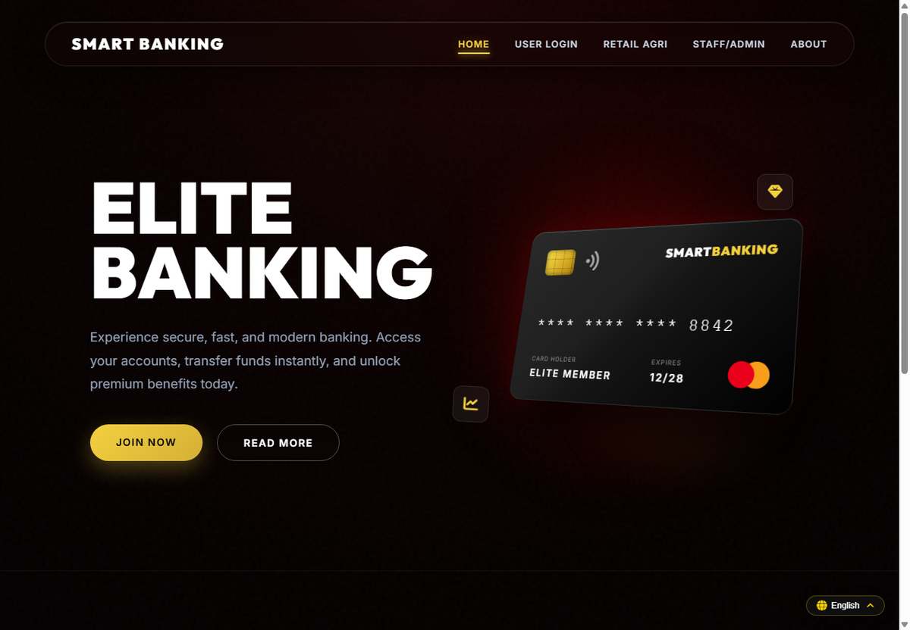

**Figure 8.2: Face Authentication Login**
*(The popup that turns on your webcam and scans your face to log you in.)*
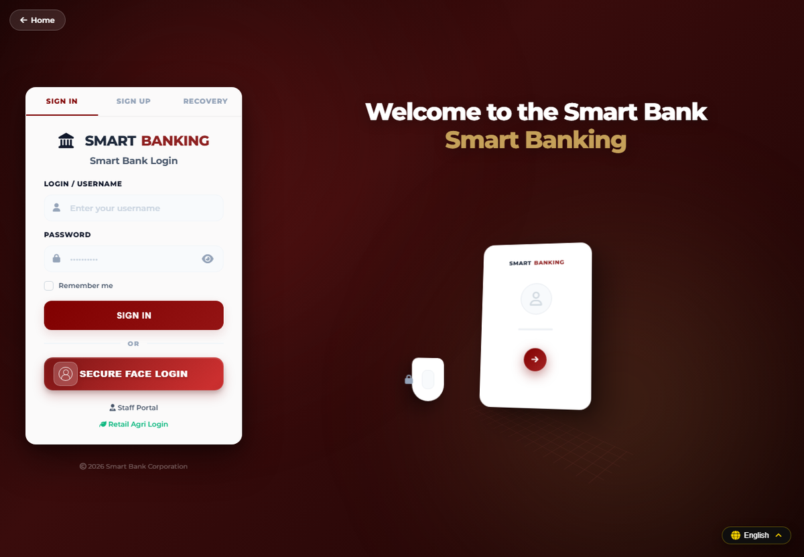

**Figure 8.3: Customer Registration & OTP**
*(The signup form with frosted glass styling and the OTP email verification popup.)*
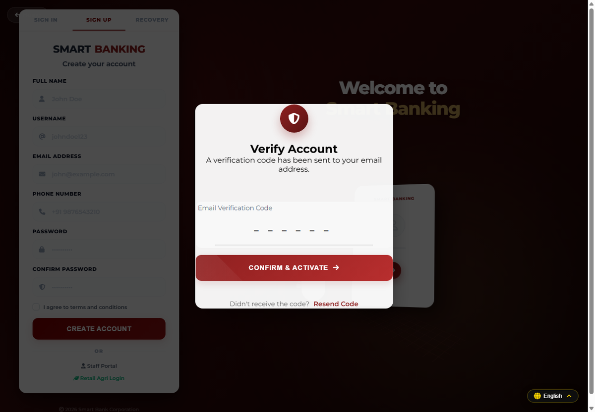

### 8.1.2 User Dashboard (SPA)
**Figure 8.4: Primary User Account View**
*(The main dashboard showing your balance, cards, quick transfer buttons, and recent transactions.)*
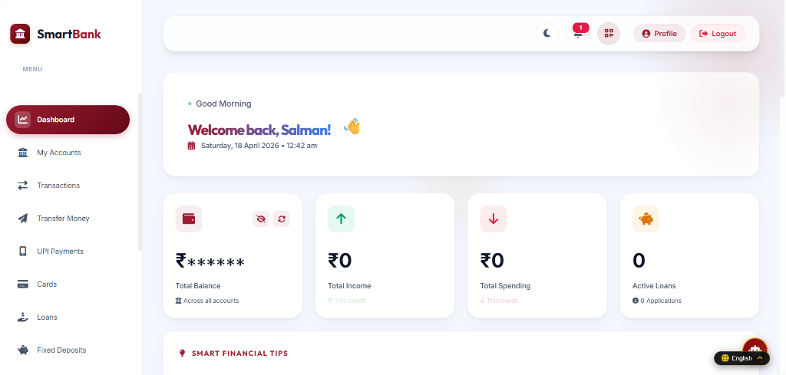

**Figure 8.5: Fund Transfer & UPI Module**
*(The money transfer form with daily limit tracking and UPI payment fields.)*
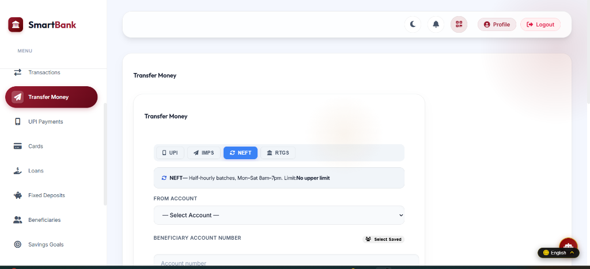

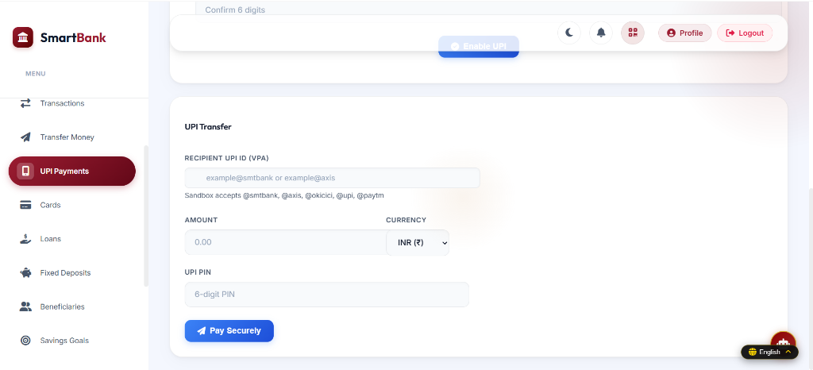

**Figure 8.6: Savings Pockets & AI Chatbot**
*(Savings goal progress bars and the floating chatbot window in the corner.)*
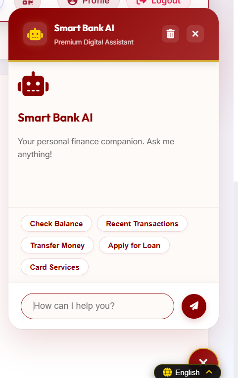

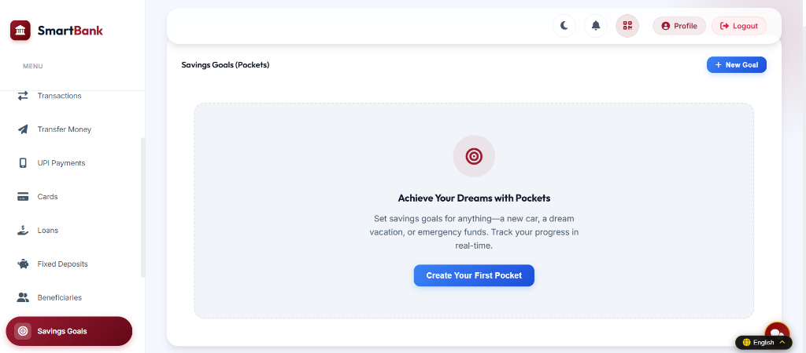

### 8.1.3 Mobile Interface (PWA)
**Figure 8.7: Mobile Dashboard & Balance Masking**
*(The mobile view with bottom navigation and the eye button that hides your balance.)*
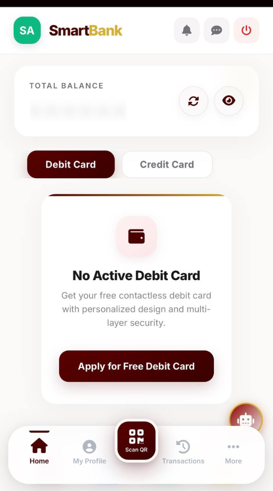

### 8.1.4 Staff & Back-Office Operations
**Figure 8.8: Staff Dashboard Main View**
*(The staff home screen showing an overview of pending tasks and navigation to different modules.)*
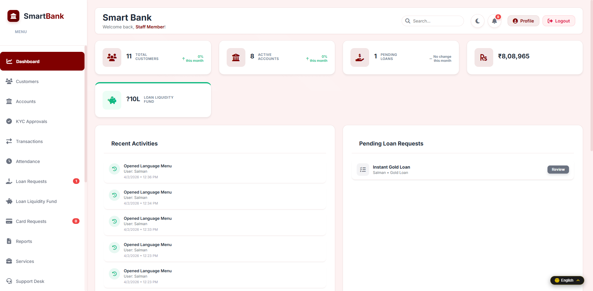

**Figure 8.9: Staff KYC Approval Queue**
*(Where staff check uploaded Aadhaar and PAN documents before approving new customers.)*
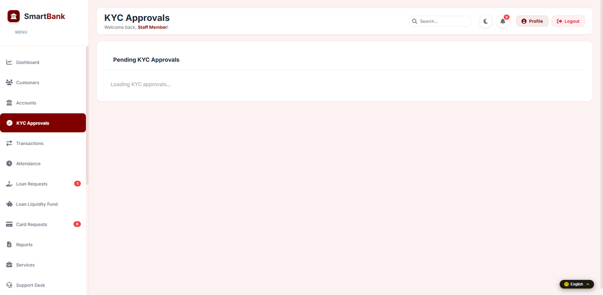

**Figure 8.10: Staff Customers View**
*(A list of all verified customers that the staff member can manage.)*
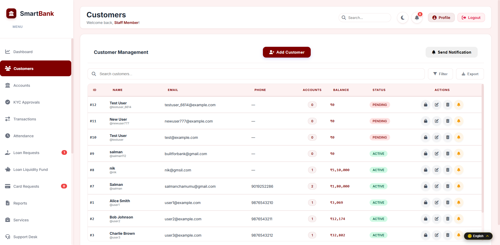

**Figure 8.11: Vault Transactions**
*(The screen for adding or withdrawing cash and processing transfers done at the bank counter.)*
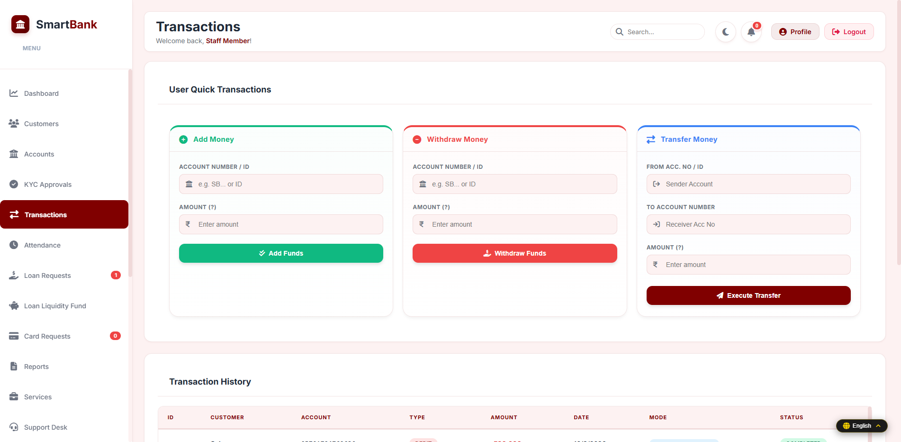

**Figure 8.12: Staff Attendance & Biometrics**
*(Staff clock-in and clock-out records, verified using face scan.)*
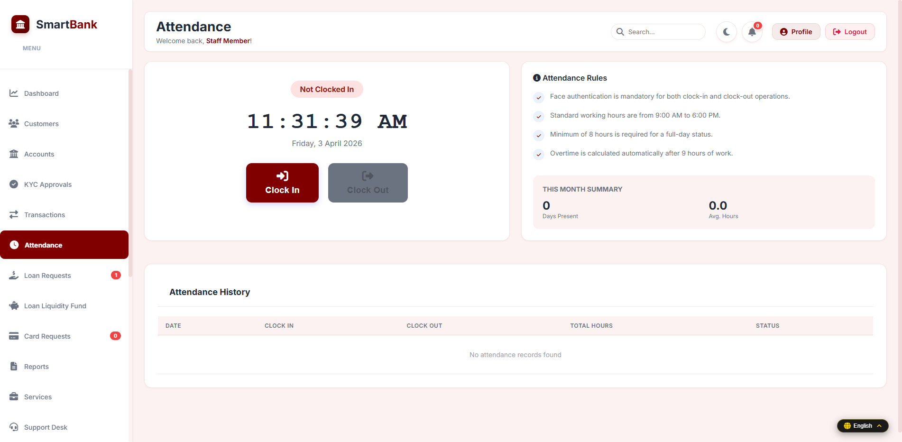

### 8.1.5 Specialized Portals
**Figure 8.13: Agriculture Hub**
*(The Agri Hub section where farmers can apply for the special 7.5% farm loans.)*
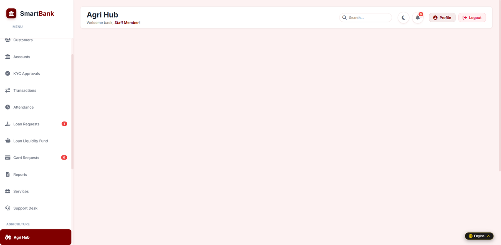

**Figure 8.14: Agriculture Loan Processing**
*(Farm loan applications that staff needs to review, with satellite map data and land documents attached.)*


**Figure 8.15: Help Desk & Support Settings**
*(The help desk where staff reads and replies to customer support tickets.)*
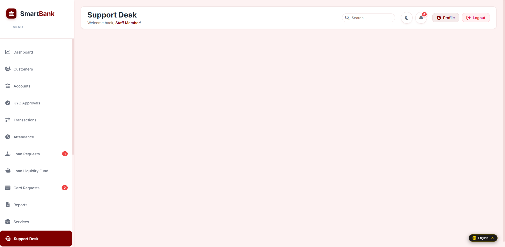

### 8.1.6 Geospatial & Reporting Integrations
**Figure 8.16: Live MapLibre System integration**
*(The 3D map with branch and ATM pins showing their exact locations.)*
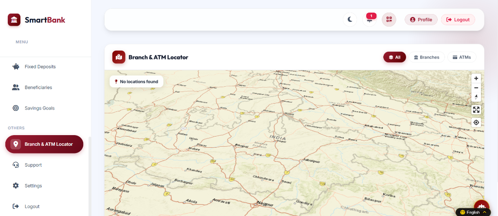

**Figure 8.17: Dynamic Report Generation**
*(The reports page where staff can generate and download PDF summaries of transactions and user data.)*
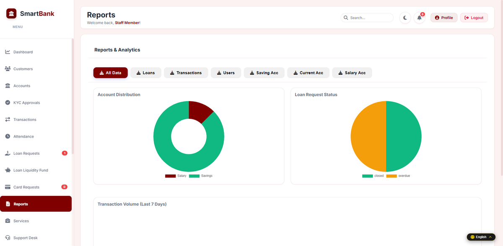

---

# 9. USER MANUAL
# CHAPTER – 9

## 9.1 Introduction
This section explains how to actually use Smart Bank — whether you are a customer, a bank employee, or the system admin. It covers everything from setting up face login to sending money and managing the Agri Hub. I wrote this so that anyone can pick up the app and start using it without needing help.

## 9.2 Hardware Requirements
- **Processor**: Intel i5 or better. Intel i7 is recommended if you want the 3D map to load faster.
- **RAM**: At least 8GB because the face recognition library needs that much to run smoothly.
- **Camera**: Any working webcam — built-in or USB. Needed for the face login feature.
- **Display**: 1080p screen is best. The frosted glass UI and 3D map look much better at higher resolution.
- **Connectivity**: A stable internet connection so the 3D map tiles can load properly.

## 9.3 Software Requirement
- **Operating System**: Windows 10/11, macOS, or Linux.
- **Web Browser**: Google Chrome or Microsoft Edge. These support WebGL for the 3D map and camera access for face login.
- **JavaScript**: Make sure JavaScript is turned on in your browser — the face scanner and charts need it.
- **PDF Viewer**: Any PDF reader works. Chrome can open the bank statements directly in a new tab.

---

# 10. CONCLUSION
# CHAPTER – 10

## 10.1 Conclusion
Building Smart Bank taught me a lot about what it takes to make a banking app that actually feels real. The face login with `face-api.js` works surprisingly well — once you register your face, logging in takes about a second. The 3D map with `MapLibre GL` is probably the feature I am most proud of because it looks nothing like a student project.

I focused on making the app fast and easy to use from day one. The Agri Hub and Savings Pockets features were fun to build because they show that a banking app does not have to be boring — it can actually help farmers sell their crops and help regular users save money for specific goals.

Looking back, Smart Bank turned out to be way more than a simple banking simulation. It has real face recognition, real email verification, real PDF statements, and a real 3D map. If I ever wanted to take this further, I would add real payment gateway integration and deploy it as an actual fintech product.

---

# 11. BIBLIOGRAPHY
# CHAPTER-11

## 11.1 Books reference
- **Flask Web Development**: Developing Web Applications with Python by Miguel Grinberg (O'Reilly Media).
- **SQL in 10 Minutes, Sams Teach Yourself** by Ben Forta.
- **Learning SQLite** by Kevin Sali.
- **Refactoring UI** by Adam Wathan & Steve Schoger (Design best practices for Glassmorphism).
- **Mastering JavaScript ES6+** by Simon Holmes.

## 11.2 Web References
- **Flask Documentation**: [https://flask.palletsprojects.com/](https://flask.palletsprojects.com/)
- **Face-api.js Documentation**: [https://github.com/justadudewhohacks/face-api.js/](https://github.com/justadudewhohacks/face-api.js/)
- **MapLibre GL JS Documentation**: [https://maplibre.org/maplibre-gl-js-docs/](https://maplibre.org/maplibre-gl-js-docs/)
- **MDN Web Docs**: [https://developer.mozilla.org/](https://developer.mozilla.org/)
- **Chart.js Official Docs**: [https://www.chartjs.org/docs/latest/](https://www.chartjs.org/docs/latest/)
- **FontAwesome Icon Library**: [https://fontawesome.com/icons](https://fontawesome.com/icons)
- **Google Fonts (Outfit & Inter)**: [https://fonts.google.com/](https://fonts.google.com/)