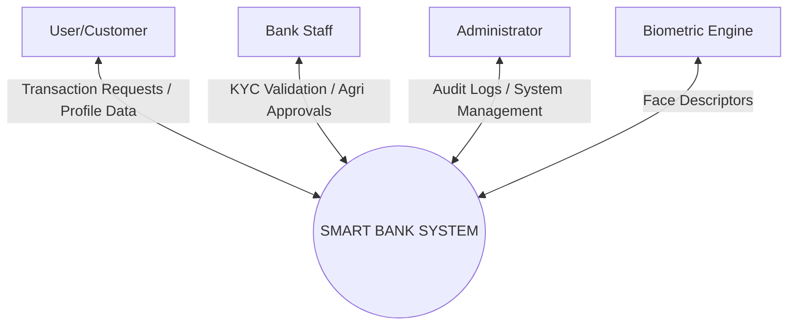
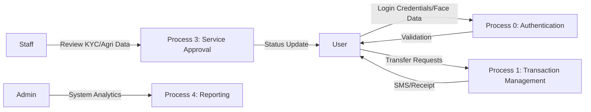
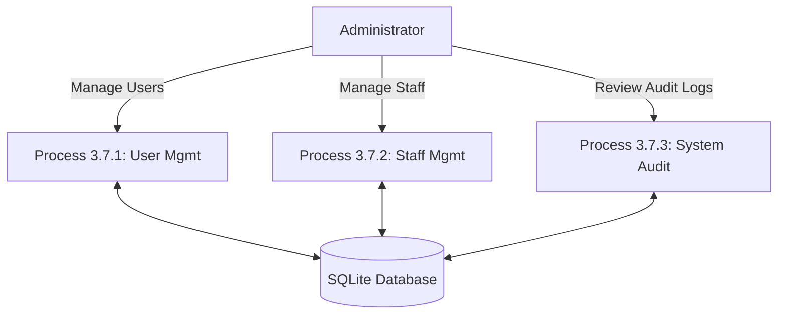
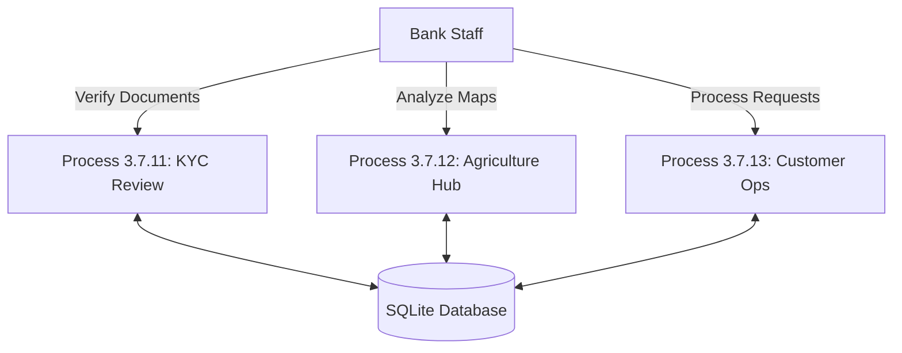
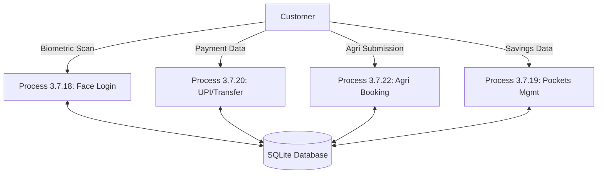
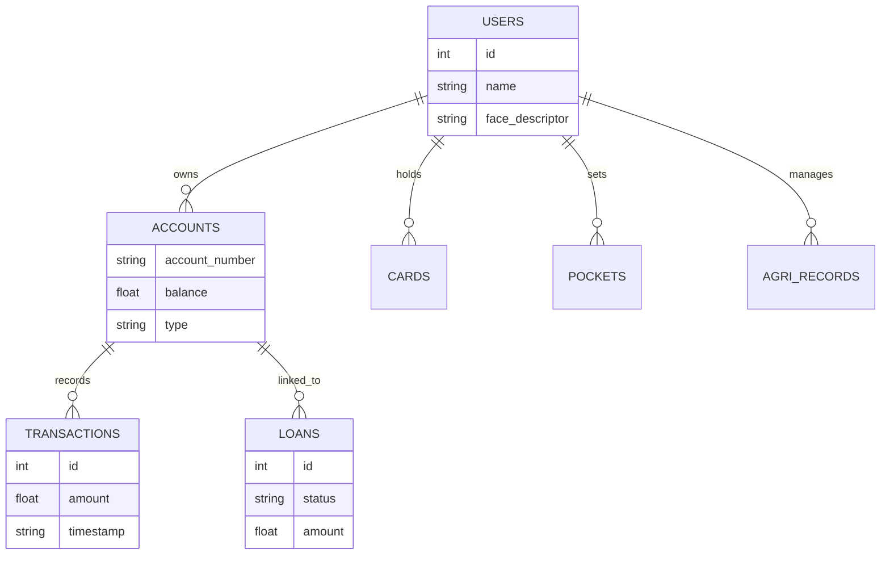
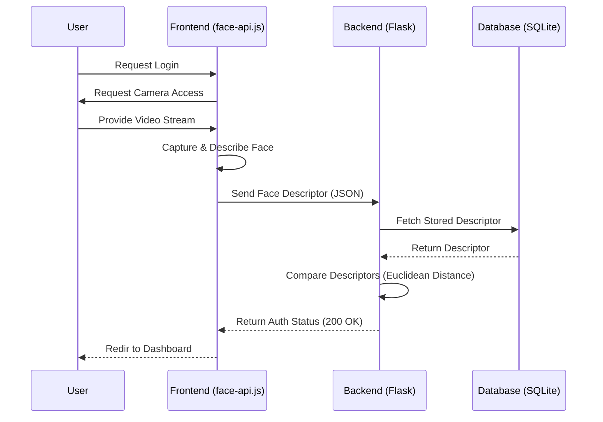
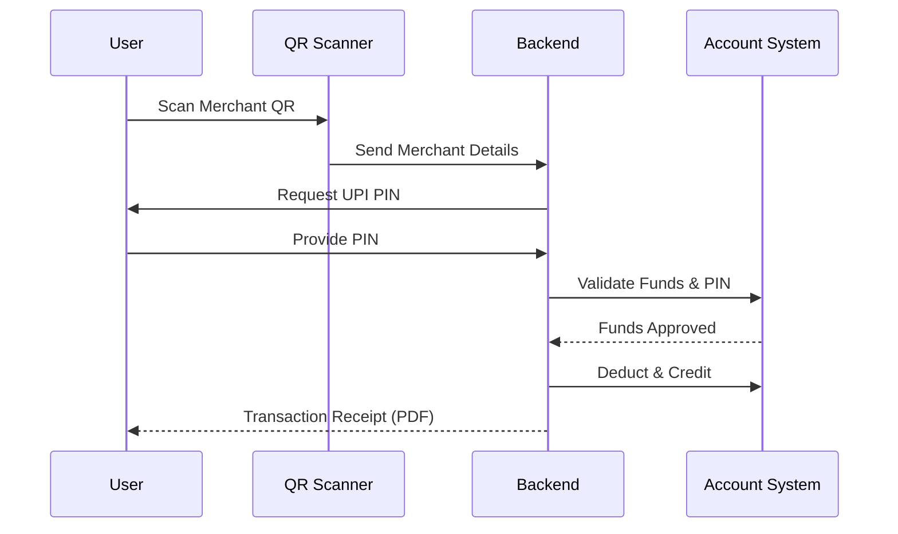
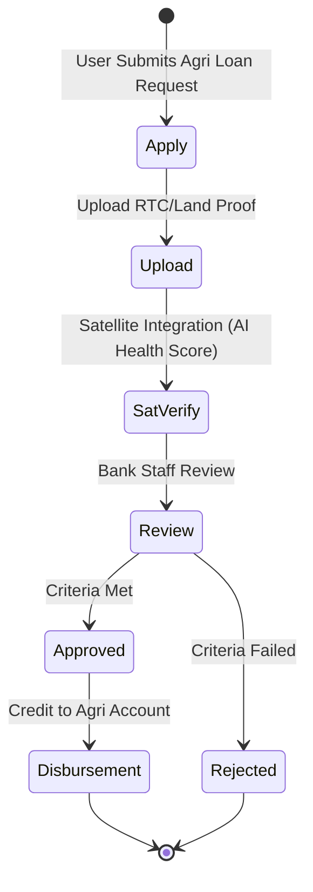

# CHAPTER-3: SYSTEM DESIGN

## 3.1 INTRODUCTION
System Design is the process of defining the architecture, components, modules, and interfaces of a system to satisfy specified requirements. For **Smart Bank**, the design focuses on secure data flow between users, staff, and biometric processing engines.

## 3.2 CONTEXT FLOW DIAGRAM
The Context Flow Diagram (CFD) shows the interaction between the Smart Bank system and its external entities (User, Admin, Staff, and Biometric API).

## 3.3 DATA FLOW DIAGRAM (DFD)
A Data Flow Diagram is a graphical representation of the "flow" of data through an information system, modeling its process aspects.

## 3.4 RULES REGARDING DFD CONSTRUCTION
1.  All processes must have at least one input and one output.
2.  Data cannot move directly from one data store to another; it must move through a process.
3.  Entities cannot move data directly to each other; it must go through a process.
4.  Processes should have unique and descriptive names.

## 3.5 DFD SYMBOLS
*   **Process (Circle/Rounded Square)**: Operations performed on data.
*   **Data Store (Open Rectangle)**: Repositories of data (e.g., Users Table).
*   **External Entity (Square)**: Destination or source of data (User/Staff).
*   **Data Flow (Arrow)**: The path data takes through the system.

## 3.6 DFD LEVEL 0 FOR SMART BANK
This fundamental DFD shows the overall system and the high-level data exchange.

## 3.7 DFD LEVEL 1 (ADMIN)
The Administrator sub-system focuses on managing user roles and system integrity.

*   **3.7.1 DFD Level 2 (Manage Customers)**: Create, Block, and Edit customer profiles and account types.
*   **3.7.2 DFD Level 2 (Manage Staff)**: Oversee staff assignments, recruitment approvals, and performance logs.
*   **3.7.3 DFD Level 2 (Manage Service Applications)**: Review and approve Card/Loan escalations from the Staff portal.

## 3.7.10 DFD LEVEL 1 (STAFF)
Focused on localized operational tasks, KYC verification, and agricultural loan assessment.

*   **3.7.11 DFD Level 2 (KYC Authentication)**: Verification of ID proofs and Face Descriptors for new account seekers.
*   **3.7.12 DFD Level 2 (Agriculture Hub)**: Real-time analysis of satellite imagery and land proof uploads (RTC).
*   **3.7.13 DFD Level 2 (Customer Jobs)**: Managing the queue for card activations and loan disbursements.

## 3.7.16 DFD LEVEL 1 (CUSTOMER)
The core retail banking interface for daily financial activities and personal growth.

*   **3.7.17 DFD Level 2 (Register)**: Initial onboarding with 256-bit encryption and account type selection.
*   **3.7.18 DFD Level 2 (Face Login)**: The core engine comparing real-time scans with stored descriptors.
*   **3.7.19 DFD Level 2 (Savings Goals/Pockets)**: Setting, monitoring, and funding specific budget targets.
*   **3.7.20 DFD Level 2 (UPI/QR Payments)**: Real-time QR code simulation and UPI PIN validation protocols.
*   **3.7.21 DFD Level 2 (Statement Generation)**: ReportLab PDF processing using dynamic date filters (6-Months/Current).
*   **3.7.22 DFD Level 2 (Agriculture Booking)**: Application for specialized 7.5% p.a. farm loans with satellite proof.

## 3.8 ENTITY-RELATIONSHIP DIAGRAM (ERD)

### 3.8.1 ER-Diagram Symbols
*   **Rectangle**: Entity (e.g., Users, Transactions).
*   **Ellipse**: Attribute (e.g., balance, name).
*   **Diamond**: Relationship (e.g., "owns", "initiates").
*   **Lines**: Connecting flows.

### 3.8.2 ER DIAGRAM FOR SMART BANK

## 3.9 SEQUENCE DIAGRAMS
Sequence diagrams model the logic of usage scenarios by showing the messages passed between objects over time.

### 3.9.1 Biometric Authentication Sequence

### 3.9.2 UPI Transaction Sequence

## 3.10 ACTIVITY DIAGRAMS
Activity diagrams show the workflow of a system, representing the flow of control from one activity to another.

### 3.10.1 Agriculture Loan Workflow

